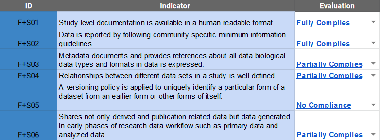

# Evaluation Method

The FAIRplus maturity model is still under development. 🚧

We are investigating existing evaluation methods, such as RDA Data Maturity Model.

FAIRplus project targets developing a maturity model based on Data Usage areas.

Current FAIRplus indicators measure compliance of data sets to given Data Usage areas, but do not provide a maturation path yet.


## How to use FAIRplus Indicators:
1) Download Evaluation form <a href="https://github.com/FAIRplus/CMM/raw/master/docs/Data%20FAIRness%20Assessment.xlsx">here</a>.

2) Read the detailed descriptions of [FAIRplus Indicators](FAIRPlus-Indicators.md).


3) Select **Evaluation** option from the drop-down in the **Evaluation Form** (from Step 1) and perform manual evaluation for each metric to provide the compliance level.



4) Check the Level of Compliance Visualization for each Data Usage area in the **Maturity of DU Areas** sheet of the Evaluation Form.


5) Decide the Data Usage areas that needs focus in your FAIRification and list the corresponding Indicators to improve.

<hr>

Currently RDA Evaluation methods will be tested and used for defining the levels of data set maturity.
As the FAIRplus process maturity model develops, a new data maturity evaluation approach will be introduced.
<br>

Further:  [RDA Evaluation Model](rda-evaluation.md).

---

## Authors

| Name | Affiliation  | orcid | CrediT role  |
| :------------- | :------------- | :------------- |:------------- |
| Oya Deniz Beyan | fit.fraunhofer.de | [0000-0000-0000-0000](https://orcid.org/orcid.org/0000-0000-0000-0000) | Writing - Original Draft |
|  |  | | Writing - Review & Editing, Funding acquisition | 

---

## License

````{license_fairplus}
CC-BY-4.0
````