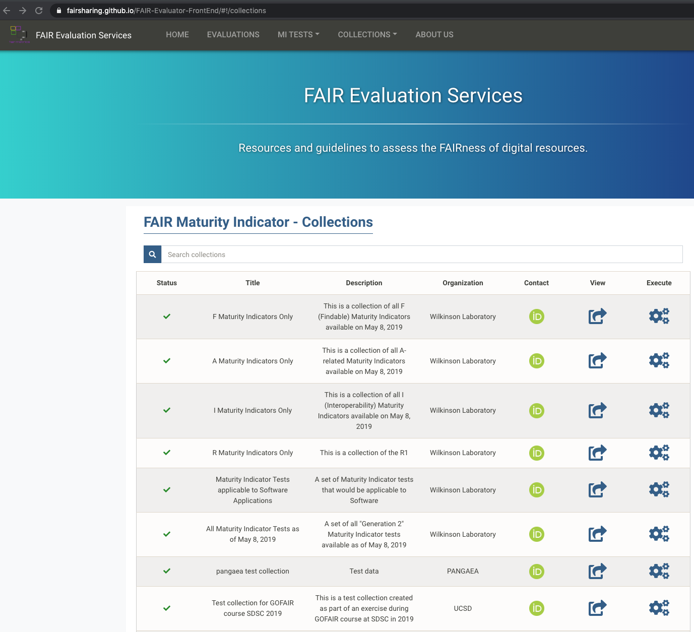
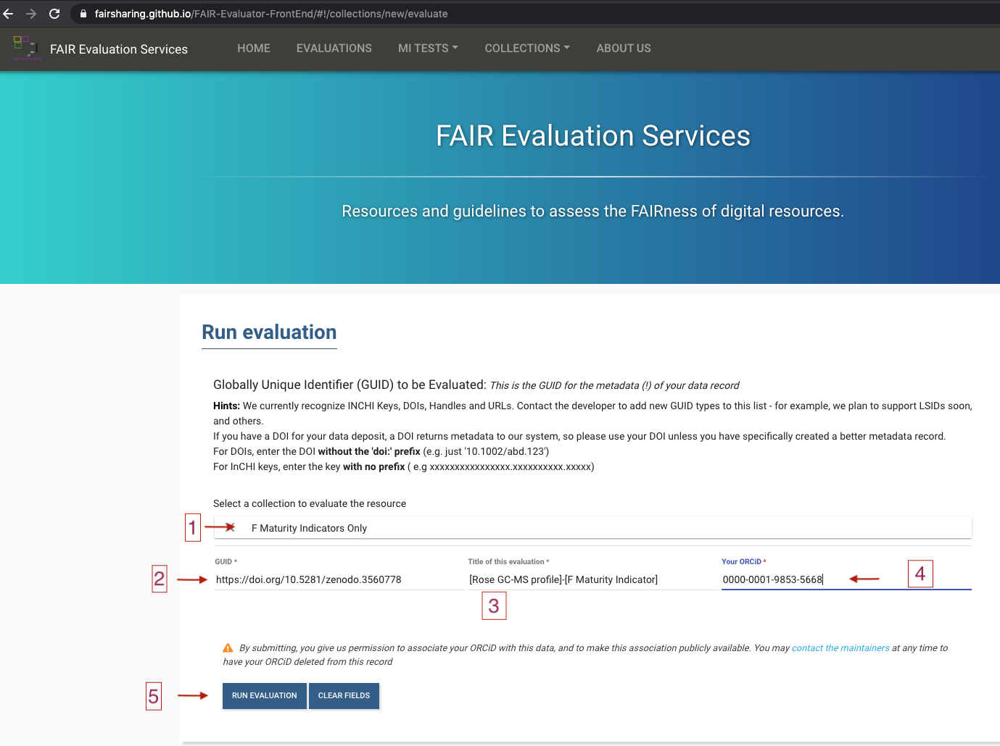
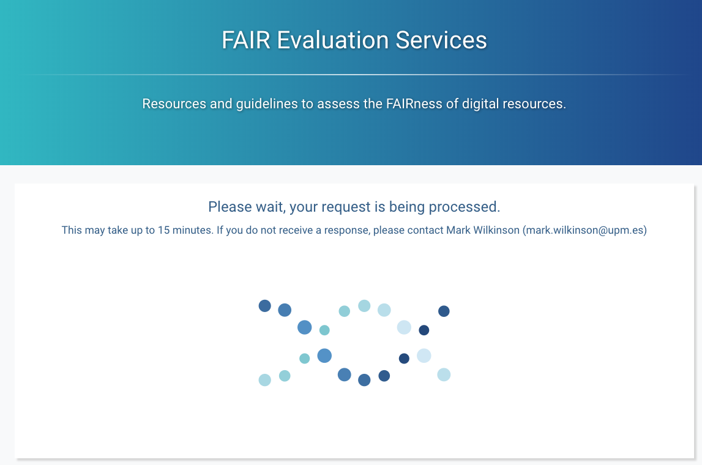
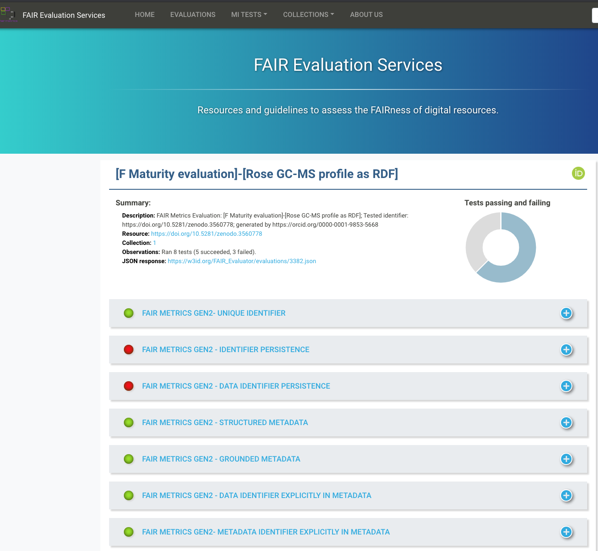

(fcb-assess-fair-automatic-evaluator)=
# FAIR Evaluator tool


````{panels_fairplus}
:identifier_text: FCB049
:identifier_link: 'https://w3id.org/faircookbook/FCB049'
:difficulty_level: 3
:recipe_type: hands_on
:reading_time_minutes: 30
:intended_audience: principal_investigator, data_manager, data_scientist  
:has_executable_code: yeah
:recipe_name: FAIR Evaluator tool
```` 


## Ingredients
	
| Ingredient | Type| Comment|
|:-----| :----|:-----|
|[HTTP1.1 protocol](https://tools.ietf.org/html/rfc2616)| data communication protocol | |
|[guidance on persistent resolvable identifiers](https://www.gov.uk/government/publications/open-standards-for-government/persistent-resolvable-identifiers)| policy| |
|[Persistent Uniform Resource Locators - PURL](https://archive.org/services/purl/)|redirection service| |
|[Archival Resource Key](https://n2t.net/e/ark_ids.html)| identifier minting service; identifier resolution service| |
|[Handle system](http://www.rfc-editor.org/rfc/rfc3650.txt)|identifier minting service; identifier resolution service| |
|[DOI](https://doi.org/)| identifier minting service| based on Handle system |
|[identifiers.org](https://identifiers.org/)|identifier resolution service||
|[EZID resolution service](https://ezid.cdlib.org/)|identifier resolution service||
|[name2things rsolution service](http://n2t.net/)|identifier resolution service||
|[FAIREvaluator](https://W3id.org/AmIFAIR)|FAIR assessment||
|[FAIRShake](https://fairshake.cloud/)| FAIR assessment||
|[RDF/Linked Data](https://www.w3.org/standards/semanticweb/data)| model | |


| Actions.Objectives.Tasks  | Input | Output  |
| :------------- | :------------- | :------------- |
| <!-- TODO add a link to corresponding document -->  | <!-- TODO add a link to corresponding document --> | <!-- TODO add a link to corresponding document --> |
| <!-- TODO add a link to corresponding document -->  | <!-- TODO add a link to corresponding document --> | <!-- TODO add a link to corresponding document --> |
| <!-- TODO add a link to corresponding document -->  | <!-- TODO add a link to corresponding document --> | <!-- TODO add a link to corresponding document --> |
| <!-- TODO add a link to corresponding document -->  | <!-- TODO add a link to corresponding document --> | <!-- TODO add a link to corresponding document --> |
| <!-- TODO add a link to corresponding document -->  | <!-- TODO add a link to corresponding document --> | <!-- TODO add a link to corresponding document --> |
| <!-- TODO add a link to corresponding document -->  | <!-- TODO add a link to corresponding document --> | <!-- TODO add a link to corresponding document --> |

        

## Objectives

- Perform an automatic assessment of a dataset against the FAIR principles {footcite}`pmid26978244` expressed as nanopublications using the [FAIREvaluator](https://w3id.org/AmIFAIR) {footcite}`pmid31541130`.
- Obtain human and machine readable reports highlighting strengths and weaknesses with respect to FAIR.

## Step by Step Process

### Loading FAIREvaluator web application 
     
Navigate the FAIREvaluator tool, which can be accessed via the following 2 addresses:

- [https://w3id.org/AmIFAIR](https://w3id.org/AmIFAIR)

- [https://fairsharing.github.io/FAIR-Evaluator-FrontEnd](https://fairsharing.github.io/FAIR-Evaluator-FrontEnd/#!/#%2F!)


<!--  -->

```{figure} ./assets/fair-eval-img1.png
---
width: 800px
name: the FAIREvaluator Home page
alt: the FAIREvaluator Home page
---
the [FAIREvaluator](https://w3id.org/AmIFAIR) Home page
```


### Understanding the FAIR indicators

In order the run the FAIREvaluator, it is important to understand to notion of FAIR indicators (formerly referred to as FAIR metrics).
One may browse the list of currently community defined indicators from the `Collections` page 

<!--   -->

```{figure} ./assets/fair-eval-img2.png
---
width: 800px
name: Select a 'FAIR Maturity Indicator - Collections'
alt: Select a 'FAIR Maturity Indicator - Collections'
---
Select a 'FAIR Maturity Indicator - Collections'
```    

### Preparing the input information

To run an evaluation, the FAIREvaluator needs to following 5 inputs from users:

1. a collection of FAIR indicators, selected from the list described above.
2. a globally unique, persistent, resolveable identifier for the resource to be evaluated.
3. a title for the evaluation. Enforce a naming convention to make future searches easier as these evaluations are saved.
4. a person identifier in the form of an ORCID.

<!--  -->

```{figure} ./assets/fair-eval-img4.png
---
width: 800px
name: Running the FAIREvaluator - part 1 - setting the input
alt: Running the FAIREvaluator - part 1 - setting the input
---
Running the FAIREvaluator - part 1: setting the input
```

### Running the FAIREvaluator

Hit the 'Run Evaluation' button from 'https://fairsharing.github.io/FAIR-Evaluator-FrontEnd/#!/collections/new/evaluate' page


<!--  -->

```{figure} ./assets/fair-eval-img5.png
---
width: 800px
name: Running the FAIREvaluator - part 2 - execution
alt: Running the FAIREvaluator - part 2 - execution
---
Running the FAIREvaluator - part 2: execution
```

     
### Analysing the FAIREvaluator report

Following execution of the FAIREvaluator, a detail report is generated.

<!--  -->

```{figure} ./assets/fair-eval-img6.png
---
width: 800px
name: FAIREvaluator report - overall report
alt: FAIREvaluator report - overall report
---
FAIREvaluator report - overall report
```

Time to dig into the details and figure out the reasons why some indicators are reporting a failure:

<!--  -->

```{figure} ./assets/fair-eval-img7.png
---
width: 800px
name: FAIREvaluator error report 
alt: FAIREvaluator error report
---
apparently a problem with identifier persistence if using DOI, which are URN rather than URL *stricto-sensu*
```

## Conclusion

Using software tools to assess FAIR maturity constitutes an essential activity to ensure processes and capabilities actually deliver and claims can be checked.
Furthermore, only automation is able to cope with the scale and volumes of assets to evaluate.
The software-based evaluations are repeatable, reproducible and free of bias (other than those that may be related to definitions of the FAIR indicators themselves).
These are also more demanding in terms of technical implementation and knowledge.
Services such as the FAIRevaluator are essential to gauge improvements of data management services and for helping developers build FAIR services and data.


## Reference

```{footbibliography}
```

<!-- Wilkinson, M.D., Dumontier, M., Sansone, S. et al. Evaluating FAIR maturity through a scalable, automated, community-governed framework. Sci Data 6, 174 (2019). [doi:10.1038/s41597-019-0184-5](https://doi.org/10.1038/s41597-019-0184-5)

Clarke et al. FAIRshake: Toolkit to Evaluate the FAIRness of Research Digital Resources, Cell Systems (2019),[doi:10.1016/j.cels.2019.09.011](https://doi.org/10.1016/j.cels.2019.09.011)
 -->


## Authors

````{authors_fairplus}
Philippe: Writing - Original Draft
Dominique: Writing - Review & Editing
````


---

## License

````{license_fairplus}
CC-BY-4.0
````
