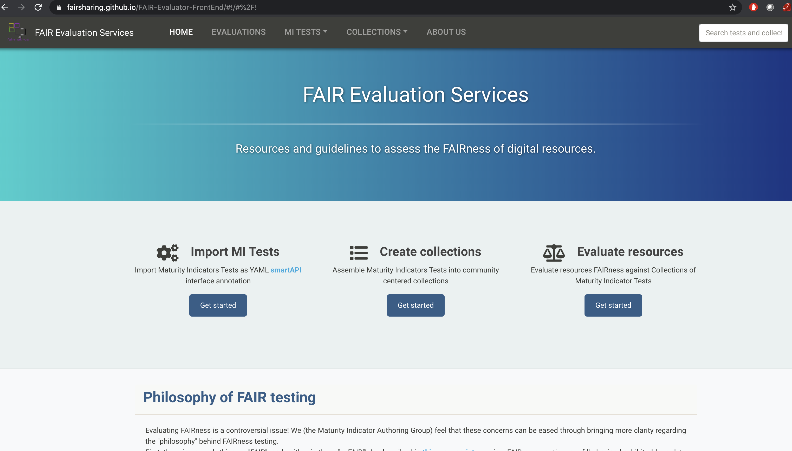
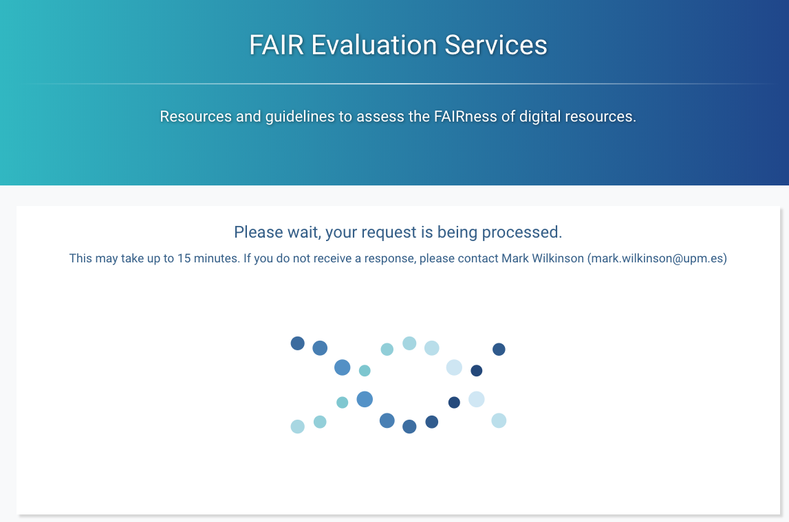
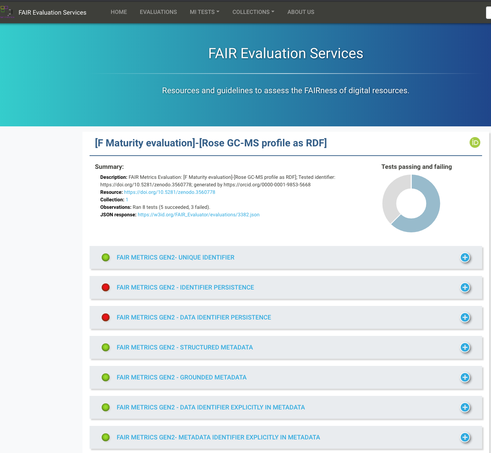
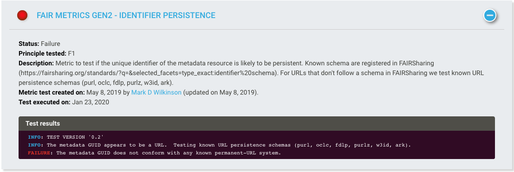

(fcb-assess-fair-automatic-evaluator)=
# FAIR Evaluator tool


````{panels_fairplus}
:identifier_text: FCB049
:identifier_link: 'https://w3id.org/faircookbook/FCB049'
:difficulty_level: 3
:recipe_type: hands_on
:reading_time_minutes: 30
:intended_audience: principal_investigator, data_manager, data_scientist  
:maturity_level: 0
:maturity_indicator: 0
:has_executable_code: nope
:recipe_name: Assessing with FAIR Evaluator
```` 


## Ingredients
	
| Ingredient | Type| Comment|
|:-----| :----|:-----|
|[HTTP1.1 protocol](https://tools.ietf.org/html/rfc2616)| data communication protocol | |
|[guidance on persistent resolvable identifiers](https://www.gov.uk/government/publications/open-standards-for-government/persistent-resolvable-identifiers)| policy (URL_TO_INSERT_TERM_1564 https://fairsharing.org/search?fairsharingRegistry=Policy) | |
|[Persistent Uniform Resource Locator (URL_TO_INSERT_RECORD_1565 https://fairsharing.org/FAIRsharing.3e603c)  (URL_TO_INSERT_RECORD_1566 https://fairsharing.org/FAIRsharing.9d38e2) s - PURL](https://archive.org/services/purl/)|redirection service| |
|[Arch (URL_TO_INSERT_RECORD_1569 https://fairsharing.org/FAIRsharing.52b22c) ival Resource Key](https://n2t.net/e/ark_ids.html)| identifier (URL_TO_INSERT_TERM_1567 https://fairsharing.org/search?recordType=identifier_schema)  minting service; identifier (URL_TO_INSERT_TERM_1568 https://fairsharing.org/search?recordType=identifier_schema)  resolution service| |
|[Handle (URL_TO_INSERT_RECORD_1571 https://fairsharing.org/FAIRsharing.0b7e54)  (URL_TO_INSERT_RECORD_1572 https://fairsharing.org/FAIRsharing.0b7e54)  system](http://www.rfc-editor.org/rfc/rfc3650.txt)|identifier minting service; identifier (URL_TO_INSERT_TERM_1570 https://fairsharing.org/search?recordType=identifier_schema)  resolution service| |
|[DOI](https://doi.org/)| identifier (URL_TO_INSERT_TERM_1573 https://fairsharing.org/search?recordType=identifier_schema)  minting service| based on Handle (URL_TO_INSERT_RECORD_1574 https://fairsharing.org/FAIRsharing.0b7e54)  (URL_TO_INSERT_RECORD_1575 https://fairsharing.org/FAIRsharing.0b7e54)  system |
|[identifiers.org](https://identifiers.org/)|identifier resolution service||
|[EZID resolution service](https://ezid.cdlib.org/)|identifier resolution service||
|[name2things rsolution service](http://n2t.net/)|identifier resolution service||
|[FAIREvaluator](https://W3id.org (URL_TO_INSERT_RECORD_1576 https://fairsharing.org/FAIRsharing.S6BoUk) /AmIFAIR)|FAIR assessment||
|[FAIRShake](https://fairshake.cloud/)| FAIR (URL_TO_INSERT_RECORD_1577 https://fairsharing.org/FAIRsharing.WWI10U)  assessment||
|[RDF (URL_TO_INSERT_RECORD_1579 https://fairsharing.org/FAIRsharing.p77ph9) /Linked Data](https://www.w3.org/standards/semanticweb/data)| model (URL_TO_INSERT_TERM_1578 https://fairsharing.org/search?recordType=model_and_format)  | |


| Actions.Objectives.Tasks  | Input | Output  |
| :------------- | :------------- | :------------- |
| <!-- TODO add a link to corresponding document -->  | <!-- TODO add a link to corresponding document --> | <!-- TODO add a link to corresponding document --> |
| <!-- TODO add a link to corresponding document -->  | <!-- TODO add a link to corresponding document --> | <!-- TODO add a link to corresponding document --> |
| <!-- TODO add a link to corresponding document -->  | <!-- TODO add a link to corresponding document --> | <!-- TODO add a link to corresponding document --> |
| <!-- TODO add a link to corresponding document -->  | <!-- TODO add a link to corresponding document --> | <!-- TODO add a link to corresponding document --> |
| <!-- TODO add a link to corresponding document -->  | <!-- TODO add a link to corresponding document --> | <!-- TODO add a link to corresponding document --> |
| <!-- TODO add a link to corresponding document -->  | <!-- TODO add a link to corresponding document --> | <!-- TODO add a link to corresponding document --> |

        

## Objectives

- Perform an automatic assessment of a dataset against the FAIR (URL_TO_INSERT_RECORD_1582 https://fairsharing.org/FAIRsharing.WWI10U)  principles (URL_TO_INSERT_RECORD_1581 https://fairsharing.org/FAIRsharing.WWI10U)  {footcite}`pmid26978244` expressed as nanopublications using the [FAIREvaluator](https://w3id.org (URL_TO_INSERT_RECORD_1580 https://fairsharing.org/FAIRsharing.S6BoUk) /AmIFAIR) {footcite}`pmid31541130`.
- Obtain human and machine-readable reports highlighting strengths and weaknesses with respect to FAIR (URL_TO_INSERT_RECORD_1583 https://fairsharing.org/FAIRsharing.WWI10U) .

## Step by Step Process

### Loading FAIREvaluator web application 
     
Navigate the FAIR (URL_TO_INSERT_RECORD_1584 https://fairsharing.org/FAIRsharing.WWI10U) Evaluator tool, which can be accessed via the following 2 addresses:

- [https://w3id.org (URL_TO_INSERT_RECORD_1585 https://fairsharing.org/FAIRsharing.S6BoUk) /AmIFAIR](https://w3id.org (URL_TO_INSERT_RECORD_1586 https://fairsharing.org/FAIRsharing.S6BoUk) /AmIFAIR)

- [https://fairsharing.github.io/FAIR-Evaluator-FrontEnd](https://fairsharing.github.io/FAIR-Evaluator-FrontEnd/#!/#%2F!)


<!--  -->
````{dropdown}
:open:
```{figure} ./assets/fair-eval-img1.png
---
width: 800px
name: the FAIR (URL_TO_INSERT_RECORD_1587 https://fairsharing.org/FAIRsharing.WWI10U) Evaluator Home page
alt: the FAIR (URL_TO_INSERT_RECORD_1588 https://fairsharing.org/FAIRsharing.WWI10U) Evaluator Home page
---
the [FAIREvaluator](https://w3id.org (URL_TO_INSERT_RECORD_1589 https://fairsharing.org/FAIRsharing.S6BoUk) /AmIFAIR) Home page
```
````


### Understanding the FAIR indicators

In order the run the FAIR (URL_TO_INSERT_RECORD_1591 https://fairsharing.org/FAIRsharing.WWI10U) Evaluator, it is important to understand to notion of FAIR (URL_TO_INSERT_RECORD_1592 https://fairsharing.org/FAIRsharing.WWI10U)  indicators (formerly referred to as FAIR (URL_TO_INSERT_RECORD_1593 https://fairsharing.org/FAIRsharing.WWI10U)  metric (URL_TO_INSERT_TERM_1590 https://fairsharing.org/search?recordType=metric) s).
One may browse the list of currently community defined indicators from the `Collection (URL_TO_INSERT_TERM_1594 https://fairsharing.org/search?recordType=collection) s` page 

<!--   -->

````{dropdown}
:open:
```{figure} ./assets/fair-eval-img2.png
---
width: 800px
name: Select a 'FAIR (URL_TO_INSERT_RECORD_1596 https://fairsharing.org/FAIRsharing.WWI10U)  Maturity Indicator - Collection (URL_TO_INSERT_TERM_1595 https://fairsharing.org/search?recordType=collection) s'
alt: Select a 'FAIR (URL_TO_INSERT_RECORD_1598 https://fairsharing.org/FAIRsharing.WWI10U)  Maturity Indicator - Collection (URL_TO_INSERT_TERM_1597 https://fairsharing.org/search?recordType=collection) s'
---
Select a 'FAIR (URL_TO_INSERT_RECORD_1600 https://fairsharing.org/FAIRsharing.WWI10U)  Maturity Indicator - Collection (URL_TO_INSERT_TERM_1599 https://fairsharing.org/search?recordType=collection) s'
```
````    

### Preparing the input information

To run an evaluation, the FAIR (URL_TO_INSERT_RECORD_1601 https://fairsharing.org/FAIRsharing.WWI10U) Evaluator needs to following 5 inputs from users:

1. a collection (URL_TO_INSERT_TERM_1602 https://fairsharing.org/search?recordType=collection)  of FAIR (URL_TO_INSERT_RECORD_1603 https://fairsharing.org/FAIRsharing.WWI10U)  indicators, selected from the list described above.
2. a globally unique, persistent, resolvable identifier (URL_TO_INSERT_TERM_1604 https://fairsharing.org/search?recordType=identifier_schema)  for the resource to be evaluated.
3. a title for the evaluation. Enforce a naming convention to make future search (URL_TO_INSERT_RECORD_1605 https://fairsharing.org/FAIRsharing.52b22c) es easier as these evaluations are saved.
4. a person identifier (URL_TO_INSERT_TERM_1606 https://fairsharing.org/search?recordType=identifier_schema)  in the form of an ORCID (URL_TO_INSERT_RECORD_1607 https://fairsharing.org/FAIRsharing.nx58jg) .

<!--  -->

````{dropdown}
:open:
```{figure} ./assets/fair-eval-img4.png
---
width: 800px
name: Running the FAIR (URL_TO_INSERT_RECORD_1608 https://fairsharing.org/FAIRsharing.WWI10U) Evaluator - part 1 - setting the input
alt: Running the FAIR (URL_TO_INSERT_RECORD_1609 https://fairsharing.org/FAIRsharing.WWI10U) Evaluator - part 1 - setting the input
---
Running the FAIR (URL_TO_INSERT_RECORD_1610 https://fairsharing.org/FAIRsharing.WWI10U) Evaluator - part 1: setting the input
```
````

### Running the FAIREvaluator

Hit the 'Run Evaluation' button from 'https://fairsharing.github.io/FAIR-Evaluator-FrontEnd/#!/collections/new/evaluate' page


<!--  -->

````{dropdown}
:open:
```{figure} ./assets/fair-eval-img5.png
---
width: 800px
name: Running the FAIR (URL_TO_INSERT_RECORD_1611 https://fairsharing.org/FAIRsharing.WWI10U) Evaluator - part 2 - execution
alt: Running the FAIR (URL_TO_INSERT_RECORD_1612 https://fairsharing.org/FAIRsharing.WWI10U) Evaluator - part 2 - execution
---
Running the FAIR (URL_TO_INSERT_RECORD_1613 https://fairsharing.org/FAIRsharing.WWI10U) Evaluator - part 2: execution
```
````

     
### Analysing the FAIREvaluator report

Following execution of the FAIR (URL_TO_INSERT_RECORD_1614 https://fairsharing.org/FAIRsharing.WWI10U) Evaluator, a detail report is generated.

<!--  -->

````{dropdown}
:open:
```{figure} ./assets/fair-eval-img6.png
---
width: 800px
name: FAIR (URL_TO_INSERT_RECORD_1615 https://fairsharing.org/FAIRsharing.WWI10U) Evaluator report - overall report
alt: FAIR (URL_TO_INSERT_RECORD_1616 https://fairsharing.org/FAIRsharing.WWI10U) Evaluator report - overall report
---
FAIR (URL_TO_INSERT_RECORD_1617 https://fairsharing.org/FAIRsharing.WWI10U) Evaluator report - overall report
```
````

Time to dig into the details and figure out the reasons why some indicators are reporting a failure:

<!--  -->

````{dropdown}
:open:
```{figure} ./assets/fair-eval-img7.png
---
width: 800px
name: FAIR (URL_TO_INSERT_RECORD_1618 https://fairsharing.org/FAIRsharing.WWI10U) Evaluator error report 
alt: FAIR (URL_TO_INSERT_RECORD_1619 https://fairsharing.org/FAIRsharing.WWI10U) Evaluator error report
---
apparently a problem with identifier (URL_TO_INSERT_TERM_1620 https://fairsharing.org/search?recordType=identifier_schema)  persistence if using DOI (URL_TO_INSERT_RECORD_1621 https://fairsharing.org/FAIRsharing.hFLKCn) , which are URN rather than URL (URL_TO_INSERT_RECORD_1622 https://fairsharing.org/FAIRsharing.9d38e2)  *sensu stricto*
```
````

## Conclusion

Using software tools to assess FAIR (URL_TO_INSERT_RECORD_1623 https://fairsharing.org/FAIRsharing.WWI10U)  maturity constitutes an essential activity to ensure processes and capabilities actually deliver and claims can be checked.
Furthermore, only automation is able to cope with the scale and volumes of assets to evaluate.
The software-based evaluations are repeatable, reproducible and free of bias (other than those that may be related to definitions of the FAIR (URL_TO_INSERT_RECORD_1624 https://fairsharing.org/FAIRsharing.WWI10U)  indicators themselves).
These are also more demanding in terms of technical implementation and knowledge.
Services such as the FAIR (URL_TO_INSERT_RECORD_1625 https://fairsharing.org/FAIRsharing.WWI10U) evaluator are essential to gauge improvements of data management services and for helping developers build FAIR (URL_TO_INSERT_RECORD_1626 https://fairsharing.org/FAIRsharing.WWI10U)  services and data.


## Reference
````{dropdown} **References**
```{footbibliography}
```
````

<!-- Wilkinson, M.D., Dumontier, M., Sansone, S. et al. Evaluating FAIR maturity through a scalable, automated, community-governed framework. Sci Data 6, 174 (2019). [doi:10.1038/s41597-019-0184-5](https://doi.org/10.1038/s41597-019-0184-5)

Clarke et al. FAIRshake: Toolkit to Evaluate the FAIRness of Research Digital Resources, Cell Systems (2019),[doi:10.1016/j.cels.2019.09.011](https://doi.org/10.1016/j.cels.2019.09.011)
 -->


## Authors

````{authors_fairplus}
Philippe: Writing - Original Draft
Dominique: Writing - Review & Editing
````


## License

````{license_fairplus}
CC-BY-4.0
````
