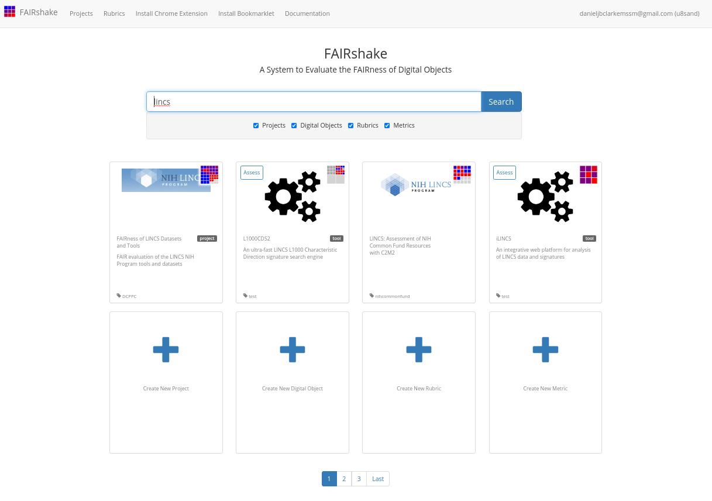
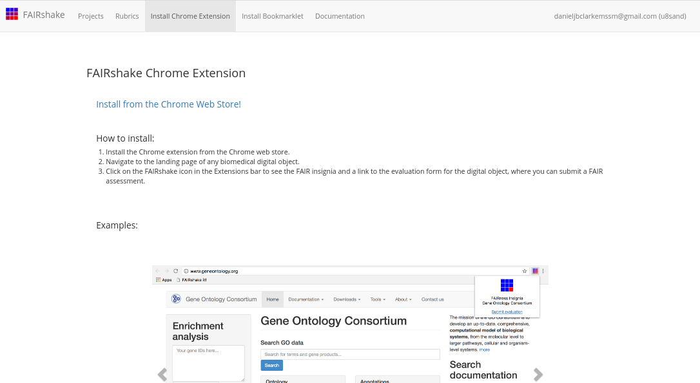
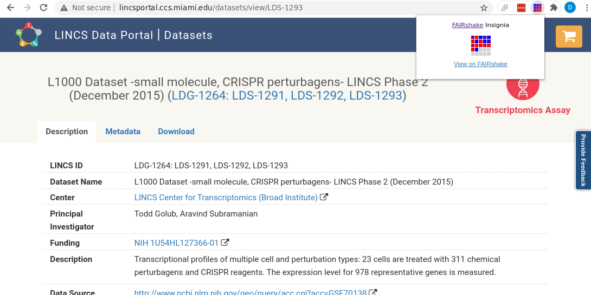
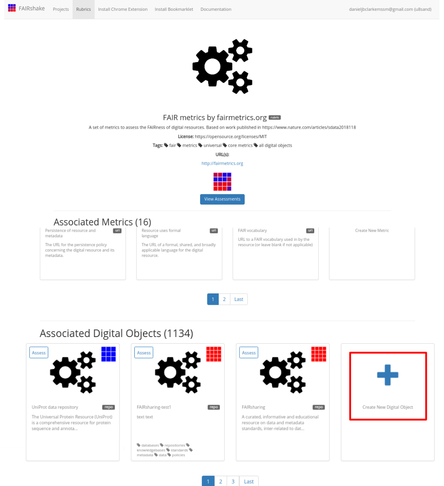
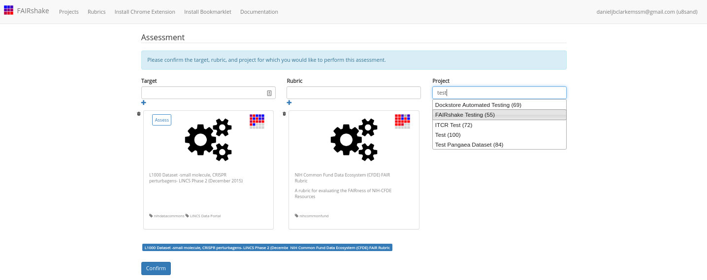
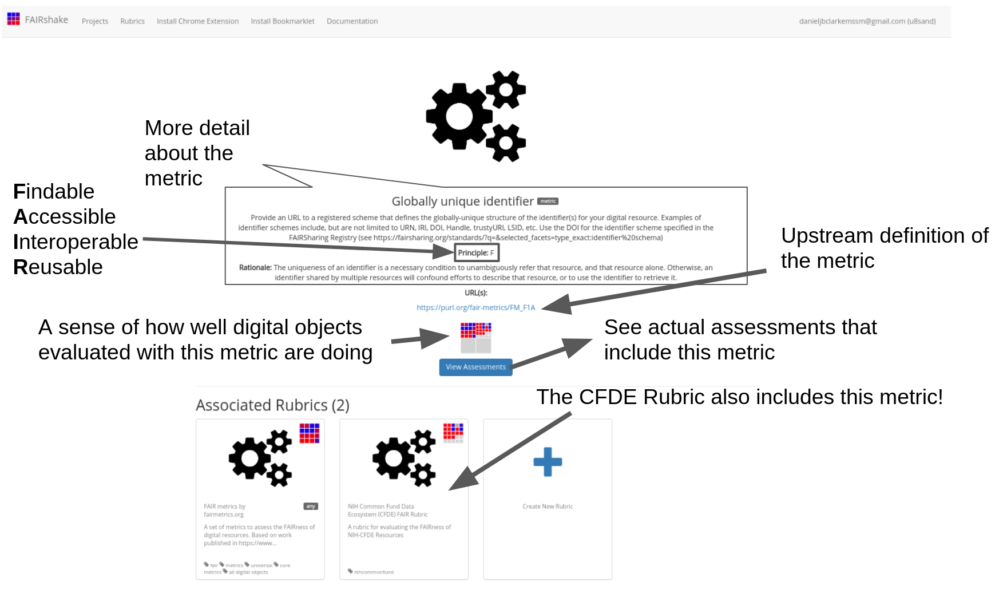
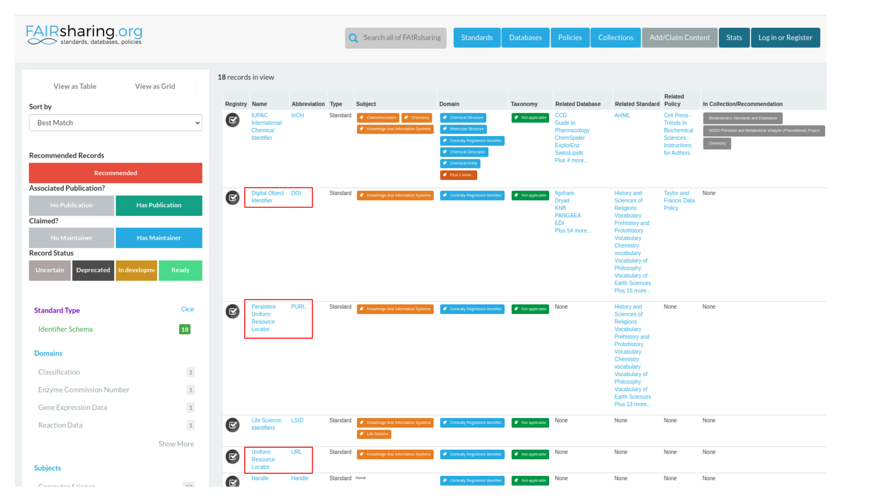
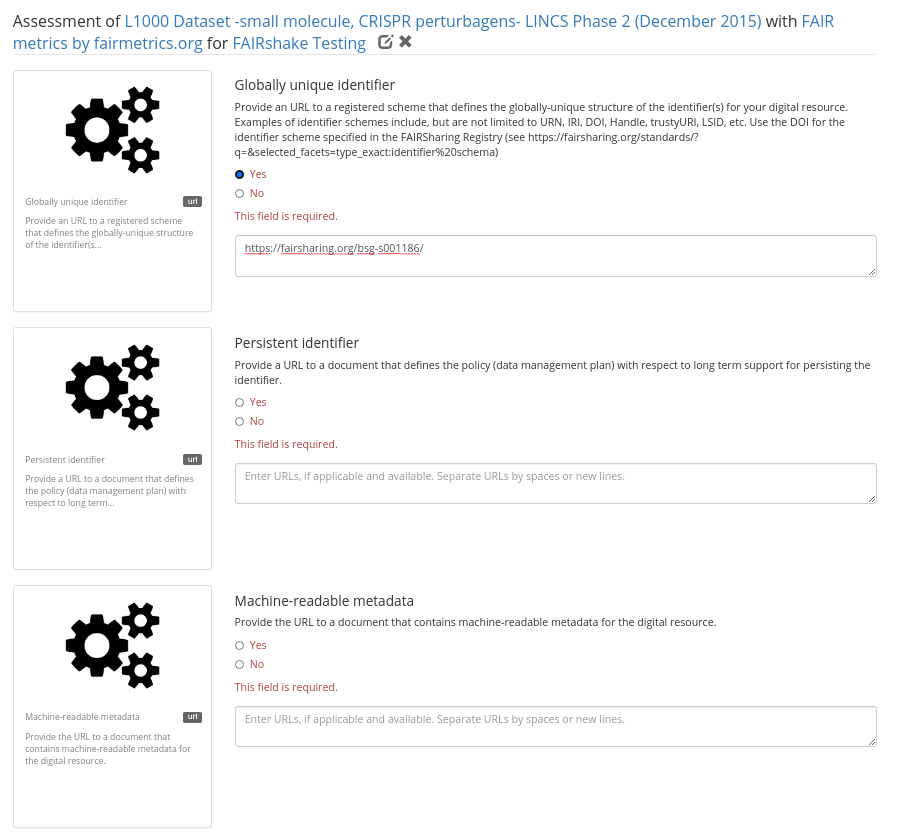
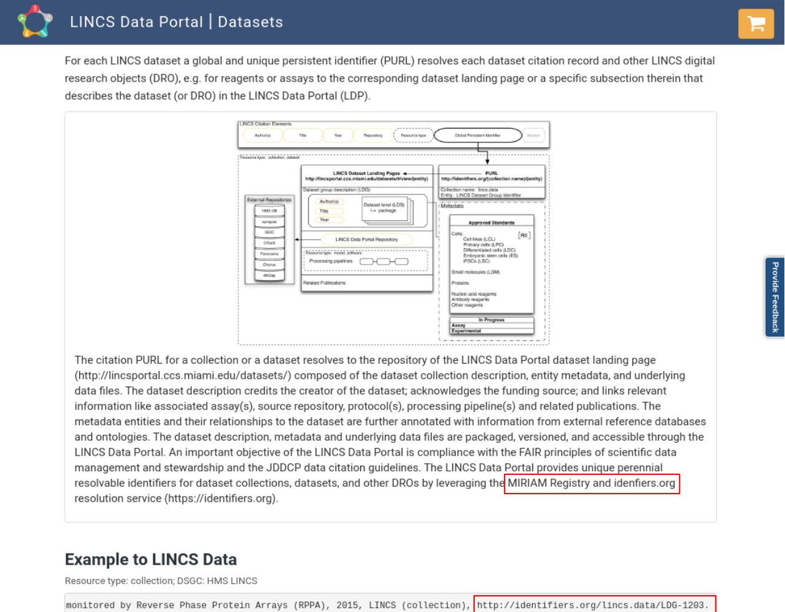
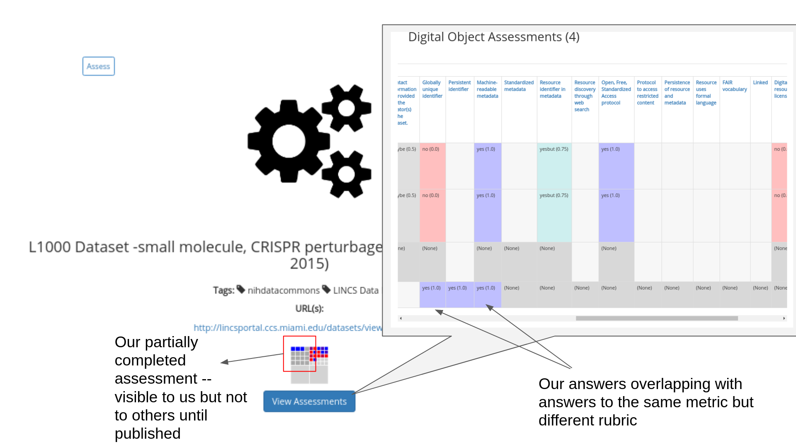

(fcb-assess-fair-fairshake)=
# FAIRshake tool


````{panels_fairplus}
:identifier_text: FCB050
:identifier_link: 'https://w3id.org/faircookbook/FCB050'
:difficulty_level: 3
:recipe_type: hands_on
:reading_time_minutes: 30
:intended_audience: principal_investigator, data_manager, data_scientist 
:maturity_level: 0 
:maturity_indicator: 0
:has_executable_code: nope
:recipe_name: Assessing with FAIRshake
```` 


````{note} 

```{image} ./images/CFDE-logo.png 
:width: 100px
:align: right
```
This is a tutorial that demonstrates how to use FAIRshake to perform FAIR evaluations of DATS serialized metadata in the context of the CFDE.

This recipe was originally write for the NIH Common Fund Data Ecosystem and is reproduced here for convenience.
````

## Background

Adhering to [FAIRness](https://cfde-published-documentation.readthedocs-hosted.com/en/latest/CFDE-glossary/#fair) is somewhat abstract. While all of the components of becoming FAIR can be addressed at some level, it remains difficult to provide a concrete answer about whether something is indeed FAIR or not. In general, improvement is only real if it can be measured. To address this limitation of the FAIR guidelines, [FAIRshake](https://cfde-published-documentation.readthedocs-hosted.com/en/latest/CFDE-glossary/#fairshake) was created with the basic goal of making FAIR more concrete and measurable. While FAIRshake provides a catalog of community-contributed ways to characterize FAIRness, it is still up to a given project to decide which of these criteria they will adopt and/or create {footcite}`Clarke2019`.

FAIRshake provides:

- A catalog of digital objects: these can be, for example,  datasets, APIs, workflows, each having their own unique identity and is the target of a FAIR assessment. That-is whatever the digital object is, you want to assess how much it is Findable, Accessible, Interoperable and Reusable {footcite}`pmid26978244`.
- A catalog of projects: where a project contains any set of digital objects grouped for the purpose of analytic and findability, e.g., all digital objects that belong to a specific NIH Common Fund program could be bundled into one project. If you plan on automating FAIR assessments, it makes sense to do it as part of a project so that assessments can be compared only against other assessments within your project.
- A catalog of metrics: these are any singular FAIR criterion, or a FAIR compliance question, that can often be answered with yes/no/percentage of compliance. It is often the case that manual assessments are qualitative yes (1) / no (0) while automated assessments can often be more granular.
- A catalog of rubrics: these are sets/bundles of FAIR metrics meant to be answered together, e.g., a "FAIR" API should satisfy several independent metrics already registered in FAIRshake, these can be a part of one or more rubrics.
- Facilitation of FAIR assessments: any digital object can be assessed with a given rubric in the context of a project both manually through the FAIRshake website, or 'automatically' by enabling assessment registration over API. Some automatic assessments have been integrated into the manual assessment UI on FAIRshake but this is still under development. Contributing your own automatic assessment modules will be discussed in this tutorial.
- Aggregations of FAIR assessments: FAIRshake provides the FAIR insignia, a look at the average assessments of a given digital object, project, or rubric. It also provides project analytics in the form of a report with summary statistics charts.


## Motivation


By selecting and adhering to a rubric or set of metrics shared by other projects, a resource can independently assert metric conformance thus improving interoperability between resources that share those metrics. Each metric defines a concrete ideal criterion that is desired and satisfaction of that metric can be represented as a percentage or a number between 0 and 1. Some metrics may be categorical, in which case their contribution can be defined as discrete scores from 0 (least desirable) to 1 (most desirable). Given these normalized bounds, we can always compute a single scalar within the same range by finding the mean value of scores.

The FAIR insignia aggregates each metric separately to inform someone where they can do better (metrics that have a low percentage) and where they are already doing well (metrics that have a high percentage). Digital objects may be assessed by different rubrics (sets of metrics), which are often made up of different metrics.

<!--  -->
<!-- <div></div> -->

````{dropdown}
:open:
```{figure} https://fairshake.cloud/static/image/insignia-anatomy.png
---
width: 800px
alt: FAIRshare insignia explained
name: FAIRshare insignia explained
---
FAIRshare insignia explained
```
````


These insignias capture a visual snapshot of a resources' aggregated assessments at a glance. Interactive tooltips shown by hovering over a particular square reveal which metric is represented by that square. Clicking a given box will bring you to a landing page with detailed information about the metric.

It's important to note that these insignias can only represent knowledge that is reported and as such, a "low score" should be interpreted as something to look into and not something to be accused of. It's also important to note that FAIR in general **does not represent quality of data but rather an expectation of how easy it might be to find, access, interoperate with and reuse that data**. By using automated mechanisms or strict clear-cut guidelines we can determine a score for this expectation.

As a simple example, consider a metric which wants to assess whether a citation can be located for a dataset from its landing page (a url); a human would look on the page and report whether they found it or not on the page, a robot might depend on [data citation guidelines](https://www.nature.com/articles/sdata2018259) which would expect to find a DOI or semantically annotated microdata or [JSON-LD](https://cfde-published-documentation.readthedocs-hosted.com/en/latest/CFDE-glossary/#json-ld). While a robot might miss the obvious human-readable citation available on the page, it would also mean that a browser extension or bioinformatic crawling effort **would likely also miss it**. As such, a metric that is *not completely satisfied* may impair a use-case that depends on FAIR. FAIR Assessments can help identify situations like this and drive improvements.

To increase your FAIR score, you should identify which metrics may need improvement, learn more about what that metric covers both theoretically (what the metric says) and concretely (how it was actually assessed). It is important to make sure that you are improving the overall FAIRness of your resource, and not just "hacking the FAIR metrics." In the context of the CFDE, periodic FAIR assessments are performed using a [common rubric based on compliance with the C2M2](https://fairshake.cloud/rubric/36/) which is also detailed in another FAIR recipe dedicated to the CFDE rubric but is also addressed later in this recipe in the context of automated FAIR assessments. We encourage you to question when scores for certain metrics do not reflect what you feel is correct; it will take investigation of the metric itself, your own resource, and the C2M2 metadata models capturing of your resource. We encourage you to re-purpose the rubric we're using along with any additional metrics you hope to satisfy and assess your own resources. Comparing the assessments on your actual data and the assessment on your C2M2 converted data may reveal areas for improvement.


## Ingredients

1. A digital object or set of digital objects to assess for FAIRness
2. A rubric from FAIRshake encapsulating the FAIR metrics you wish to use to perform the FAIR assessments
3. Machine-readable (ideally standardized) metadata description for enabling automated assessments


## Objectives

In this recipe we'll look at the process of performing a FAIR evaluation using FAIRshake starting from scratch and covering various decisions that must be made along the way. We'll use the CFDE DCC resources already [transformed to the C2M2](#fair-repo) as the target of our assessment. This is because an automated assessment that is common across all CF DCCs is not possible without a common machine-readable metadata standard.

1. Use FAIRshake to facilitate FAIR Rubric discovery and development
2. Assess a digital object manually
3. Identify avenues for performing automated assessments
4. Perform an automated assessment on a single digital object serialized with machine-readable metadata, and demonstrate how it can be applied globally
5. Develop an understanding of how well the digital object(s) comply with the chosen rubric
6. Learn how to contribute new automated assessments to the FAIRshake ecosystem


## Recipe

Because these ingredients are generic, we'll scope the recipe by considering a concrete scenario for each part of the recipe.

### Scenario

Janice is a researcher at a Common Fund program who wants to assess her dataset using the CFDE rubric on FAIRshake that was used for the CFDE resources. After performing this assessment, she hopes to discover ways to improve her score. She has a resource in mind but would first like to get familiarized and set up with FAIRshake which she understands might be helpful.

### Using FAIRshake

FAIRshake can be accessed at [fairshake.cloud](https://fairshake.cloud). There are several YouTube tutorials and some general and technical documentation accessible [on the website](https://fairshake.cloud/documentation/).

After [logging in to the website](https://fairshake.cloud/accounts/login/), you will be able to create content on the site including registering a project, digital object, rubric, metric, or performing a FAIR assessment.

After logging in:
<!--  -->

````{dropdown}
:open:
```{figure} ./images/ss8.png
---
width: 800px
alt: FAIRshake login page
name: FAIRshake login page
---
FAIRshake login page
```
````

You're brought back to [the home page](https://fairshake.cloud/?q=lincs&projects=1&digitalobjects=1&rubrics=1&metrics=1) where you can perform searches to locate projects, digital objects, rubrics or metrics by name, perform assessments or add new elements.
<!--  -->

````{dropdown}
:open:
```{figure} ./images/ss9.png
---
width: 800px
alt: FAIRshake performing a search
name: FAIRshake performing a search
---
FAIRshake performing a search
```
````

#### Scenario

Janice is interested in a resource she contributed to: [L1000 dataset of CRISPR perturbagens](http://lincsportal.ccs.miami.edu/datasets/view/LDS-1293). She had a hard time finding it in the search so she decided to try the [FAIRshake Chrome extension](https://fairshake.cloud/chrome_extension/).

<!--  -->
````{dropdown}
:open:
```{figure} ./images/ss10.png
---
width: 800px
alt: FAIRshake Chrome Extension install
name: FAIRshake Chrome Extension install
---
FAIRshake Chrome Extension install
```
````

After installing the extension she went to the [resource's own landing page](http://lincsportal.ccs.miami.edu/datasets/view/LDS-1293) (not the one on FAIRshake!) and activated the extension to find that, in fact, an assessment already exists for her already-C2M2 cataloged resource.

<!--  -->

````{dropdown}
:open:
```{figure} ./images/ss6.png
---
width: 800px
alt: Screenshot showing the FAIRshake chrome extension assessment summary
name: Screenshot showing the FAIRshake chrome extension assessment summary
---
Screenshot showing the FAIRshake chrome extension assessment summary
```
````

She points her mouse over some of the red squares revealing information she doesn't quite understand.

<!--  -->
````{dropdown}
:open:
```{figure} ./images/ss7.png
---
width: 800px
alt: Screenshot showing the FAIRshake chrome extension assessment summary tooltip
name: Screenshot showing the FAIRshake chrome extension assessment summary tooltip
---
Screenshot showing the FAIRshake chrome extension assessment summary tooltip
```
````

Though an assay is listed and described accurately on the page, there is no OBI term available on the page. She hopes to understand how this answer came to be and learn how the detailed and valuable assay information shown on the landing page can be made more FAIR.

### Assess a digital object manually

The C2M2 rubric was developed by the CFDE team to represent the concrete areas of FAIRness that the CFDE plans to focus on and ideally satisfy in order to accomplish several use-cases determined at the beginning of the project. The metrics chosen represent some broad subset of FAIR but don't necessarily cover all aspects necessary to make digital objects FAIR in *your* community.

To that end, and to get a better sense of the scope of the FAIR metrics that could be developed to better serve your community, let's take a look at the [FAIR metrics by fairmetrics.org Rubric](https://fairshake.cloud/rubric/25/). This rubric is a FAIRshake entry for the universal FAIR metrics published in [this paper](https://www.nature.com/articles/sdata2018118), representing a universal set of broad criteria that should apply to all digital objects.

<!-- ] -->
````{dropdown}
:open:
```{figure} ./images/ss1.png
---
width: 800px
alt: FAIR metrics Rubric on FAIRshake
name: FAIR metrics Rubric on FAIRshake
---
FAIR metrics Rubric on FAIRshake
```
````

If you're following along, feel free to pick a digital object of your own that you know well and see if you can complete and publish a manual assessment with it! You can always find and delete it from your account if you choose not to keep it, just be sure not to publish it unless you're happy with it.

#### Scenario

Janice decides to perform a manual assessment of her resource using the FAIRmetrics rubric before digging into the specifics of the CFDE assessment.

<!--  -->
````{dropdown}
:open:
```{figure} ./images/ss11.png
---
width: 500px
alt: View on FAIRshake with extension
name: View on FAIRshake with extension
---
View on FAIRshake with extension
```
````

Which brings her to FAIRshake to see the [relevant information available on FAIRshake](https://fairshake.cloud/?q=http%3A%2F%2Flincsportal.ccs.miami.edu%2Fdatasets%2Fview%2FLDS-1293&projects=1&digitalobjects=1&rubrics=1&metrics=1) related to the page she was on.

<!--  -->
````{dropdown}
:open:
```{figure} ./images/ss12.png
---
width: 800px
alt: View on FAIRshake link location
name: View on FAIRshake link location
---
View on FAIRshake link location
```
````

Alternatively, she could have found or registered her digital object directly on the FAIRshake website with the 'Create New Digital Object' button.

Clicking the assess button, she ends up at [the assessment preparation page](https://fairshake.cloud/assessment/prepare/?q=http%3A%2F%2Flincsportal.ccs.miami.edu%2Fdatasets%2Fview%2FLDS-1293&projects=1&digitalobjects=1&rubrics=1&metrics=1&target=8901).

<!--  -->
````{dropdown}
:open:
```{figure} ./images/ss13.png
---
width: 800px
alt: Preparing an assessment on FAIRshake
name: Preparing an assessment on FAIRshake
---
Preparing an assessment on FAIRshake
```
````

The digital object and its only rubric were selected automatically, but she ends up instead [select the fairmetrics rubric](https://fairshake.cloud/assessment/prepare/?target=8901&rubric=25).

<!--  -->
````{dropdown}
:open:
```{figure} ./images/ss14.png
---
width: 800px
alt: Selecting the FAIRmetrics rubric
name: Selecting the FAIRmetrics rubric
---
Selecting the FAIRmetrics rubric
```
````

Instead of using the CFDE project, she will perform this assessment as part of the FAIRshake testing project. It will likely make sense to create our own project if we expect to do a bunch of related assessments.

<!--  -->
````{dropdown}
:open:
```{figure} ./images/ss15.png
---
width: 800px
alt: Selecting the FAIRmetrics project
name: Selecting the FAIRmetrics project
---
Selecting the FAIRmetrics project
```
````

It's also important to note that project here can be left blank if our assessment isn't for any project.

<!--  -->
````{dropdown}
:open:
```{figure} ./images/ss16.png
---
width: 800px
alt: Preparing the FAIRshake Assessment
name: Preparing the FAIRshake Assessment
---
Preparing the FAIRshake Assessment
```
````

Confirming this, Janice [begins a manual assessment](https://fairshake.cloud/assessment/prepare/?target=8901&rubric=25&project=55).

<!--  -->
````{dropdown}
:open:
```{figure} ./images/ss17.png
---
width: 800px
alt: Performing a Manual Assessment with FAIRshake
name: Performing a Manual Assessment with FAIRshake
---
Performing a Manual Assessment with FAIRshake
```
````

Each metric represents a concept pertinent to FAIRness which is described shortly before each prompt but potentially in more depth on the metrics' landing page. Clicking on the metric "card" to the left of the question she gets [much more information in a new tab](https://fairshake.cloud/metric/104/).

<!--  -->
````{dropdown}
:open:
```{figure} ./images/ss18.png
---
width: 800px
alt: Global unique identifier metric on FAIRshake
name: Global unique identifier metric on FAIRshake
---
Global unique identifier metric on FAIRshake
```
````

[Clicking 'View assessments'](https://fairshake.cloud/metric/104/assessments/) she can even see what other digital objects in the database got as an answer during an assessment through a tabular view.

<!--  -->
````{dropdown}
:open:
```{figure} ./images/ss19.png
---
width: 800px
alt: Assessments for Global unique identifier
name: Assessments for Global unique identifier
---
Assessments for Global unique identifier
```
````

Clicking on any of these links will allow you to explore the projects, rubrics, or digital objects that were assessed to provide a more elaborate sense of why a particular score was received and in what context, we can see, for example, that these top entries refer to assessments made during an EBI workshop.

Getting back to the assessment, Janice must determine whether the digital object satisfies the criterion at hand. This one asks us to provide a standard that defines the globally-unique structure of the identifier used for the resource.

<!--  -->
````{dropdown}
:open:
```{figure} ./images/ss20.png
---
width: 800px
alt: Identifying identifiers
name: Identifying identifiers
---
Identifying identifiers
```
````

She finds out quite quickly that there are several identifiers:
- the data source: http://www.ncbi.nlm.nih.gov/geo/query/acc.cgi?acc=GSE70138
  - the data source's local identifier GSE70138
- the local identifier: LDS-1293
- the url is an identifier <http://lincsportal.ccs.miami.edu/datasets/view/LDS-1293>

While all of these are identifiers, not all of them are used outside of the resource itself and thus shared as "globally" accepted. The *scheme* however is shared because URL [appears in the FAIRsharing database](https://fairsharing.org/standards/?q=&selected_facets=type_exact:identifier%20schema) along with DOI and other standardized identifier schemes.

<!--  -->

````{dropdown}
:open:
```{figure} ./images/ss21.png
---
width: 800px
alt: FAIRsharing identifiers
name: FAIRsharing identifiers
---
FAIRsharing identifiers
```
````

A **URL** provides some level of standardization more than, say, a digital object that *doesn't have a resolvable URL*. But other identifier schemes may carry with them even more information, like a **DOI** which adds additional semantic interoperability conditions not present on URLs. Thus in certain circumstances, a URL might be good enough, but in others, a more specific standardized identifier might be more pertinent.

While a DOI guarantees authorship information associated with it, a URL may very well contain absolutely anything. Furthermore, many organizations have come together to try to guarantee that DOIs will not change, while URLs can be changed or removed by the owner of the resource.

Thus the matric *is* satisfied in a broad context, though if the question was more specific, for instance -- "is there a DOI for this digital object?" She might have answered differently. Hopefully this demonstration helps to illuminate the need for establishing more specific metrics relevant to your community. The more quantitative a metric is, the more stable and useful it will be when measured.

<!--  -->

````{dropdown}
:open:
```{figure} ./images/ss22.png
---
width: 800px
alt: Answer to question 1
name: Answer to question 1
---
Answer to question 1
```
````


The next metric, persistent identifier, addresses persistence specifically and asks for a document describing the persistent identifier strategy. There is no obvious identifier type that guarantees this so she chooses to investigate further. After some digging she finds information about citation [in the terms](http://lincsportal.ccs.miami.edu/datasets/terms):

<!--  -->

````{dropdown}
:open:
```{figure} ./images/ss23.png
---
width: 800px
alt: LINCS dataset terms
name: LINCS dataset terms
---
LINCS dataset terms
```
````

This reveals that our local identifiers are registered in [identifiers.org](http://identifiers.org/), also recognized as [a standard in FAIRsharing](https://fairsharing.org/FAIRsharing.nknzhj). In fact she could create a few more identifiers with this knowledge:

- `lincs.data:LDS-1293`
- http://identifiers.org/lincs.data/LDS-1293

Even if LINCS decides to change the URL structure of its webpage, there is an expectation that these identifiers will be persistent and *not* change in structure. According to the terms, these are meant to be "global and unique persistent identifiers." These identifiers could likely satisfy the persistent identifier criterion citing the scheme [as it is registered in identifiers.org](https://registry.identifiers.org/registry/lincs.data), but they are not immediately obvious and available on the landing page.

This demonstrates a scenario where even though LINCS *has* persistent identifiers somewhere, they might not be discovered during the FAIR assessment. Whether we found the answer or not, we can learn something that can be improved.

<!--  -->

````{dropdown}
:open:
```{figure} ./images/ss24.png
---
width: 800px
alt: Answer to question 2
name: Answer to question 2
---
Answer to question 2
```
````

Lastly we'll look at the machine readable metadata before discussing automated assessments.

FAIR strives to make things more Findable, Accessible, Interoperable, and Reusable, not just from a human perspective but also for a machine. With the massive amounts of data available in the public domain, many researchers conduct research by automatically locating data and operating with it without ever directly picking and choosing data sets. To this end it's important that the FAIR principles also be considered from a machine perspective. For example, though the assay is well described on our page, would someone be able to automatically identify datasets on our page with certain criteria such as data or assay-type?

In this vein, machine readable metadata should ideally be available and documented. Again, it is not quite clear from the landing page or even from browsing the website, that there [*is* a public API documentation](https://smart-api.info/ui/1ad2cba40cb25cd70d00aa8fba9cfaf3) documented and registered in [SmartAPI](https://smart-api.info/), another community resource [also recognized by FAIRsharing](https://fairsharing.org/search/?q=smartapi).

This API provides a structured way of accessing the information on the website making dataset selection and filterability more viable but nonetheless still not trivial. As such we could say that we have machine-readable metadata but it doesn't express the full picture.

<!--  -->

````{dropdown}
:open:
```{figure} ./images/ss25.png
---
width: 800px
alt: Answer to question 3
name: Answer to question 3
---
Answer to question 3
```
````


Hopefully it is clear that the FAIR metrics are broad ideas of things to think about when it comes to FAIR, but we'll likely need some more strict and concrete criterion if we're to measure FAIRness with precision. Furthermore, finding this information is a time consuming process and would be intractable with a large enough set of digital objects.

This is where automated assessments and quantifiable metrics come in to help measure the moving target that is FAIRness. It is important to recognize at this point that a "good" or "bad" score produced by manual assessment does little more than prompt discussion. Can someone who *doesn't* know your resource well come up with the same FAIR assessment as you? If your information isn't blatantly obvious the answer will probably be **no**, and this is still valueable even if it's not the precise situation.

When we're done with our assessment (or just want to save it for later) we can save, publish or delete it at the bottom of the assessment. Once published, an assessment cannot be modified, only one assessment on the same target, rubric, project can be worked on (without publishing) at a time. It's important to note that comments and urls will only be accessible to the authors of the digital object, the assessment, or the project in which it is assessed.

<!--  -->

````{dropdown}
:open:
```{figure} ./images/ss26.png
---
width: 800px
alt: Save publish or delete assessment
name: Save publish or delete assessment
---
Save publish or delete assessment
```
````

If you complete and publish an assessment, your answers will become associated with the digital object that you assessed, and this information will be used for rendering the insignia and performing the analytics for that digital object.

<!--  -->

````{dropdown}
:open:
```{figure} ./images/ss27.png
---
width: 800px
alt: Assessment shown on FAIRshake
name: Assessment shown on FAIRshake
---
Assessment shown on FAIRshake
```
````


Though the assessments seem to agree that the digital object has machine readable metadata, it's unclear from an outsider's perspective whether or not a globally unique identifier is present. Next, we'll find out exactly why, since those were reported by an automated assessment.

### Perform automated assessments

The C2M2 Metadata model defines a unified structure which all DCCs will be converting their own metadata to. With this machine-readable metadata, we can assess FAIRness in an automatic fashion based on the fields available to us. Scripts which demonstrate the conversion of several DCC metadata into the C2M2 are available [here](#fair-repo), and scripts to assess that unified metadata for its compliance with the CFDE Rubric are [here](#fair-repo-assessments).

We produced reports over time on the assessments that were executed on the CFDE portal and will continue to do so. This report is summarized [here](#fair-repo-report). The assessment script can be executed once you have generated C2M2 converted data; documentation for this is out of the scope of this recipe.

If you have a frictionless datapackage containing your data, you can perform a FAIR assessment on that datapackage to identify gaps in your metadata. The script is also capable of performing FAIR assessments on the public repository via the DERIVA API.

Please note that you need access to the [CFDE FAIR Repo](#fair-repo) to access these scripts.

```bash
git clone https://github.com/nih-cfde/FAIR.git
cd Demos/FAIRAssessment/c2m2

# see script help for more options
python3 assess.py --help

# perform a complete assessment with your frictionless datapackage
python3 assess.py --offline-package=/your/datapackage.json --output-file=output.jsonl
```

Please note that this script tests a number of metrics including validating terms against ontologies, probing links to see if they are available and more, and as such may take some time to run on large amounts of data.

The resulting file, results.tsv, contains a table with the results of the assessment which include answers to each metric for each file in your [Frictionless Datapackage](https://cfde-published-documentation.readthedocs-hosted.com/en/latest/CFDE-glossary/#frictionless-data-package). These results should be inspected to determine areas which can be improved. They can be interrogated offline with your favorite spreadsheet program or in the context of the other data [using the same report we produce](#fair-repo-report), or they can be published onto FAIRshake directly see [Registering assessments on FAIRshake](#Registering-assessments-on-FAIRshake).


### Building your own Automated Assessment

For assessments on completely new sets of digital objects with a completely new rubric, you need to build your own automated assessments. We'll walk through how one might go about doing this.


#### Preparing to Build an Automated Assessment

Certain standards are well-defined and designed in a way that makes it possible to computationally verify whether a digital object is complying with the standard. In an ideal world, all standards should be made in this way, such that an automated mechanism exists for confirming compliance. In reality, however, many standards are not--ultimately necessitating harmonization before datasets, APIs, or anything to be used together.


Some examples of well-defined standards are TCP/IP and HTTP. The effectiveness of these standards and their adoption enables the internet to function and grow as it does. Another, more relevant standard is [RDF](https://cfde-published-documentation.readthedocs-hosted.com/en/latest/CFDE-glossary/#rdf). RDF defines a way to serialize metadata and permits harmonization via ontologies or shape constraint languages (such as [SHACL](https://www.w3.org/TR/shacl/)). Another standard that is not explicitly based on RDF is [JSON Schema](https://cfde-published-documentation.readthedocs-hosted.com/en/latest/CFDE-glossary/#json-schema). JSON Schema builds off of [JSON](https://cfde-published-documentation.readthedocs-hosted.com/en/latest/CFDE-glossary/#json) and allows one to use json itself to define what is a valid JSON instance of some metadata. A JSON Schema document can effectively become its own standard given that it is well described and validatable using a JSON Schema validator.


In the case of assessing digital objects that comply with standards that are defined using mechanisms easily validated, automated assessments become simple and in many cases involve simply taking advantage of already constructed mechanisms for asserting compliance with those standards. In the case that those standards are not well-defined; the best course of action would be to convert those digital objects to an alternative and validatable standard, or alternatively formally codify the standard. In either case, you're doing some FAIRification in an effort to even begin the assessment. We have to do this step because we can't measure compliance with a standard if we don't have a quantifiable standard in the first place! Well we could do it but only manually.


#### Case Study: Performing an Automated Assessment on DATS


One can think of an automated assessment as a unit/integration test for compliance with a standard. Ideally, this test will reveal issues with integration at the digital object provider level at the benefit of the consumer of those digital objects. Automated assessments are only possible on existing machine-readable metadata and validatable standards, such as [DATS](https://cfde-published-documentation.readthedocs-hosted.com/en/latest/CFDE-glossary/#dats). As such we'll utilize DATS for our assessment; not only will we assess compliance with DATS itself, we'll go further with several additional 'optional' parts of DATS including ontological term verification and other sanity checks.


While there are several ways one can go about making an assessment, one way is to construct the rubric and metrics metadata while you construct the code to assert that metric.


```python
rubric = {
  '@id': 25, # ID in FAIRshake
  'name': 'NIH CFDE Interoperability',
  'description': 'This rubric identifies aspects of the metadata models which promote interoperable dataset querying and filtering',
  'metrics': {},
}

def metric(schema):
  ''' A python decorator for registering a metric for the rubric. Usage:
  @metric({
    '@id': unique_id,
    'metric': 'metadata'
  })
  def _(asset):
    yield { 'value': 1.0, 'comment': 'Success' }
  '''
  global rubric
  def wrapper(func):
    rubric['metrics'][schema['@id']] = dict(schema, func=func)
  setattr(wrapper, '__name__', schema['name'])
  return wrapper

def assess(rubric, doc):
  ''' How to use use this rubric for assessing a document. Usage:
  assess(rubric, { "your": "metadata" })
  '''
  assessment = {
    '@type': 'Assessment',
    'target': doc,
    'rubric': rubric['@id'],
    'answers': []
  }
  # print(assessment)
  for metric in rubric['metrics'].values():
    # print('Checking {}...'.format(metric['name']))
    for answer in metric['func'](doc):
      # print(' => {}'.format(answer))
      assessment['answers'].append({
        'metric': { k: v for k, v in metric.items() if k != 'func' },
        'answer': answer,
      })
  return assessment
```


With these functions setup, all we have left is to define the metrics and their metadata, then the assess function can operate on a given document. Let's write a metric for assessing DATS:


```python
@metric({
  '@id': 107, # ID in FAIRshake
  'name': 'DATS',
  'description': 'The metadata properly conforms with the DATS metadata specification',
  'principle': 'Findable',
})
def _(doc):
  from jsonschema import Draft4Validator
  errors = list(Draft4Validator({'$ref': 'http://w3id.org/dats/schema/dataset_schema.json'}).iter_errors(doc))
  yield {
    'value': max(1 - (len(errors) / 100), 0),
    'comment': 'DATS JSON-Schema Validation results in {} error(s)\n{}'.format(
      len(errors) if errors else 'no',
      '\n'.join(map(str, errors))
    ).strip(),
  }

# ... additional metrics ...
```


With this added metric, which uses jsonschema to validate the conformance of the metadata document to the DATS metadata model, an assessment would now produce answers for this specific metric. We've normalized the answers between 0 and 1, you get a 1 for full conformance or a 0 for >= 100 validation errors. It's important to note that this isn't the complete picture, perhaps you have a field for a landing page, but that website is down!


```python
@metric({
  '@id': 16, # ID in FAIRshake
  'name': 'Landing Page',
  'description': 'A landing page exists and is accessible',
  'principle': 'Findable',
})
def _(doc):
  landingPages = set(
    node['access']['landingPage']
    for node in jsonld_frame(doc, {
      '@type': 'DatasetDistribution',
      'access': {
        'landingPage': {},
      }
    })['@graph']
    if node['access'] and node['access']['landingPage']
  )
  if landingPages:
    for landingPage in landingPages:
      if requests.get(landingPage).status_code < 400:
        yield {
          'value': 1,
          'comment': 'Landing page found {} and seems to be accessible'.format(landingPage)
        }
      else:
        yield {
          'value': 0.75,
          'comment': 'Landing page found {} but seems to report a problem'.format(landingPage)
        }
  else:
    yield {
      'value': 0,
      'comment': 'Could not identify any landing pages'
    }

```


Above we have an example which uses jsonld framing to find landing pages, for each of those landing pages we attempt to load the page and expect to get a reasonable http status code (a value less than 400, 200-299 for success, or 300-399 for redirects). This could be improved further to be more stringent (ensure we can find the title of our document on the landing page or something along those lines) but even this basic loose criterion is not always satisfied.


Ultimately this can become a command line application that we run in parallel on lots of DATS metadata. You can refer to the scripts [here](#fair-repo-assessments) for examples on how you can accomplish this. It's also possible to resolve additional metadata in the process of the assessment through forward chaining or other methods, an example of an assessment like that is also [in that repository](#fair-repo-assessments): `data_citation_assessment.py` which uses a url to negotiate and resolve microdata according to this [Data citation paper's guidelines](https://www.nature.com/articles/s41597-019-0031-8).


### Publishing codified FAIRshake metrics and resolvers for assessment reproducibility


It is useful for reproducibility purposes but also for reusability purposes for automated FAIR assessment code to be shared publicly. To that end, a repository for storing that code and its association with the FAIRshake metrics was developed and can be found [here](https://github.com/MaayanLab/fairshake-assessments). This catalog and the code in it can also be used to perform future FAIR assessments that use the same metrics, rubrics, or resolvers. Pull requests are welcome but existing automated mechanisms can immediately be used by installing the package and using some of the core functions. Performing this assessment with that repository works like so:


```python
#!/bin/python
# assumption: DATS objects are generated line by line
# usage: assess.py < input_dats.txt > output_assessments.txt

import sys, json
from fairshake_assessments.core import assess_many_async
from fairshake_assessments.rubrics.rubric_36_nih_cfde import rubric_36_nih_cfde

for assessment in assess_many_async(map(json.loads, sys.stdin)):
  print(json.dumps(assessment))
```


Note that other rubrics, metrics, and resolvers (e.g. ways of finding DATS from a `url`) are available in the `fairshake-assessments` and are associated with some of the FAIRshake metrics.


### <a name="Registering-assessments-on-FAIRshake"></a>Registering assessments on FAIRshake

Now that we've performed our assessment, we should publish these results on FAIRshake for us and the world to see where improvements can be made. It is important to note that the assessment results are a function of all parties (the digital object, the standard, the underlying repository or system that serves the digital object) and as such must be compared relative to the same baseline.

The [fairshake-assessments](https://github.com/maayanLab/fairshake-assessments) library can also help with this.

```python
#!/bin/python
# assumption: assessment objects formatted according to the FAIRshake API in a .jsonl file
# usage: API_KEY='' register.py < assessments.jsonl
# see https://fairshake.cloud/accounts/api_access/ for an API_KEY

import sys
import json
from fairshake_assessments.core import (
  get_fairshake_client,
  find_or_create_fairshake_digital_object,
  publish_fairshake_assessment,
)

project = 87 # project id on fairshake

fairshake = get_fairshake_client(api_key=os.environ['API_KEY'])
for assessment in map(json.loads, sys.stdin):
  target = find_or_create_fairshake_digital_object(fairshake=fairshake, **assessment['target'])
  publish_fairshake_assessment(
    fairshake=fairshake,
    project=project,
    **assessment
  )
```


### Reviewing the state of FAIRness in a project

Once an assessment has been published on FAIRshake, it becomes possible to browse those assessments both via a high level summary page and via a more granular tabular view.

The rubric we used for the CFDE is available from [here](https://fairshake.cloud/rubric/36). It includes most of the universal FAIR metrics but also some metrics that address specific CFDE use-cases such as 'A relevant file type is present and resolvable with EDAM'. This rubric was used to assess the metadata produced by the CFDE for several DCCs as part of [this project](https://fairshake.cloud/project/87), you can also see statistics for those assessments there.

<!--  -->
<!-- <div></div> -->

````{dropdown}
:open:
```{figure} https://github.com/nih-cfde/the-fair-cookbook/blob/dev/content/recipes/04/images/ss5.png?raw=true
---
width: 1000px
alt: Reviewing FAIR assessment breakdown on FAIRshake
name: Reviewing FAIR assessment breakdown on FAIRshake
---
Reviewing FAIR assessment breakdown on FAIRshake
```
````


Each bar is hoverable on FAIRshake indicating which metric is receiving that which particular score. 
The score itself is quantified between 0 and 1 much like the scores used to color the FAIR insignia,
0 representing little to no digital objects satisfy that particular metric and 1 meaning that the majority of digital objects satisfy the metric.

## Conclusion

In this recipe, we have detailed and described the manual and automatic process of FAIRification with FAIRshake 
for a CFDE case study. 
While the assessment described here was for the CFDE DATS serialized assets,
the same process is applicable to any standard and any type of digital object.
Examples exist for assessing APIs, GitHub repositories, and tools, among other case studies using standards applicable to each.
As more standards become codified and accessible through FAIRshake, they will become simpler to evaluate, ultimately 
increasing the FAIRness of the standard itself and anything using that standard.
It should be noted that the process of using FAIRshake for performing assessments is mainly designed to increase 
awareness about standards that digital object producers can apply to improve the FAIRness of the digital assets they produce and publish.


## References
````{dropdown} **References**
```{footbibliography}
```
````

<!-- ### <a name="fair-repo"></a><a name="fair-repo-report"></a><a name="fair-repo-assessments"></a>FAIR Repo -->

````{dropdown} **Supplementary Information**
The CFDE FAIR repository is currently private given that it contains details about DCCs that have not yet been verified.
Please submit a request to <https://www.nih-cfde.org/contact/> if you need access to the repository.

If you have access to the repository, you can access information in it about:
- [scripts](https://github.com/nih-cfde/FAIR) to convert several DCC's publicly facing metadata into C2M2 compatible frictionless data packages organized by DCC name
- [scripts](https://github.com/nih-cfde/FAIR/tree/master/Demos/FAIRAssessment) to automatically assess C2M2 compatible frictionless data packages against the C2M2 rubric on FAIRshake
- [reports](https://github.com/nih-cfde/FAIR/tree/master/Demos/FAIRAssessment/report) showing the satisfaction of the converted DCC metadata with the C2M2 rubric over time (FAIR assessments over time)
````


## Authors

````{authors_fairplus}
Daniel: Writing - Original Draft, Code
````


## License

````{license_fairplus}
CC0-1.0
````
