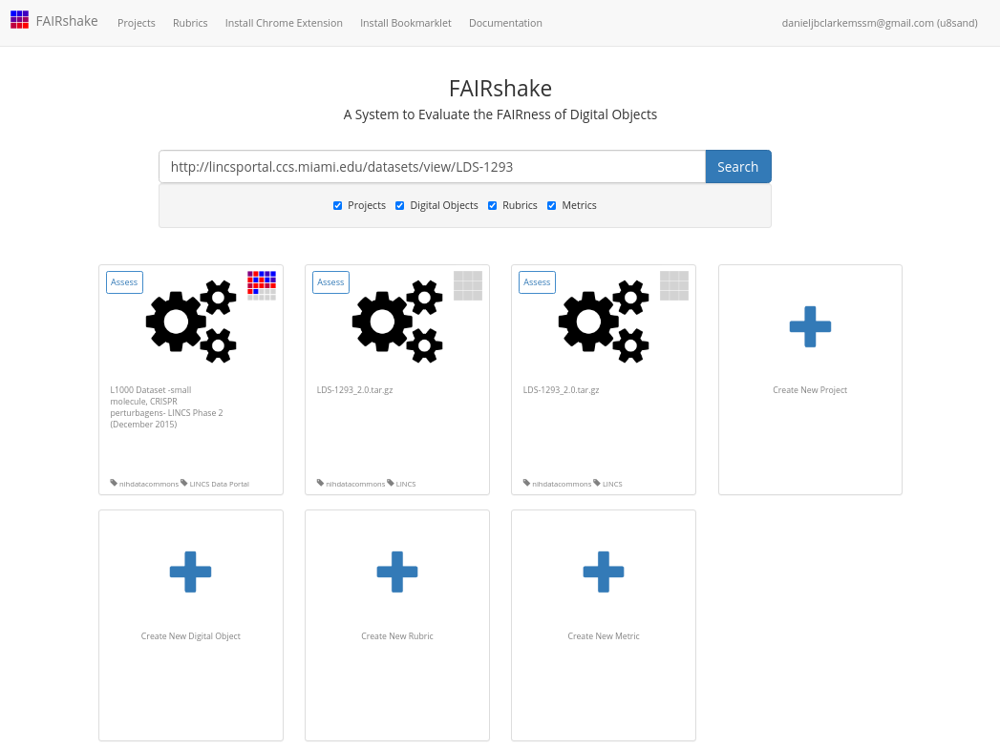

(fcb-assess-fair-fairshake)=
# FAIRshake tool


````{panels_fairplus}
:identifier_text: FCB050
:identifier_link: 'https://w3id.org/faircookbook/FCB050'
:difficulty_level: 3
:recipe_type: hands_on
:reading_time_minutes: 30
:intended_audience: principal_investigator, data_manager, data_scientist 
:maturity_level: 0 
:maturity_indicator: 0
:has_executable_code: nope
:recipe_name: Assessing with FAIRshake
```` 


````{note} 

```{image} ./images/CFDE-logo.png 
:width: 100px
:align: right
```
This is a tutorial that demonstrates how to use FAIRshake to perform FAIR evaluations of DATS serialized metadata in the context of the CFDE.

This recipe was originally write for the NIH Common Fund Data Ecosystem and is reproduced here for convenience.
````

## Background

Adhering to [FAIRness](https://cfde-published-documentation.readthedocs-hosted.com/en/latest/CFDE-glossary/#fair) is somewhat abstract. While all of the components of becoming FAIR (URL_TO_INSERT_RECORD_1216 https://fairsharing.org/FAIRsharing.WWI10U)  can be addressed at some level, it remains difficult to provide a concrete answer about whether something is indeed FAIR (URL_TO_INSERT_RECORD_1217 https://fairsharing.org/FAIRsharing.WWI10U)  or not. In general, improvement is only real if it can be measured. To address this limitation of the FAIR (URL_TO_INSERT_RECORD_1218 https://fairsharing.org/FAIRsharing.WWI10U)  guideline (URL_TO_INSERT_TERM_1215 https://fairsharing.org/search?recordType=reporting_guideline) s, [FAIRshake](https://cfde-published-documentation.readthedocs-hosted.com/en/latest/CFDE-glossary/#fairshake) was created with the basic goal of making FAIR (URL_TO_INSERT_RECORD_1219 https://fairsharing.org/FAIRsharing.WWI10U)  more concrete and measurable. While FAIR (URL_TO_INSERT_RECORD_1220 https://fairsharing.org/FAIRsharing.WWI10U) shake provides a catalog of community-contributed ways to characterize FAIR (URL_TO_INSERT_RECORD_1221 https://fairsharing.org/FAIRsharing.WWI10U) ness, it is still up to a given project (URL_TO_INSERT_TERM_1214 https://fairsharing.org/search?recordType=project)  to decide which of these criteria they will adopt and/or create {footcite}`Clarke2019`.

FAIR (URL_TO_INSERT_RECORD_1222 https://fairsharing.org/FAIRsharing.WWI10U) shake provides:

- A catalog of digital objects: these can be, for example,  datasets, APIs, workflows, each having their own unique identity and is the target of a FAIR (URL_TO_INSERT_RECORD_1223 https://fairsharing.org/FAIRsharing.WWI10U)  assessment. That-is whatever the digital object is, you want to assess how much it is Findable, Accessible, Interoperable and Reusable {footcite}`pmid26978244`.
- A catalog of project (URL_TO_INSERT_TERM_1224 https://fairsharing.org/search?recordType=project) s: where a project (URL_TO_INSERT_TERM_1225 https://fairsharing.org/search?recordType=project)  contains any set of digital objects grouped (URL_TO_INSERT_RECORD_1230 https://fairsharing.org/FAIRsharing.31385c)  for the purpose of analytic and findability, e.g., all digital objects that belong to a specific NIH Common Fund program could be bundled into one project (URL_TO_INSERT_TERM_1226 https://fairsharing.org/search?recordType=project) . If you plan on automating FAIR (URL_TO_INSERT_RECORD_1229 https://fairsharing.org/FAIRsharing.WWI10U)  assessments, it makes sense to do it as part of a project (URL_TO_INSERT_TERM_1227 https://fairsharing.org/search?recordType=project)  so that assessments can be compared only against other assessments within your project (URL_TO_INSERT_TERM_1228 https://fairsharing.org/search?recordType=project) .
- A catalog of metric (URL_TO_INSERT_TERM_1231 https://fairsharing.org/search?recordType=metric) s: these are any singular FAIR (URL_TO_INSERT_RECORD_1232 https://fairsharing.org/FAIRsharing.WWI10U)  criterion, or a FAIR (URL_TO_INSERT_RECORD_1233 https://fairsharing.org/FAIRsharing.WWI10U)  compliance question, that can often be answered with yes/no/percentage of compliance. It is often the case that manual assessments are qualitative yes (1) / no (0) while automated assessments can often be more granular.
- A catalog of rubrics: these are sets/bundles of FAIR (URL_TO_INSERT_RECORD_1236 https://fairsharing.org/FAIRsharing.WWI10U)  metric (URL_TO_INSERT_TERM_1234 https://fairsharing.org/search?recordType=metric) s meant to be answered together, e.g., a "FAIR (URL_TO_INSERT_RECORD_1237 https://fairsharing.org/FAIRsharing.WWI10U) " API should satisfy several independent metric (URL_TO_INSERT_TERM_1235 https://fairsharing.org/search?recordType=metric) s already registered in FAIR (URL_TO_INSERT_RECORD_1238 https://fairsharing.org/FAIRsharing.WWI10U) shake, these can be a part of one or more rubrics.
- Facilitation of FAIR (URL_TO_INSERT_RECORD_1240 https://fairsharing.org/FAIRsharing.WWI10U)  assessments: any digital object can be assessed with a given rubric in the context of a project (URL_TO_INSERT_TERM_1239 https://fairsharing.org/search?recordType=project)  both manually through the FAIR (URL_TO_INSERT_RECORD_1241 https://fairsharing.org/FAIRsharing.WWI10U) shake website, or 'automatically' by enabling assessment registration over API. Some automatic assessments have been integrated into the manual assessment UI on FAIR (URL_TO_INSERT_RECORD_1242 https://fairsharing.org/FAIRsharing.WWI10U) shake but this is still under development. Contributing your own automatic assessment modules will be discussed in this tutorial.
- Aggregations of FAIR (URL_TO_INSERT_RECORD_1245 https://fairsharing.org/FAIRsharing.WWI10U)  assessments: FAIR (URL_TO_INSERT_RECORD_1246 https://fairsharing.org/FAIRsharing.WWI10U) shake provides the FAIR (URL_TO_INSERT_RECORD_1247 https://fairsharing.org/FAIRsharing.WWI10U)  insignia, a look at the average assessments of a given digital object, project (URL_TO_INSERT_TERM_1243 https://fairsharing.org/search?recordType=project) , or rubric. It also provides project (URL_TO_INSERT_TERM_1244 https://fairsharing.org/search?recordType=project)  analytics in the form of a report with summary statistics charts.


## Motivation


By selecting and adhering to a rubric or set of metric (URL_TO_INSERT_TERM_1248 https://fairsharing.org/search?recordType=metric) s shared by other project (URL_TO_INSERT_TERM_1254 https://fairsharing.org/search?recordType=project) s, a resource can independently assert metric (URL_TO_INSERT_TERM_1249 https://fairsharing.org/search?recordType=metric)  conformance thus improving interoperability between resources that share those metric (URL_TO_INSERT_TERM_1250 https://fairsharing.org/search?recordType=metric) s. Each metric (URL_TO_INSERT_TERM_1251 https://fairsharing.org/search?recordType=metric)  defines a concrete ideal criterion that is desired and satisfaction of that metric (URL_TO_INSERT_TERM_1252 https://fairsharing.org/search?recordType=metric)  can be represented as a percentage or a number between 0 and 1. Some metric (URL_TO_INSERT_TERM_1253 https://fairsharing.org/search?recordType=metric) s may be categorical, in which case their contribution can be defined as discrete score (URL_TO_INSERT_RECORD_1255 https://fairsharing.org/FAIRsharing.m283c)  (URL_TO_INSERT_RECORD_1257 https://fairsharing.org/FAIRsharing.xMmOCL) s from 0 (least desirable) to 1 (most desirable). Given these normalized bounds, we can always compute a single scalar within the same range by finding the mean value of score (URL_TO_INSERT_RECORD_1256 https://fairsharing.org/FAIRsharing.m283c)  (URL_TO_INSERT_RECORD_1258 https://fairsharing.org/FAIRsharing.xMmOCL) s.

The FAIR (URL_TO_INSERT_RECORD_1264 https://fairsharing.org/FAIRsharing.WWI10U)  insignia aggregates each metric (URL_TO_INSERT_TERM_1259 https://fairsharing.org/search?recordType=metric)  separately to inform someone where they can do better (metric (URL_TO_INSERT_TERM_1260 https://fairsharing.org/search?recordType=metric) s that have a low percentage) and where they are already doing well (metric (URL_TO_INSERT_TERM_1261 https://fairsharing.org/search?recordType=metric) s that have a high percentage). Digital objects may be assessed by different rubrics (sets of metric (URL_TO_INSERT_TERM_1262 https://fairsharing.org/search?recordType=metric) s), which are often made up of different metric (URL_TO_INSERT_TERM_1263 https://fairsharing.org/search?recordType=metric) s.

<!--  -->
<!-- <div></div> -->

````{dropdown}
:open:
```{figure} https://fairshake.cloud/static/image/insignia-anatomy.png
---
width: 800px
alt: FAIR (URL_TO_INSERT_RECORD_1265 https://fairsharing.org/FAIRsharing.WWI10U) share insignia explained
name: FAIR (URL_TO_INSERT_RECORD_1266 https://fairsharing.org/FAIRsharing.WWI10U) share insignia explained
---
FAIR (URL_TO_INSERT_RECORD_1267 https://fairsharing.org/FAIRsharing.WWI10U) share insignia explained
```
````


These insignias capture a visual snapshot of a resources' aggregated assessments at a glance. Interactive tooltips shown by hovering over a particular square reveal which metric (URL_TO_INSERT_TERM_1268 https://fairsharing.org/search?recordType=metric)  is represented by that square. Clicking a given box will bring you to a landing page with detailed informat (URL_TO_INSERT_TERM_1270 https://fairsharing.org/search?recordType=model_and_format) ion about the metric (URL_TO_INSERT_TERM_1269 https://fairsharing.org/search?recordType=metric) .

It's important to note that these insignias can only represent knowledge that is reported and as such, a "low score (URL_TO_INSERT_RECORD_1272 https://fairsharing.org/FAIRsharing.m283c)  (URL_TO_INSERT_RECORD_1274 https://fairsharing.org/FAIRsharing.xMmOCL) " should be interpreted as something to look into and not something to be accused of. It's also important to note that FAIR (URL_TO_INSERT_RECORD_1276 https://fairsharing.org/FAIRsharing.WWI10U)  in general **does not represent quality of data but rather an expectation of how easy it might be to find, access, interoperate with and reuse that data**. By using automated mechanisms or strict clear-cut guideline (URL_TO_INSERT_TERM_1271 https://fairsharing.org/search?recordType=reporting_guideline) s we can determine a score (URL_TO_INSERT_RECORD_1273 https://fairsharing.org/FAIRsharing.m283c)  (URL_TO_INSERT_RECORD_1275 https://fairsharing.org/FAIRsharing.xMmOCL)  for this expectation.

As a simple example, consider a metric (URL_TO_INSERT_TERM_1277 https://fairsharing.org/search?recordType=metric)  which wants to assess whether a citation can be located for a dataset from its landing page (a url); a human would look on the page and report whether they found it or not on the page, a robot might depend on [data citation guidelines](https://www.nature.com/articles/sdata2018259) which would expect to find a DOI (URL_TO_INSERT_RECORD_1280 https://fairsharing.org/FAIRsharing.hFLKCn)  or semantically annotated microdata or [JSON-LD](https://cfde-published-documentation.readthedocs-hosted.com/en/latest/CFDE-glossary/#json-ld). While a robot might miss the obvious human-readable citation available on the page, it would also mean that a browser extension or bioinformat (URL_TO_INSERT_TERM_1279 https://fairsharing.org/search?recordType=model_and_format) ic crawling effort **would likely also miss it**. As such, a metric (URL_TO_INSERT_TERM_1278 https://fairsharing.org/search?recordType=metric)  that is *not completely satisfied* may impair a use-case that depends on FAIR (URL_TO_INSERT_RECORD_1281 https://fairsharing.org/FAIRsharing.WWI10U) . FAIR (URL_TO_INSERT_RECORD_1282 https://fairsharing.org/FAIRsharing.WWI10U)  Assessments can help identify situations like this and drive improvements.

To increase your FAIR (URL_TO_INSERT_RECORD_1295 https://fairsharing.org/FAIRsharing.WWI10U)  score (URL_TO_INSERT_RECORD_1291 https://fairsharing.org/FAIRsharing.m283c)  (URL_TO_INSERT_RECORD_1293 https://fairsharing.org/FAIRsharing.xMmOCL) , you should identify which metric (URL_TO_INSERT_TERM_1283 https://fairsharing.org/search?recordType=metric) s may need improvement, learn more about what that metric (URL_TO_INSERT_TERM_1284 https://fairsharing.org/search?recordType=metric)  covers both theoretically (what the metric (URL_TO_INSERT_TERM_1285 https://fairsharing.org/search?recordType=metric)  says) and concretely (how it was actually assessed). It is important to make sure that you are improving the overall FAIR (URL_TO_INSERT_RECORD_1296 https://fairsharing.org/FAIRsharing.WWI10U) ness of your resource, and not just "hacking the FAIR (URL_TO_INSERT_RECORD_1297 https://fairsharing.org/FAIRsharing.WWI10U)  metric (URL_TO_INSERT_TERM_1286 https://fairsharing.org/search?recordType=metric) s." In the context of the CFDE, periodic FAIR (URL_TO_INSERT_RECORD_1298 https://fairsharing.org/FAIRsharing.WWI10U)  assessments are performed using a [common rubric based on compliance with the C2M2](https://fairshake.cloud/rubric/36/) which is also detailed in another FAIR (URL_TO_INSERT_RECORD_1299 https://fairsharing.org/FAIRsharing.WWI10U)  recipe dedicated to the CFDE rubric but is also addressed later in this recipe in the context of automated FAIR (URL_TO_INSERT_RECORD_1300 https://fairsharing.org/FAIRsharing.WWI10U)  assessments. We encourage you to question when score (URL_TO_INSERT_RECORD_1292 https://fairsharing.org/FAIRsharing.m283c)  (URL_TO_INSERT_RECORD_1294 https://fairsharing.org/FAIRsharing.xMmOCL) s for certain metric (URL_TO_INSERT_TERM_1287 https://fairsharing.org/search?recordType=metric) s do not reflect what you feel is correct; it will take investigation of the metric (URL_TO_INSERT_TERM_1288 https://fairsharing.org/search?recordType=metric)  itself, your own resource, and the C2M2 metadata model (URL_TO_INSERT_TERM_1290 https://fairsharing.org/search?recordType=model_and_format) s capturing of your resource. We encourage you to re-purpose the rubric we're using along with any additional metric (URL_TO_INSERT_TERM_1289 https://fairsharing.org/search?recordType=metric) s you hope to satisfy and assess your own resources. Comparing the assessments on your actual data and the assessment on your C2M2 converted data may reveal areas for improvement.


## Ingredients

1. A digital object or set of digital objects to assess for FAIR (URL_TO_INSERT_RECORD_1301 https://fairsharing.org/FAIRsharing.WWI10U) ness
2. A rubric from FAIR (URL_TO_INSERT_RECORD_1303 https://fairsharing.org/FAIRsharing.WWI10U) shake encapsulating the FAIR (URL_TO_INSERT_RECORD_1304 https://fairsharing.org/FAIRsharing.WWI10U)  metric (URL_TO_INSERT_TERM_1302 https://fairsharing.org/search?recordType=metric) s you wish to use to perform the FAIR (URL_TO_INSERT_RECORD_1305 https://fairsharing.org/FAIRsharing.WWI10U)  assessments
3. Machine-readable (ideally standard (URL_TO_INSERT_TERM_1306 https://fairsharing.org/search?fairsharingRegistry=Standard) ized) metadata description for enabling automated assessments


## Objectives

In this recipe we'll look at the process of performing a FAIR (URL_TO_INSERT_RECORD_1310 https://fairsharing.org/FAIRsharing.WWI10U)  evaluation using FAIR (URL_TO_INSERT_RECORD_1311 https://fairsharing.org/FAIRsharing.WWI10U) shake starting from scratch and covering various decisions that must be made along the way. We'll use the CFDE DC (URL_TO_INSERT_RECORD_1308 https://fairsharing.org/FAIRsharing.3nx7t)  (URL_TO_INSERT_RECORD_1312 https://fairsharing.org/3547) C resources already [transformed to the C2M2](#fair-repo) as the target of our assessment. This is because an automated assessment that is common across all CF DC (URL_TO_INSERT_RECORD_1309 https://fairsharing.org/FAIRsharing.3nx7t)  (URL_TO_INSERT_RECORD_1313 https://fairsharing.org/3547) Cs is not possible without a common machine-readable metadata standard (URL_TO_INSERT_TERM_1307 https://fairsharing.org/search?fairsharingRegistry=Standard) .

1. Use FAIR (URL_TO_INSERT_RECORD_1314 https://fairsharing.org/FAIRsharing.WWI10U) shake to facilitate FAIR (URL_TO_INSERT_RECORD_1315 https://fairsharing.org/FAIRsharing.WWI10U)  Rubric discovery and development
2. Assess a digital object manually
3. Identify avenues for performing automated assessments
4. Perform an automated assessment on a single digital object serialized with machine-readable metadata, and demonstrate how it can be applied globally
5. Develop an understanding of how well the digital object(s) comply with the chosen rubric
6. Learn how to contribute new automated assessments to the FAIR (URL_TO_INSERT_RECORD_1316 https://fairsharing.org/FAIRsharing.WWI10U) shake ecosystem


## Recipe

Because these ingredients are generic, we'll scope the recipe by considering a concrete scenario for each part of the recipe.

### Scenario

Janice is a research (URL_TO_INSERT_RECORD_1322 https://fairsharing.org/FAIRsharing.52b22c) er at a Common Fund program who wants to assess her dataset using the CFDE rubric on FAIR (URL_TO_INSERT_RECORD_1320 https://fairsharing.org/FAIRsharing.WWI10U) shake that was used for the CFDE resources. After performing this assessment, she hopes to discover ways to improve her score (URL_TO_INSERT_RECORD_1317 https://fairsharing.org/FAIRsharing.m283c)  (URL_TO_INSERT_RECORD_1318 https://fairsharing.org/FAIRsharing.xMmOCL) . She has a resource in mind but would first like to get fam (URL_TO_INSERT_RECORD_1319 https://fairsharing.org/FAIRsharing.d0886a) iliarized and set up with FAIR (URL_TO_INSERT_RECORD_1321 https://fairsharing.org/FAIRsharing.WWI10U) shake which she understands might be helpful.

### Using FAIRshake

FAIR (URL_TO_INSERT_RECORD_1323 https://fairsharing.org/FAIRsharing.WWI10U) shake can be accessed at [fairshake.cloud](https://fairshake.cloud). There are several YouTube tutorials and some general and technical documentation accessible [on the website](https://fairshake.cloud/documentation/).

After [logging in to the website](https://fairshake.cloud/accounts/login/), you will be able to create content on the site including registering a project (URL_TO_INSERT_TERM_1325 https://fairsharing.org/search?recordType=project) , digital object, rubric, metric (URL_TO_INSERT_TERM_1324 https://fairsharing.org/search?recordType=metric) , or performing a FAIR (URL_TO_INSERT_RECORD_1326 https://fairsharing.org/FAIRsharing.WWI10U)  assessment.

After logging in:
<!--  -->

````{dropdown}
:open:
```{figure} ./images/ss8.png
---
width: 800px
alt: FAIR (URL_TO_INSERT_RECORD_1327 https://fairsharing.org/FAIRsharing.WWI10U) shake login page
name: FAIR (URL_TO_INSERT_RECORD_1328 https://fairsharing.org/FAIRsharing.WWI10U) shake login page
---
FAIR (URL_TO_INSERT_RECORD_1329 https://fairsharing.org/FAIRsharing.WWI10U) shake login page
```
````

You're brought back to [the home page](https://fairshake.cloud/?q=lincs&projects=1&digitalobjects=1&rubrics=1&metrics=1) where you can perform search (URL_TO_INSERT_RECORD_1332 https://fairsharing.org/FAIRsharing.52b22c) es to locate project (URL_TO_INSERT_TERM_1331 https://fairsharing.org/search?recordType=project) s, digital objects, rubrics or metric (URL_TO_INSERT_TERM_1330 https://fairsharing.org/search?recordType=metric) s by name, perform assessments or add new elements.
<!--  -->

````{dropdown}
:open:
```{figure} ./images/ss9.png
---
width: 800px
alt: FAIR (URL_TO_INSERT_RECORD_1333 https://fairsharing.org/FAIRsharing.WWI10U) shake performing a search (URL_TO_INSERT_RECORD_1334 https://fairsharing.org/FAIRsharing.52b22c) 
name: FAIR (URL_TO_INSERT_RECORD_1335 https://fairsharing.org/FAIRsharing.WWI10U) shake performing a search (URL_TO_INSERT_RECORD_1336 https://fairsharing.org/FAIRsharing.52b22c) 
---
FAIR (URL_TO_INSERT_RECORD_1337 https://fairsharing.org/FAIRsharing.WWI10U) shake performing a search (URL_TO_INSERT_RECORD_1338 https://fairsharing.org/FAIRsharing.52b22c) 
```
````

#### Scenario

Janice is interested in a resource she contributed to: [L1000 dataset of CRISPR perturbagens](http://lincsportal.ccs.miami.edu/datasets/view/LDS-1293). She had a hard time finding it in the search (URL_TO_INSERT_RECORD_1340 https://fairsharing.org/FAIRsharing.52b22c)  so she decided to try the [FAIR (URL_TO_INSERT_RECORD_1339 https://fairsharing.org/FAIRsharing.WWI10U) shake Chrome extension](https://fairshake.cloud/chrome_extension/).

<!--  -->
````{dropdown}
:open:
```{figure} ./images/ss10.png
---
width: 800px
alt: FAIR (URL_TO_INSERT_RECORD_1341 https://fairsharing.org/FAIRsharing.WWI10U) shake Chrome Extension install
name: FAIR (URL_TO_INSERT_RECORD_1342 https://fairsharing.org/FAIRsharing.WWI10U) shake Chrome Extension install
---
FAIR (URL_TO_INSERT_RECORD_1343 https://fairsharing.org/FAIRsharing.WWI10U) shake Chrome Extension install
```
````

After installing the extension she went to the [resource's own landing page](http://lincsportal.ccs.miami.edu/datasets/view/LDS-1293) (not the one on FAIR (URL_TO_INSERT_RECORD_1344 https://fairsharing.org/FAIRsharing.WWI10U) shake!) and activated the extension to find that, in fact, an assessment already exists for her already-C2M2 cataloged resource.

<!--  -->

````{dropdown}
:open:
```{figure} ./images/ss6.png
---
width: 800px
alt: Screenshot showing the FAIR (URL_TO_INSERT_RECORD_1345 https://fairsharing.org/FAIRsharing.WWI10U) shake chrome extension assessment summary
name: Screenshot showing the FAIR (URL_TO_INSERT_RECORD_1346 https://fairsharing.org/FAIRsharing.WWI10U) shake chrome extension assessment summary
---
Screenshot showing the FAIR (URL_TO_INSERT_RECORD_1347 https://fairsharing.org/FAIRsharing.WWI10U) shake chrome extension assessment summary
```
````

She points her mouse over some of the red squares revealing informat (URL_TO_INSERT_TERM_1348 https://fairsharing.org/search?recordType=model_and_format) ion she doesn't quite understand.

<!--  -->
````{dropdown}
:open:
```{figure} ./images/ss7.png
---
width: 800px
alt: Screenshot showing the FAIR (URL_TO_INSERT_RECORD_1349 https://fairsharing.org/FAIRsharing.WWI10U) shake chrome extension assessment summary tooltip
name: Screenshot showing the FAIR (URL_TO_INSERT_RECORD_1350 https://fairsharing.org/FAIRsharing.WWI10U) shake chrome extension assessment summary tooltip
---
Screenshot showing the FAIR (URL_TO_INSERT_RECORD_1351 https://fairsharing.org/FAIRsharing.WWI10U) shake chrome extension assessment summary tooltip
```
````

Though an assay is listed and described accurately on the page, there is no OBI (URL_TO_INSERT_RECORD_1353 https://fairsharing.org/FAIRsharing.284e1z)  term available on the page. She hopes to understand how this answer came to be and learn how the detailed and valuable assay informat (URL_TO_INSERT_TERM_1352 https://fairsharing.org/search?recordType=model_and_format) ion shown on the landing page can be made more FAIR (URL_TO_INSERT_RECORD_1354 https://fairsharing.org/FAIRsharing.WWI10U) .

### Assess a digital object manually

The C2M2 rubric was developed (URL_TO_INSERT_RECORD_1360 https://fairsharing.org/FAIRsharing.31385c)  by the CFDE team to represent the concrete areas of FAIR (URL_TO_INSERT_RECORD_1357 https://fairsharing.org/FAIRsharing.WWI10U) ness that the CFDE plans to focus on and ideally satisfy in order to accomplish several use-cases determined at the beginning of the project (URL_TO_INSERT_TERM_1356 https://fairsharing.org/search?recordType=project) . The metric (URL_TO_INSERT_TERM_1355 https://fairsharing.org/search?recordType=metric) s chosen represent some broad subset of FAIR (URL_TO_INSERT_RECORD_1358 https://fairsharing.org/FAIRsharing.WWI10U)  but don't necessarily cover all aspects necessary to make digital objects FAIR (URL_TO_INSERT_RECORD_1359 https://fairsharing.org/FAIRsharing.WWI10U)  in *your* community.

To that end, and to get a better sense of the scope of the FAIR (URL_TO_INSERT_RECORD_1363 https://fairsharing.org/FAIRsharing.WWI10U)  metric (URL_TO_INSERT_TERM_1361 https://fairsharing.org/search?recordType=metric) s that could be developed (URL_TO_INSERT_RECORD_1366 https://fairsharing.org/FAIRsharing.31385c)  to better serve your community, let's take a look at the [FAIR metrics by fairmetrics.org Rubric](https://fairshake.cloud/rubric/25/). This rubric is a FAIR (URL_TO_INSERT_RECORD_1364 https://fairsharing.org/FAIRsharing.WWI10U) shake entry for the universal FAIR (URL_TO_INSERT_RECORD_1365 https://fairsharing.org/FAIRsharing.WWI10U)  metric (URL_TO_INSERT_TERM_1362 https://fairsharing.org/search?recordType=metric) s published in [this paper](https://www.nature.com/articles/sdata2018118), representing a universal set of broad criteria that should apply to all digital objects.

<!-- ] -->
````{dropdown}
:open:
```{figure} ./images/ss1.png
---
width: 800px
alt: FAIR (URL_TO_INSERT_RECORD_1368 https://fairsharing.org/FAIRsharing.WWI10U)  metric (URL_TO_INSERT_TERM_1367 https://fairsharing.org/search?recordType=metric) s Rubric on FAIR (URL_TO_INSERT_RECORD_1369 https://fairsharing.org/FAIRsharing.WWI10U) shake
name: FAIR (URL_TO_INSERT_RECORD_1371 https://fairsharing.org/FAIRsharing.WWI10U)  metric (URL_TO_INSERT_TERM_1370 https://fairsharing.org/search?recordType=metric) s Rubric on FAIR (URL_TO_INSERT_RECORD_1372 https://fairsharing.org/FAIRsharing.WWI10U) shake
---
FAIR (URL_TO_INSERT_RECORD_1374 https://fairsharing.org/FAIRsharing.WWI10U)  metric (URL_TO_INSERT_TERM_1373 https://fairsharing.org/search?recordType=metric) s Rubric on FAIR (URL_TO_INSERT_RECORD_1375 https://fairsharing.org/FAIRsharing.WWI10U) shake
```
````

If you're following along, feel free to pick a digital object of your own that you know well and see if you can complete and publish a manual assessment with it! You can always find and delete it from your account if you choose not to keep it, just be sure not to publish it unless you're happy with it.

#### Scenario

Janice decides to perform a manual assessment of her resource using the FAIR (URL_TO_INSERT_RECORD_1377 https://fairsharing.org/FAIRsharing.WWI10U) metric (URL_TO_INSERT_TERM_1376 https://fairsharing.org/search?recordType=metric) s rubric before digging into the specifics of the CFDE assessment.

<!--  -->
````{dropdown}
:open:
```{figure} ./images/ss11.png
---
width: 500px
alt: View on FAIR (URL_TO_INSERT_RECORD_1378 https://fairsharing.org/FAIRsharing.WWI10U) shake with extension
name: View on FAIR (URL_TO_INSERT_RECORD_1379 https://fairsharing.org/FAIRsharing.WWI10U) shake with extension
---
View on FAIR (URL_TO_INSERT_RECORD_1380 https://fairsharing.org/FAIRsharing.WWI10U) shake with extension
```
````

Which brings her to FAIR (URL_TO_INSERT_RECORD_1381 https://fairsharing.org/FAIRsharing.WWI10U) shake to see the [relevant information available on FAIRshake](https://fairshake.cloud/?q=http%3A%2F%2Flincsportal.ccs.miami.edu%2Fdatasets%2Fview%2FLDS-1293&projects=1&digitalobjects=1&rubrics=1&metrics=1) related to the page she was on.

<!--  -->
````{dropdown}
:open:
```{figure} ./images/ss12.png
---
width: 800px
alt: View on FAIR (URL_TO_INSERT_RECORD_1382 https://fairsharing.org/FAIRsharing.WWI10U) shake link location
name: View on FAIR (URL_TO_INSERT_RECORD_1383 https://fairsharing.org/FAIRsharing.WWI10U) shake link location
---
View on FAIR (URL_TO_INSERT_RECORD_1384 https://fairsharing.org/FAIRsharing.WWI10U) shake link location
```
````

Alternatively, she could have found or registered her digital object directly on the FAIR (URL_TO_INSERT_RECORD_1385 https://fairsharing.org/FAIRsharing.WWI10U) shake website with the 'Create New Digital Object' button.

Clicking the assess button, she ends up at [the assessment preparation page](https://fairshake.cloud/assessment/prepare/?q=http%3A%2F%2Flincsportal.ccs.miami.edu%2Fdatasets%2Fview%2FLDS-1293&projects=1&digitalobjects=1&rubrics=1&metrics=1&target=8901).

<!--  -->
````{dropdown}
:open:
```{figure} ./images/ss13.png
---
width: 800px
alt: Preparing an assessment on FAIR (URL_TO_INSERT_RECORD_1386 https://fairsharing.org/FAIRsharing.WWI10U) shake
name: Preparing an assessment on FAIR (URL_TO_INSERT_RECORD_1387 https://fairsharing.org/FAIRsharing.WWI10U) shake
---
Preparing an assessment on FAIR (URL_TO_INSERT_RECORD_1388 https://fairsharing.org/FAIRsharing.WWI10U) shake
```
````

The digital object and its only rubric were selected automatically, but she ends up instead [select the fairmetrics rubric](https://fairshake.cloud/assessment/prepare/?target=8901&rubric=25).

<!--  -->
````{dropdown}
:open:
```{figure} ./images/ss14.png
---
width: 800px
alt: Selecting the FAIR (URL_TO_INSERT_RECORD_1390 https://fairsharing.org/FAIRsharing.WWI10U) metric (URL_TO_INSERT_TERM_1389 https://fairsharing.org/search?recordType=metric) s rubric
name: Selecting the FAIR (URL_TO_INSERT_RECORD_1392 https://fairsharing.org/FAIRsharing.WWI10U) metric (URL_TO_INSERT_TERM_1391 https://fairsharing.org/search?recordType=metric) s rubric
---
Selecting the FAIR (URL_TO_INSERT_RECORD_1394 https://fairsharing.org/FAIRsharing.WWI10U) metric (URL_TO_INSERT_TERM_1393 https://fairsharing.org/search?recordType=metric) s rubric
```
````

Instead of using the CFDE project (URL_TO_INSERT_TERM_1395 https://fairsharing.org/search?recordType=project) , she will perform this assessment as part of the FAIR (URL_TO_INSERT_RECORD_1398 https://fairsharing.org/FAIRsharing.WWI10U) shake testing project (URL_TO_INSERT_TERM_1396 https://fairsharing.org/search?recordType=project) . It will likely make sense to create our own project (URL_TO_INSERT_TERM_1397 https://fairsharing.org/search?recordType=project)  if we expect to do a bunch of related assessments.

<!--  -->
````{dropdown}
:open:
```{figure} ./images/ss15.png
---
width: 800px
alt: Selecting the FAIR (URL_TO_INSERT_RECORD_1401 https://fairsharing.org/FAIRsharing.WWI10U) metric (URL_TO_INSERT_TERM_1399 https://fairsharing.org/search?recordType=metric) s project (URL_TO_INSERT_TERM_1400 https://fairsharing.org/search?recordType=project) 
name: Selecting the FAIR (URL_TO_INSERT_RECORD_1404 https://fairsharing.org/FAIRsharing.WWI10U) metric (URL_TO_INSERT_TERM_1402 https://fairsharing.org/search?recordType=metric) s project (URL_TO_INSERT_TERM_1403 https://fairsharing.org/search?recordType=project) 
---
Selecting the FAIR (URL_TO_INSERT_RECORD_1407 https://fairsharing.org/FAIRsharing.WWI10U) metric (URL_TO_INSERT_TERM_1405 https://fairsharing.org/search?recordType=metric) s project (URL_TO_INSERT_TERM_1406 https://fairsharing.org/search?recordType=project) 
```
````

It's also important to note that project (URL_TO_INSERT_TERM_1408 https://fairsharing.org/search?recordType=project)  here can be left blank if our assessment isn't for any project (URL_TO_INSERT_TERM_1409 https://fairsharing.org/search?recordType=project) .

<!--  -->
````{dropdown}
:open:
```{figure} ./images/ss16.png
---
width: 800px
alt: Preparing the FAIR (URL_TO_INSERT_RECORD_1410 https://fairsharing.org/FAIRsharing.WWI10U) shake Assessment
name: Preparing the FAIR (URL_TO_INSERT_RECORD_1411 https://fairsharing.org/FAIRsharing.WWI10U) shake Assessment
---
Preparing the FAIR (URL_TO_INSERT_RECORD_1412 https://fairsharing.org/FAIRsharing.WWI10U) shake Assessment
```
````

Confirming this, Janice [begins a manual assessment](https://fairshake.cloud/assessment/prepare/?target=8901&rubric=25&project=55).

<!--  -->
````{dropdown}
:open:
```{figure} ./images/ss17.png
---
width: 800px
alt: Performing a Manual Assessment with FAIR (URL_TO_INSERT_RECORD_1413 https://fairsharing.org/FAIRsharing.WWI10U) shake
name: Performing a Manual Assessment with FAIR (URL_TO_INSERT_RECORD_1414 https://fairsharing.org/FAIRsharing.WWI10U) shake
---
Performing a Manual Assessment with FAIR (URL_TO_INSERT_RECORD_1415 https://fairsharing.org/FAIRsharing.WWI10U) shake
```
````

Each metric (URL_TO_INSERT_TERM_1416 https://fairsharing.org/search?recordType=metric)  represents a concept pertinent to FAIR (URL_TO_INSERT_RECORD_1419 https://fairsharing.org/FAIRsharing.WWI10U) ness which is described shortly before each prompt but potentially in more depth on the metric (URL_TO_INSERT_TERM_1417 https://fairsharing.org/search?recordType=metric) s' landing page. Clicking on the metric (URL_TO_INSERT_TERM_1418 https://fairsharing.org/search?recordType=metric)  "card" to the left of the question she gets [much more information in a new tab](https://fairshake.cloud/metric/104/).

<!--  -->
````{dropdown}
:open:
```{figure} ./images/ss18.png
---
width: 800px
alt: Global unique identifier (URL_TO_INSERT_TERM_1421 https://fairsharing.org/search?recordType=identifier_schema)  metric (URL_TO_INSERT_TERM_1420 https://fairsharing.org/search?recordType=metric)  on FAIR (URL_TO_INSERT_RECORD_1422 https://fairsharing.org/FAIRsharing.WWI10U) shake
name: Global unique identifier (URL_TO_INSERT_TERM_1424 https://fairsharing.org/search?recordType=identifier_schema)  metric (URL_TO_INSERT_TERM_1423 https://fairsharing.org/search?recordType=metric)  on FAIR (URL_TO_INSERT_RECORD_1425 https://fairsharing.org/FAIRsharing.WWI10U) shake
---
Global unique identifier (URL_TO_INSERT_TERM_1427 https://fairsharing.org/search?recordType=identifier_schema)  metric (URL_TO_INSERT_TERM_1426 https://fairsharing.org/search?recordType=metric)  on FAIR (URL_TO_INSERT_RECORD_1428 https://fairsharing.org/FAIRsharing.WWI10U) shake
```
````

[Clicking 'View assessments'](https://fairshake.cloud/metric/104/assessments/) she can even see what other digital objects in the database (URL_TO_INSERT_TERM_1429 https://fairsharing.org/search?fairsharingRegistry=Database)  got as an answer during an assessment through a tabular view.

<!--  -->
````{dropdown}
:open:
```{figure} ./images/ss19.png
---
width: 800px
alt: Assessments for Global unique identifier (URL_TO_INSERT_TERM_1430 https://fairsharing.org/search?recordType=identifier_schema) 
name: Assessments for Global unique identifier (URL_TO_INSERT_TERM_1431 https://fairsharing.org/search?recordType=identifier_schema) 
---
Assessments for Global unique identifier (URL_TO_INSERT_TERM_1432 https://fairsharing.org/search?recordType=identifier_schema) 
```
````

Clicking on any of these links will allow you to explore the project (URL_TO_INSERT_TERM_1433 https://fairsharing.org/search?recordType=project) s, rubrics, or digital objects that were assessed to provide a more elaborate sense of why a particular score (URL_TO_INSERT_RECORD_1434 https://fairsharing.org/FAIRsharing.m283c)  (URL_TO_INSERT_RECORD_1435 https://fairsharing.org/FAIRsharing.xMmOCL)  was received and in what context, we can see, for example, that these top entries refer to assessments made during an EBI workshop.

Getting back to the assessment, Janice must determine whether the digital object satisfies the criterion at hand. This one asks us to provide a standard (URL_TO_INSERT_TERM_1436 https://fairsharing.org/search?fairsharingRegistry=Standard)  that defines the globally-unique structure of the identifier (URL_TO_INSERT_TERM_1437 https://fairsharing.org/search?recordType=identifier_schema)  used for the resource.

<!--  -->
````{dropdown}
:open:
```{figure} ./images/ss20.png
---
width: 800px
alt: Identifying identifier (URL_TO_INSERT_TERM_1438 https://fairsharing.org/search?recordType=identifier_schema) s
name: Identifying identifier (URL_TO_INSERT_TERM_1439 https://fairsharing.org/search?recordType=identifier_schema) s
---
Identifying identifier (URL_TO_INSERT_TERM_1440 https://fairsharing.org/search?recordType=identifier_schema) s
```
````

She finds out quite quickly that there are several identifier (URL_TO_INSERT_TERM_1441 https://fairsharing.org/search?recordType=identifier_schema) s:
- the data source: http://www.ncbi.nlm.nih.gov/geo (URL_TO_INSERT_RECORD_1442 https://fairsharing.org/FAIRsharing.5hc8vt) /query/acc.cgi?acc=GSE70138
  - the data source's local identifier (URL_TO_INSERT_TERM_1443 https://fairsharing.org/search?recordType=identifier_schema)  GSE70138
- the local identifier (URL_TO_INSERT_TERM_1444 https://fairsharing.org/search?recordType=identifier_schema) : LDS-1293
- the url is an identifier (URL_TO_INSERT_TERM_1445 https://fairsharing.org/search?recordType=identifier_schema)  <http://lincsportal.ccs.miami.edu/datasets/view/LDS-1293>

While all of these are identifier (URL_TO_INSERT_TERM_1447 https://fairsharing.org/search?recordType=identifier_schema) s, not all of them are used outside of the resource itself and thus shared as "globally" accepted. The *scheme* however is shared because URL (URL_TO_INSERT_RECORD_1450 https://fairsharing.org/FAIRsharing.9d38e2)  [appears in the FAIRsharing database](https://fairsharing.org (URL_TO_INSERT_RECORD_1451 https://fairsharing.org/3518)  (URL_TO_INSERT_RECORD_1452 https://fairsharing.org/3536)  (URL_TO_INSERT_RECORD_1453 https://fairsharing.org/3538) /standards/?q=&selected_facets=type_exact:identifier%20schema) along with DOI (URL_TO_INSERT_RECORD_1449 https://fairsharing.org/FAIRsharing.hFLKCn)  and other standard (URL_TO_INSERT_TERM_1446 https://fairsharing.org/search?fairsharingRegistry=Standard) ized identifier (URL_TO_INSERT_TERM_1448 https://fairsharing.org/search?recordType=identifier_schema)  schemes.

<!--  -->

````{dropdown}
:open:
```{figure} ./images/ss21.png
---
width: 800px
alt: FAIR (URL_TO_INSERT_RECORD_1456 https://fairsharing.org/FAIRsharing.WWI10U) sharing (URL_TO_INSERT_RECORD_1455 https://fairsharing.org/FAIRsharing.2abjs5)  identifier (URL_TO_INSERT_TERM_1454 https://fairsharing.org/search?recordType=identifier_schema) s
name: FAIR (URL_TO_INSERT_RECORD_1459 https://fairsharing.org/FAIRsharing.WWI10U) sharing (URL_TO_INSERT_RECORD_1458 https://fairsharing.org/FAIRsharing.2abjs5)  identifier (URL_TO_INSERT_TERM_1457 https://fairsharing.org/search?recordType=identifier_schema) s
---
FAIR (URL_TO_INSERT_RECORD_1462 https://fairsharing.org/FAIRsharing.WWI10U) sharing (URL_TO_INSERT_RECORD_1461 https://fairsharing.org/FAIRsharing.2abjs5)  identifier (URL_TO_INSERT_TERM_1460 https://fairsharing.org/search?recordType=identifier_schema) s
```
````

A **URL** provides some level of standard (URL_TO_INSERT_TERM_1463 https://fairsharing.org/search?fairsharingRegistry=Standard) ization more than, say, a digital object that *doesn't have a resolvable URL (URL_TO_INSERT_RECORD_1468 https://fairsharing.org/FAIRsharing.9d38e2) *. But other identifier (URL_TO_INSERT_TERM_1466 https://fairsharing.org/search?recordType=identifier_schema)  schemes may carry with them even more informat (URL_TO_INSERT_TERM_1465 https://fairsharing.org/search?recordType=model_and_format) ion, like a **DOI** which adds additional semantic interoperability conditions not present on URL (URL_TO_INSERT_RECORD_1469 https://fairsharing.org/FAIRsharing.9d38e2) s. Thus in certain circumstances, a URL (URL_TO_INSERT_RECORD_1470 https://fairsharing.org/FAIRsharing.9d38e2)  might be good enough, but in others, a more specific standard (URL_TO_INSERT_TERM_1464 https://fairsharing.org/search?fairsharingRegistry=Standard) ized identifier (URL_TO_INSERT_TERM_1467 https://fairsharing.org/search?recordType=identifier_schema)  might be more pertinent.

While a DOI (URL_TO_INSERT_RECORD_1472 https://fairsharing.org/FAIRsharing.hFLKCn)  guarantees authorship informat (URL_TO_INSERT_TERM_1471 https://fairsharing.org/search?recordType=model_and_format) ion associated with it, a URL (URL_TO_INSERT_RECORD_1474 https://fairsharing.org/FAIRsharing.9d38e2)  may very well contain absolutely anything. Furthermore, many organizations have come together to try to guarantee that DOI (URL_TO_INSERT_RECORD_1473 https://fairsharing.org/FAIRsharing.hFLKCn) s will not change, while URL (URL_TO_INSERT_RECORD_1475 https://fairsharing.org/FAIRsharing.9d38e2) s can be changed or removed by the owner of the resource.

Thus the matric *is* satisfied in a broad context, though if the question was more specific, for instance -- "is there a DOI (URL_TO_INSERT_RECORD_1478 https://fairsharing.org/FAIRsharing.hFLKCn)  for this digital object?" She might have answered differently. Hopefully this demonstration helps to illuminate the need for establishing more specific metric (URL_TO_INSERT_TERM_1476 https://fairsharing.org/search?recordType=metric) s relevant to your community. The more quantitative a metric (URL_TO_INSERT_TERM_1477 https://fairsharing.org/search?recordType=metric)  is, the more stable and useful it will be when measured.

<!--  -->

````{dropdown}
:open:
```{figure} ./images/ss22.png
---
width: 800px
alt: Answer to question 1
name: Answer to question 1
---
Answer to question 1
```
````


The next metric (URL_TO_INSERT_TERM_1479 https://fairsharing.org/search?recordType=metric) , persistent identifier (URL_TO_INSERT_TERM_1481 https://fairsharing.org/search?recordType=identifier_schema) , addresses persistence specifically and asks for a document describing the persistent identifier (URL_TO_INSERT_TERM_1482 https://fairsharing.org/search?recordType=identifier_schema)  strategy. There is no obvious identifier (URL_TO_INSERT_TERM_1483 https://fairsharing.org/search?recordType=identifier_schema)  type that guarantees this so she chooses to investigate further. After some digging she finds informat (URL_TO_INSERT_TERM_1480 https://fairsharing.org/search?recordType=model_and_format) ion about citation [in the terms](http://lincsportal.ccs.miami.edu/datasets/terms):

<!--  -->

````{dropdown}
:open:
```{figure} ./images/ss23.png
---
width: 800px
alt: LINCS dataset terms
name: LINCS dataset terms
---
LINCS dataset terms
```
````

This reveals that our local identifier (URL_TO_INSERT_TERM_1485 https://fairsharing.org/search?recordType=identifier_schema) s are registered in [identifiers.org](http://identifiers.org/), also recognized as [a standard (URL_TO_INSERT_TERM_1484 https://fairsharing.org/search?fairsharingRegistry=Standard)  in FAIRsharing](https://fairsharing.org (URL_TO_INSERT_RECORD_1487 https://fairsharing.org/3518)  (URL_TO_INSERT_RECORD_1488 https://fairsharing.org/3536)  (URL_TO_INSERT_RECORD_1489 https://fairsharing.org/3538) /FAIRsharing.nknzhj). In fact she could create a few more identifier (URL_TO_INSERT_TERM_1486 https://fairsharing.org/search?recordType=identifier_schema) s with this knowledge:

- `lincs.data:LDS-1293`
- http://identifiers.org/lincs.data/LDS-1293

Even if LINCS decides to change the URL (URL_TO_INSERT_RECORD_1495 https://fairsharing.org/FAIRsharing.9d38e2)  structure of its webpage, there is an expectation that these identifier (URL_TO_INSERT_TERM_1490 https://fairsharing.org/search?recordType=identifier_schema) s will be persistent and *not* change in structure. According to the terms, these are meant to be "global and unique persistent identifier (URL_TO_INSERT_TERM_1491 https://fairsharing.org/search?recordType=identifier_schema) s." These identifier (URL_TO_INSERT_TERM_1492 https://fairsharing.org/search?recordType=identifier_schema) s could likely satisfy the persistent identifier (URL_TO_INSERT_TERM_1493 https://fairsharing.org/search?recordType=identifier_schema)  criterion citing the scheme [as it is registered in identifiers.org](https://registry.identifiers.org (URL_TO_INSERT_RECORD_1494 https://fairsharing.org/FAIRsharing.n14rc8) /registry/lincs.data), but they are not immediately obvious and available on the landing page.

This demonstrates a scenario where even though LINCS *has* persistent identifier (URL_TO_INSERT_TERM_1496 https://fairsharing.org/search?recordType=identifier_schema) s somewhere, they might not be discovered during the FAIR (URL_TO_INSERT_RECORD_1497 https://fairsharing.org/FAIRsharing.WWI10U)  assessment. Whether we found the answer or not, we can learn something that can be improved.

<!--  -->

````{dropdown}
:open:
```{figure} ./images/ss24.png
---
width: 800px
alt: Answer to question 2
name: Answer to question 2
---
Answer to question 2
```
````

Lastly we'll look at the machine readable metadata before discussing automated assessments.

FAIR (URL_TO_INSERT_RECORD_1499 https://fairsharing.org/FAIRsharing.WWI10U)  strives to make things more Findable, Accessible, Interoperable, and Reusable, not just from a human perspective but also for a machine. With the massive amounts of data available in the public domain, many research (URL_TO_INSERT_RECORD_1501 https://fairsharing.org/FAIRsharing.52b22c) ers conduct research (URL_TO_INSERT_RECORD_1502 https://fairsharing.org/FAIRsharing.52b22c)  by automatically locating data and operating with it without ever directly picking and choosing data sets. To this end it's important that the FAIR (URL_TO_INSERT_RECORD_1500 https://fairsharing.org/FAIRsharing.WWI10U)  principles (URL_TO_INSERT_RECORD_1498 https://fairsharing.org/FAIRsharing.WWI10U)  also be considered from a machine perspective. For example, though the assay is well described on our page, would someone be able to automatically identify datasets on our page with certain criteria such as data or assay-type?

In this vein, machine readable metadata should ideally be available and documented. Again, it is not quite clear from the landing page or even from browsing the website, that there [*is* a public API documentation](https://smart-api.info (URL_TO_INSERT_RECORD_1503 https://fairsharing.org/FAIRsharing.f3jewy) /ui/1ad2cba40cb25cd70d00aa8fba9cfaf3) documented and registered in [SmartAPI](https://smart-api.info (URL_TO_INSERT_RECORD_1504 https://fairsharing.org/FAIRsharing.f3jewy) /), another community resource [also recognized by FAIRsharing](https://fairsharing.org (URL_TO_INSERT_RECORD_1505 https://fairsharing.org/3518)  (URL_TO_INSERT_RECORD_1506 https://fairsharing.org/3536)  (URL_TO_INSERT_RECORD_1507 https://fairsharing.org/3538) /search/?q=smartapi).

This API provides a structured way of accessing the informat (URL_TO_INSERT_TERM_1508 https://fairsharing.org/search?recordType=model_and_format) ion on the website making dataset selection and filterability more viable but nonetheless still not trivial. As such we could say that we have machine-readable metadata but it doesn't express the full picture.

<!--  -->

````{dropdown}
:open:
```{figure} ./images/ss25.png
---
width: 800px
alt: Answer to question 3
name: Answer to question 3
---
Answer to question 3
```
````


Hopefully it is clear that the FAIR (URL_TO_INSERT_RECORD_1511 https://fairsharing.org/FAIRsharing.WWI10U)  metric (URL_TO_INSERT_TERM_1509 https://fairsharing.org/search?recordType=metric) s are broad ideas of things to think about when it comes to FAIR (URL_TO_INSERT_RECORD_1512 https://fairsharing.org/FAIRsharing.WWI10U) , but we'll likely need some more strict and concrete criterion if we're to measure FAIR (URL_TO_INSERT_RECORD_1513 https://fairsharing.org/FAIRsharing.WWI10U) ness with precision. Furthermore, finding this informat (URL_TO_INSERT_TERM_1510 https://fairsharing.org/search?recordType=model_and_format) ion is a time consuming process and would be intractable with a large enough set of digital objects.

This is where automated assessments and quantifiable metric (URL_TO_INSERT_TERM_1514 https://fairsharing.org/search?recordType=metric) s come in to help measure the moving target that is FAIR (URL_TO_INSERT_RECORD_1518 https://fairsharing.org/FAIRsharing.WWI10U) ness. It is important to recognize at this point that a "good" or "bad" score (URL_TO_INSERT_RECORD_1516 https://fairsharing.org/FAIRsharing.m283c)  (URL_TO_INSERT_RECORD_1517 https://fairsharing.org/FAIRsharing.xMmOCL)  produced by manual assessment does little more than prompt discussion. Can someone who *doesn't* know your resource well come up with the same FAIR (URL_TO_INSERT_RECORD_1519 https://fairsharing.org/FAIRsharing.WWI10U)  assessment as you? If your informat (URL_TO_INSERT_TERM_1515 https://fairsharing.org/search?recordType=model_and_format) ion isn't blatantly obvious the answer will probably be **no**, and this is still valueable even if it's not the precise situation.

When we're done with our assessment (or just want to save it for later) we can save, publish or delete it at the bottom of the assessment. Once published, an assessment cannot be modified, only one assessment on the same target, rubric, project (URL_TO_INSERT_TERM_1520 https://fairsharing.org/search?recordType=project)  can be worked on (without publishing) at a time. It's important to note that comments and urls will only be accessible to the authors of the digital object, the assessment, or the project (URL_TO_INSERT_TERM_1521 https://fairsharing.org/search?recordType=project)  in which it is assessed.

<!--  -->

````{dropdown}
:open:
```{figure} ./images/ss26.png
---
width: 800px
alt: Save publish or delete assessment
name: Save publish or delete assessment
---
Save publish or delete assessment
```
````

If you complete and publish an assessment, your answers will become associated with the digital object that you assessed, and this informat (URL_TO_INSERT_TERM_1522 https://fairsharing.org/search?recordType=model_and_format) ion will be used for rendering the insignia and performing the analytics for that digital object.

<!--  -->

````{dropdown}
:open:
```{figure} ./images/ss27.png
---
width: 800px
alt: Assessment shown on FAIR (URL_TO_INSERT_RECORD_1523 https://fairsharing.org/FAIRsharing.WWI10U) shake
name: Assessment shown on FAIR (URL_TO_INSERT_RECORD_1524 https://fairsharing.org/FAIRsharing.WWI10U) shake
---
Assessment shown on FAIR (URL_TO_INSERT_RECORD_1525 https://fairsharing.org/FAIRsharing.WWI10U) shake
```
````


Though the assessments seem to agree that the digital object has machine readable metadata, it's unclear from an outsider's perspective whether or not a globally unique identifier (URL_TO_INSERT_TERM_1526 https://fairsharing.org/search?recordType=identifier_schema)  is present. Next, we'll find out exactly why, since those were reported by an automated assessment.

### Perform automated assessments

The C2M2 Metadata model (URL_TO_INSERT_TERM_1527 https://fairsharing.org/search?recordType=model_and_format)  defines a unified structure which all DC (URL_TO_INSERT_RECORD_1528 https://fairsharing.org/FAIRsharing.3nx7t)  (URL_TO_INSERT_RECORD_1531 https://fairsharing.org/3547) Cs will be converting their own metadata to. With this machine-readable metadata, we can assess FAIR (URL_TO_INSERT_RECORD_1530 https://fairsharing.org/FAIRsharing.WWI10U) ness in an automatic fashion based on the fields available to us. Scripts which demonstrate the conversion of several DC (URL_TO_INSERT_RECORD_1529 https://fairsharing.org/FAIRsharing.3nx7t)  (URL_TO_INSERT_RECORD_1532 https://fairsharing.org/3547) C metadata into the C2M2 are available [here](#fair-repo), and scripts to assess that unified metadata for its compliance with the CFDE Rubric are [here](#fair-repo-assessments).

We produced reports over time on the assessments that were executed on the CFDE portal and will continue to do so. This report is summarized [here](#fair-repo-report). The assessment script can be executed once you have generated C2M2 converted data; documentation for this is out of the scope of this recipe.

If you have a frictionless datapackage containing your data, you can perform a FAIR (URL_TO_INSERT_RECORD_1534 https://fairsharing.org/FAIRsharing.WWI10U)  assessment on that datapackage to identify gaps in your metadata. The script is also capable of performing FAIR (URL_TO_INSERT_RECORD_1535 https://fairsharing.org/FAIRsharing.WWI10U)  assessments on the public repository (URL_TO_INSERT_TERM_1533 https://fairsharing.org/search?recordType=repository)  via the DERIVA API.

Please note that you need access to the [CFDE FAIR Repo](#fair-repo) to access these scripts.

```bash
git clone https://github.com/nih-cfde/FAIR.git
cd Demos/FAIRAssessment/c2m2

# see script help for more options
python3 assess.py --help

# perform a complete assessment with your frictionless datapackage
python3 assess.py --offline-package=/your/datapackage.json --output-file=output.jsonl
```

Please note that this script tests a number of metric (URL_TO_INSERT_TERM_1536 https://fairsharing.org/search?recordType=metric) s including validating terms against ontologies (URL_TO_INSERT_TERM_1537 https://fairsharing.org/search?recordType=terminology_artefact) , probing links to see if they are available and more, and as such may take some time to run on large amounts of data.

The resulting file, results.tsv, contains a table with the results of the assessment which include answers to each metric (URL_TO_INSERT_TERM_1538 https://fairsharing.org/search?recordType=metric)  for each file in your [Frictionless Datapackage](https://cfde-published-documentation.readthedocs-hosted.com/en/latest/CFDE-glossary/#frictionless-data-package). These results should be inspected to determine areas which can be improved. They can be interrogated offline with your favorite spreadsheet program or in the context of the other data [using the same report we produce](#fair-repo-report), or they can be published onto FAIR (URL_TO_INSERT_RECORD_1539 https://fairsharing.org/FAIRsharing.WWI10U) shake directly see [Registering assessments on FAIR (URL_TO_INSERT_RECORD_1540 https://fairsharing.org/FAIRsharing.WWI10U) shake](#Registering-assessments-on-FAIR (URL_TO_INSERT_RECORD_1541 https://fairsharing.org/FAIRsharing.WWI10U) shake).


### Building your own Automated Assessment

For assessments on completely new sets of digital objects with a completely new rubric, you need to build your own automated assessments. We'll walk through how one might go about doing this.


#### Preparing to Build an Automated Assessment

Certain standard (URL_TO_INSERT_TERM_1542 https://fairsharing.org/search?fairsharingRegistry=Standard) s are well-defined and designed in a way that makes it possible to computationally verify whether a digital object is complying with the standard (URL_TO_INSERT_TERM_1543 https://fairsharing.org/search?fairsharingRegistry=Standard) . In an ideal world, all standard (URL_TO_INSERT_TERM_1544 https://fairsharing.org/search?fairsharingRegistry=Standard) s should be made in this way, such that an automated mechanism exists for confirming compliance. In reality, however, many standard (URL_TO_INSERT_TERM_1545 https://fairsharing.org/search?fairsharingRegistry=Standard) s are not--ultimately necessitating harmonization before datasets, APIs, or anything to be used together.


Some examples of well-defined standard (URL_TO_INSERT_TERM_1546 https://fairsharing.org/search?fairsharingRegistry=Standard) s are TCP/IP and HTTP. The effectiveness of these standard (URL_TO_INSERT_TERM_1547 https://fairsharing.org/search?fairsharingRegistry=Standard) s and their adoption enables the internet to function and grow as it does. Another, more relevant standard (URL_TO_INSERT_TERM_1548 https://fairsharing.org/search?fairsharingRegistry=Standard)  is [RDF](https://cfde-published-documentation.readthedocs-hosted.com/en/latest/CFDE-glossary/#rdf). RDF (URL_TO_INSERT_RECORD_1552 https://fairsharing.org/FAIRsharing.p77ph9)  defines a way to serialize metadata and permits harmonization via ontologies (URL_TO_INSERT_TERM_1551 https://fairsharing.org/search?recordType=terminology_artefact)  or shape constraint languages (such as [SHACL](https://www.w3.org/TR/shacl (URL_TO_INSERT_RECORD_1559 https://fairsharing.org/FAIRsharing.f1449d) /)). Another standard (URL_TO_INSERT_TERM_1549 https://fairsharing.org/search?fairsharingRegistry=Standard)  that is not explicitly based on RDF (URL_TO_INSERT_RECORD_1553 https://fairsharing.org/FAIRsharing.p77ph9)  is [JSON (URL_TO_INSERT_RECORD_1554 https://fairsharing.org/FAIRsharing.5bbab9)  Schema](https://cfde-published-documentation.readthedocs-hosted.com/en/latest/CFDE-glossary/#json-schema). JSON (URL_TO_INSERT_RECORD_1555 https://fairsharing.org/FAIRsharing.5bbab9)  Schema builds off of [JSON](https://cfde-published-documentation.readthedocs-hosted.com/en/latest/CFDE-glossary/#json) and allows one to use json itself to define what is a valid JSON (URL_TO_INSERT_RECORD_1556 https://fairsharing.org/FAIRsharing.5bbab9)  instance of some metadata. A JSON (URL_TO_INSERT_RECORD_1557 https://fairsharing.org/FAIRsharing.5bbab9)  Schema document can effectively become its own standard (URL_TO_INSERT_TERM_1550 https://fairsharing.org/search?fairsharingRegistry=Standard)  given that it is well described and validatable using a JSON (URL_TO_INSERT_RECORD_1558 https://fairsharing.org/FAIRsharing.5bbab9)  Schema validator.


In the case of assessing digital objects that comply with standard (URL_TO_INSERT_TERM_1560 https://fairsharing.org/search?fairsharingRegistry=Standard) s that are defined using mechanisms easily validated, automated assessments become simple and in many cases involve simply taking advantage of already constructed mechanisms for asserting compliance with those standard (URL_TO_INSERT_TERM_1561 https://fairsharing.org/search?fairsharingRegistry=Standard) s. In the case that those standard (URL_TO_INSERT_TERM_1562 https://fairsharing.org/search?fairsharingRegistry=Standard) s are not well-defined; the best course of action would be to convert those digital objects to an alternative and validatable standard (URL_TO_INSERT_TERM_1563 https://fairsharing.org/search?fairsharingRegistry=Standard) , or alternatively formally codify the standard (URL_TO_INSERT_TERM_1564 https://fairsharing.org/search?fairsharingRegistry=Standard) . In either case, you're doing some FAIR (URL_TO_INSERT_RECORD_1567 https://fairsharing.org/FAIRsharing.WWI10U) ification in an effort to even begin the assessment. We have to do this step because we can't measure compliance with a standard (URL_TO_INSERT_TERM_1565 https://fairsharing.org/search?fairsharingRegistry=Standard)  if we don't have a quantifiable standard (URL_TO_INSERT_TERM_1566 https://fairsharing.org/search?fairsharingRegistry=Standard)  in the first place! Well we could do it but only manually.


#### Case Study: Performing an Automated Assessment on DATS


One can think of an automated assessment as a unit/integration test for compliance with a standard (URL_TO_INSERT_TERM_1568 https://fairsharing.org/search?fairsharingRegistry=Standard) . Ideally, this test will reveal issues with integration at the digital object provider level at the benefit of the consumer of those digital objects. Automated assessments are only possible on existing machine-readable metadata and validatable standard (URL_TO_INSERT_TERM_1569 https://fairsharing.org/search?fairsharingRegistry=Standard) s, such as [DATS](https://cfde-published-documentation.readthedocs-hosted.com/en/latest/CFDE-glossary/#dats). As such we'll utilize DATS (URL_TO_INSERT_RECORD_1570 https://fairsharing.org/FAIRsharing.e20vsd)  for our assessment; not only will we assess compliance with DATS (URL_TO_INSERT_RECORD_1571 https://fairsharing.org/FAIRsharing.e20vsd)  itself, we'll go further with several additional 'optional' parts of DATS (URL_TO_INSERT_RECORD_1572 https://fairsharing.org/FAIRsharing.e20vsd)  including ontological term verification and other sanity checks.


While there are several ways one can go about making an assessment, one way is to construct the rubric and metric (URL_TO_INSERT_TERM_1573 https://fairsharing.org/search?recordType=metric) s metadata while you construct the code to assert that metric (URL_TO_INSERT_TERM_1574 https://fairsharing.org/search?recordType=metric) .


```python
rubric = {
  '@id': 25, # ID in FAIRshake
  'name': 'NIH CFDE Interoperability',
  'description': 'This rubric identifies aspects of the metadata models which promote interoperable dataset querying and filtering',
  'metrics': {},
}

def metric(schema):
  ''' A python decorator for registering a metric for the rubric. Usage:
  @metric({
    '@id': unique_id,
    'metric': 'metadata'
  })
  def _(asset):
    yield { 'value': 1.0, 'comment': 'Success' }
  '''
  global rubric
  def wrapper(func):
    rubric['metrics'][schema['@id']] = dict(schema, func=func)
  setattr(wrapper, '__name__', schema['name'])
  return wrapper

def assess(rubric, doc):
  ''' How to use use this rubric for assessing a document. Usage:
  assess(rubric, { "your": "metadata" })
  '''
  assessment = {
    '@type': 'Assessment',
    'target': doc,
    'rubric': rubric['@id'],
    'answers': []
  }
  # print(assessment)
  for metric in rubric['metrics'].values():
    # print('Checking {}...'.format(metric['name']))
    for answer in metric['func'](doc):
      # print(' => {}'.format(answer))
      assessment['answers'].append({
        'metric': { k: v for k, v in metric.items() if k != 'func' },
        'answer': answer,
      })
  return assessment
```


With these functions setup, all we have left is to define the metric (URL_TO_INSERT_TERM_1575 https://fairsharing.org/search?recordType=metric) s and their metadata, then the assess function can operate on a given document. Let's write a metric (URL_TO_INSERT_TERM_1576 https://fairsharing.org/search?recordType=metric)  for assessing DATS (URL_TO_INSERT_RECORD_1577 https://fairsharing.org/FAIRsharing.e20vsd) :


```python
@metric({
  '@id': 107, # ID in FAIRshake
  'name': 'DATS',
  'description': 'The metadata properly conforms with the DATS metadata specification',
  'principle': 'Findable',
})
def _(doc):
  from jsonschema import Draft4Validator
  errors = list(Draft4Validator({'$ref': 'http://w3id.org/dats/schema/dataset_schema.json'}).iter_errors(doc))
  yield {
    'value': max(1 - (len(errors) / 100), 0),
    'comment': 'DATS JSON-Schema Validation results in {} error(s)\n{}'.format(
      len(errors) if errors else 'no',
      '\n'.join(map(str, errors))
    ).strip(),
  }

# ... additional metrics ...
```


With this added metric (URL_TO_INSERT_TERM_1578 https://fairsharing.org/search?recordType=metric) , which uses jsonschema to validate the conformance of the metadata document to the DATS (URL_TO_INSERT_RECORD_1581 https://fairsharing.org/FAIRsharing.e20vsd)  metadata model (URL_TO_INSERT_TERM_1580 https://fairsharing.org/search?recordType=model_and_format) , an assessment would now produce answers for this specific metric (URL_TO_INSERT_TERM_1579 https://fairsharing.org/search?recordType=metric) . We've normalized the answers between 0 and 1, you get a 1 for full conformance or a 0 for >= 100 validation errors. It's important to note that this isn't the complete picture, perhaps you have a field for a landing page, but that website is down!


```python
@metric({
  '@id': 16, # ID in FAIRshake
  'name': 'Landing Page',
  'description': 'A landing page exists and is accessible',
  'principle': 'Findable',
})
def _(doc):
  landingPages = set(
    node['access']['landingPage']
    for node in jsonld_frame(doc, {
      '@type': 'DatasetDistribution',
      'access': {
        'landingPage': {},
      }
    })['@graph']
    if node['access'] and node['access']['landingPage']
  )
  if landingPages:
    for landingPage in landingPages:
      if requests.get(landingPage).status_code < 400:
        yield {
          'value': 1,
          'comment': 'Landing page found {} and seems to be accessible'.format(landingPage)
        }
      else:
        yield {
          'value': 0.75,
          'comment': 'Landing page found {} but seems to report a problem'.format(landingPage)
        }
  else:
    yield {
      'value': 0,
      'comment': 'Could not identify any landing pages'
    }

```


Above we have an example which uses jsonld framing to find landing pages, for each of those landing pages we attempt to load the page and expect to get a reasonable http status code (a value less than 400, 200-299 for success, or 300-399 for redirects). This could be improved further to be more string (URL_TO_INSERT_RECORD_1582 https://fairsharing.org/FAIRsharing.9b7wvk) ent (ensure we can find the title of our document on the landing page or something along those lines) but even this basic loose criterion is not always satisfied.


Ultimately this can become a command line application that we run in parallel on lots of DATS (URL_TO_INSERT_RECORD_1584 https://fairsharing.org/FAIRsharing.e20vsd)  metadata. You can refer to the scripts [here](#fair-repo-assessments) for examples on how you can accomplish this. It's also possible to resolve additional metadata in the process of the assessment through forward chaining or other methods, an example of an assessment like that is also [in that repository (URL_TO_INSERT_TERM_1583 https://fairsharing.org/search?recordType=repository) ](#fair-repo-assessments): `data_citation_assessment.py` which uses a url to negotiate and resolve microdata according to this [Data citation paper's guidelines](https://www.nature.com/articles/s41597-019-0031-8).


### Publishing codified FAIRshake metrics and resolvers for assessment reproducibility


It is useful for reproducibility purposes but also for reusability purposes for automated FAIR (URL_TO_INSERT_RECORD_1592 https://fairsharing.org/FAIRsharing.WWI10U)  assessment code to be shared publicly. To that end, a repository (URL_TO_INSERT_TERM_1585 https://fairsharing.org/search?recordType=repository)  for storing that code and its association with the FAIR (URL_TO_INSERT_RECORD_1593 https://fairsharing.org/FAIRsharing.WWI10U) shake metric (URL_TO_INSERT_TERM_1587 https://fairsharing.org/search?recordType=metric) s was developed (URL_TO_INSERT_RECORD_1595 https://fairsharing.org/FAIRsharing.31385c)  and can be found [here](https://github.com (URL_TO_INSERT_RECORD_1591 https://fairsharing.org/FAIRsharing.c55d5e) /MaayanLab/fairshake-assessments). This catalog and the code in it can also be used to perform future FAIR (URL_TO_INSERT_RECORD_1594 https://fairsharing.org/FAIRsharing.WWI10U)  assessments that use the same metric (URL_TO_INSERT_TERM_1588 https://fairsharing.org/search?recordType=metric) s, rubrics, or resolvers. Pull requests are welcome but existing automated mechanisms can immediately be used by installing the package and using some of the core (URL_TO_INSERT_RECORD_1589 https://fairsharing.org/FAIRsharing.m283c)  (URL_TO_INSERT_RECORD_1590 https://fairsharing.org/FAIRsharing.xMmOCL)  functions. Performing this assessment with that repository (URL_TO_INSERT_TERM_1586 https://fairsharing.org/search?recordType=repository)  works like so:


```python
#!/bin/python
# assumption: DATS objects are generated line by line
# usage: assess.py < input_dats.txt > output_assessments.txt

import sys, json
from fairshake_assessments.core import assess_many_async
from fairshake_assessments.rubrics.rubric_36_nih_cfde import rubric_36_nih_cfde

for assessment in assess_many_async(map(json.loads, sys.stdin)):
  print(json.dumps(assessment))
```


Note that other rubrics, metric (URL_TO_INSERT_TERM_1596 https://fairsharing.org/search?recordType=metric) s, and resolvers (e.g. ways of finding DATS (URL_TO_INSERT_RECORD_1598 https://fairsharing.org/FAIRsharing.e20vsd)  from a `url`) are available in the `fairshake-assessments` and are associated with some of the FAIR (URL_TO_INSERT_RECORD_1599 https://fairsharing.org/FAIRsharing.WWI10U) shake metric (URL_TO_INSERT_TERM_1597 https://fairsharing.org/search?recordType=metric) s.


### <a name="Registering-assessments-on-FAIRshake"></a>Registering assessments on FAIRshake

Now that we've performed our assessment, we should publish these results on FAIR (URL_TO_INSERT_RECORD_1602 https://fairsharing.org/FAIRsharing.WWI10U) shake for us and the world to see where improvements can be made. It is important to note that the assessment results are a function of all parties (the digital object, the standard (URL_TO_INSERT_TERM_1600 https://fairsharing.org/search?fairsharingRegistry=Standard) , the underlying repository (URL_TO_INSERT_TERM_1601 https://fairsharing.org/search?recordType=repository)  or system that serves the digital object) and as such must be compared relative to the same baseline.

The [fairshake-assessments](https://github.com (URL_TO_INSERT_RECORD_1603 https://fairsharing.org/FAIRsharing.c55d5e) /maayanLab/fairshake-assessments) library can also help with this.

```python
#!/bin/python
# assumption: assessment objects formatted according to the FAIRshake API in a .jsonl file
# usage: API_KEY='' register.py < assessments.jsonl
# see https://fairshake.cloud/accounts/api_access/ for an API_KEY

import sys
import json
from fairshake_assessments.core import (
  get_fairshake_client,
  find_or_create_fairshake_digital_object,
  publish_fairshake_assessment,
)

project = 87 # project id on fairshake

fairshake = get_fairshake_client(api_key=os.environ['API_KEY'])
for assessment in map(json.loads, sys.stdin):
  target = find_or_create_fairshake_digital_object(fairshake=fairshake, **assessment['target'])
  publish_fairshake_assessment(
    fairshake=fairshake,
    project=project,
    **assessment
  )
```


### Reviewing the state of FAIRness in a project

Once an assessment has been published on FAIR (URL_TO_INSERT_RECORD_1604 https://fairsharing.org/FAIRsharing.WWI10U) shake, it becomes possible to browse those assessments both via a high level summary page and via a more granular tabular view.

The rubric we used for the CFDE is available from [here](https://fairshake.cloud/rubric/36). It includes most of the universal FAIR (URL_TO_INSERT_RECORD_1609 https://fairsharing.org/FAIRsharing.WWI10U)  metric (URL_TO_INSERT_TERM_1605 https://fairsharing.org/search?recordType=metric) s but also some metric (URL_TO_INSERT_TERM_1606 https://fairsharing.org/search?recordType=metric) s that address specific CFDE use-cases such as 'A relevant file type is present and resolvable with EDAM (URL_TO_INSERT_RECORD_1607 https://fairsharing.org/FAIRsharing.a6r7zs) '. This rubric was used to assess the metadata produced by the CFDE for several DC (URL_TO_INSERT_RECORD_1608 https://fairsharing.org/FAIRsharing.3nx7t)  (URL_TO_INSERT_RECORD_1610 https://fairsharing.org/3547) Cs as part of [this project](https://fairshake.cloud/project/87), you can also see statistics for those assessments there.

<!--  -->
<!-- <div></div> -->

````{dropdown}
:open:
```{figure} https://github.com/nih-cfde/the-fair-cookbook/blob/dev/content/recipes/04/images/ss5.png?raw=true
---
width: 1000px
alt: Reviewing FAIR (URL_TO_INSERT_RECORD_1611 https://fairsharing.org/FAIRsharing.WWI10U)  assessment breakdown on FAIR (URL_TO_INSERT_RECORD_1612 https://fairsharing.org/FAIRsharing.WWI10U) shake
name: Reviewing FAIR (URL_TO_INSERT_RECORD_1613 https://fairsharing.org/FAIRsharing.WWI10U)  assessment breakdown on FAIR (URL_TO_INSERT_RECORD_1614 https://fairsharing.org/FAIRsharing.WWI10U) shake
---
Reviewing FAIR (URL_TO_INSERT_RECORD_1615 https://fairsharing.org/FAIRsharing.WWI10U)  assessment breakdown on FAIR (URL_TO_INSERT_RECORD_1616 https://fairsharing.org/FAIRsharing.WWI10U) shake
```
````


Each bar is hoverable on FAIR (URL_TO_INSERT_RECORD_1620 https://fairsharing.org/FAIRsharing.WWI10U) shake indicating which metric (URL_TO_INSERT_TERM_1617 https://fairsharing.org/search?recordType=metric)  is receiving that which particular score (URL_TO_INSERT_RECORD_1618 https://fairsharing.org/FAIRsharing.m283c)  (URL_TO_INSERT_RECORD_1619 https://fairsharing.org/FAIRsharing.xMmOCL) . 
The score (URL_TO_INSERT_RECORD_1621 https://fairsharing.org/FAIRsharing.m283c)  (URL_TO_INSERT_RECORD_1623 https://fairsharing.org/FAIRsharing.xMmOCL)  itself is quantified between 0 and 1 much like the score (URL_TO_INSERT_RECORD_1622 https://fairsharing.org/FAIRsharing.m283c)  (URL_TO_INSERT_RECORD_1624 https://fairsharing.org/FAIRsharing.xMmOCL) s used to color the FAIR (URL_TO_INSERT_RECORD_1625 https://fairsharing.org/FAIRsharing.WWI10U)  insignia,
0 representing little to no digital objects satisfy that particular metric (URL_TO_INSERT_TERM_1626 https://fairsharing.org/search?recordType=metric)  and 1 meaning that the majority of digital objects satisfy the metric (URL_TO_INSERT_TERM_1627 https://fairsharing.org/search?recordType=metric) .

## Conclusion

In this recipe, we have detailed and described the manual and automatic process of FAIR (URL_TO_INSERT_RECORD_1628 https://fairsharing.org/FAIRsharing.WWI10U) ification with FAIR (URL_TO_INSERT_RECORD_1629 https://fairsharing.org/FAIRsharing.WWI10U) shake 
for a CFDE case study. 
While the assessment described here was for the CFDE DATS (URL_TO_INSERT_RECORD_1630 https://fairsharing.org/FAIRsharing.e20vsd)  serialized assets,
the same process is applicable to any standard (URL_TO_INSERT_TERM_1631 https://fairsharing.org/search?fairsharingRegistry=Standard)  and any type of digital object.
Examples exist for assessing APIs, GitHub (URL_TO_INSERT_RECORD_1634 https://fairsharing.org/FAIRsharing.c55d5e)  repositories (URL_TO_INSERT_TERM_1633 https://fairsharing.org/search?recordType=repository) , and tools, among other case studies using standard (URL_TO_INSERT_TERM_1632 https://fairsharing.org/search?fairsharingRegistry=Standard) s applicable to each.
As more standard (URL_TO_INSERT_TERM_1635 https://fairsharing.org/search?fairsharingRegistry=Standard) s become codified and accessible through FAIR (URL_TO_INSERT_RECORD_1636 https://fairsharing.org/FAIRsharing.WWI10U) shake, they will become simpler to evaluate, ultimately 
increasing the FAIR (URL_TO_INSERT_RECORD_1639 https://fairsharing.org/FAIRsharing.WWI10U) ness of the standard (URL_TO_INSERT_TERM_1637 https://fairsharing.org/search?fairsharingRegistry=Standard)  itself and anything using that standard (URL_TO_INSERT_TERM_1638 https://fairsharing.org/search?fairsharingRegistry=Standard) .
It should be noted that the process of using FAIR (URL_TO_INSERT_RECORD_1640 https://fairsharing.org/FAIRsharing.WWI10U) shake for performing assessments is mainly designed to increase 
awareness about standard (URL_TO_INSERT_TERM_1641 https://fairsharing.org/search?fairsharingRegistry=Standard) s that digital object producers can apply to improve the FAIR (URL_TO_INSERT_RECORD_1642 https://fairsharing.org/FAIRsharing.WWI10U) ness of the digital assets they produce and publish.


## References
````{dropdown} **References**
```{footbibliography}
```
````

<!-- ### <a name="fair-repo"></a><a name="fair-repo-report"></a><a name="fair-repo-assessments"></a>FAIR Repo -->

````{dropdown} **Supplementary Information**
The CFDE FAIR repository is currently private given that it contains details about DCCs that have not yet been verified.
Please submit a request to <https://www.nih-cfde.org/contact/> if you need access to the repository.

If you have access to the repository, you can access information in it about:
- [scripts](https://github.com/nih-cfde/FAIR) to convert several DCC's publicly facing metadata into C2M2 compatible frictionless data packages organized by DCC name
- [scripts](https://github.com/nih-cfde/FAIR/tree/master/Demos/FAIRAssessment) to automatically assess C2M2 compatible frictionless data packages against the C2M2 rubric on FAIRshake
- [reports](https://github.com/nih-cfde/FAIR/tree/master/Demos/FAIRAssessment/report) showing the satisfaction of the converted DCC metadata with the C2M2 rubric over time (FAIR assessments over time)
````


## Authors

````{authors_fairplus}
Daniel: Writing - Original Draft, Code
````


## License

````{license_fairplus}
CC0-1.0
````
