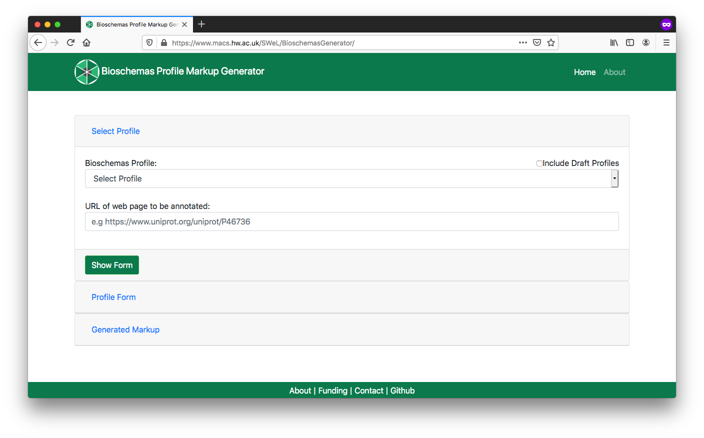

(fcb-find-bs-data)=
# Data page markup with Bioschemas 

+++
<br/>

````{panels_fairplus}
:identifier_text: FCB011
:identifier_link: 'https://w3id.org/faircookbook/FCB011'
:difficulty_level: 2
:recipe_type: guidance
:reading_time_minutes: 10
:intended_audience: software_developer, data_scientist  
:has_executable_code: nope
:recipe_name: Data page markup with Bioschemas
```` 

## Main Objectives

The main purpose of this recipe is:

> To markup a webpage representing a data record with `Bioschemas` compliant markup.

___


## Graphical Overview


```{figure} ./bs-data-mermaid.png
---
width: 800px
name: 
alt: The process of annotated a webpage with bioschema markup for Search Engine discovery
---
The process of annotated a webpage with bioschema markup for Search Engine discovery.
```


___

## Capability & Maturity Table

| Capability  | Initial Maturity Level | Final Maturity Level  |
| :------------- | :------------- | :------------- |
| Findability | minimal | repeatable |
| Interoperability | minimal |  |

----

## Method

We will outline the steps for marking up a page in your site. As a specific example, we will use the Wikidata page for [BRCA1](https://www.wikidata.org/wiki/Q227339).

1. Identify a data page in your site for which you will develop markup

2. Open the [Bioschemas Generator](http://www.macs.hw.ac.uk/SWeL/BioschemasGenerator/)

   1.  Select the type of data page that you are marking up. In the example we will use `GeneRecord`. Here are the main data record profiles to choose from <sup>[1](#draft-profiles)</sup>. 

      - `ChemicalSubstanceRecord` for a page about a chemical substance composed of molecular entities

      - `GeneRecord` for a page about a gene

      - `MolecularEntityRecord` for a page about a single molecular entity

      - `ProteinRecord` for a page about a protein

      - `Sample` for a page about a biological sample
      
      - `Taxon` for a page about a taxon
      
   2. Enter the URL of the page in URL box, e.g. `https://www.wikidata.org/wiki/Q227339`

   3. Click on the `Show Form` button

<!--     -->


```{figure} BioschemasGenerator.png
---
name: bioschemas-generator-start-screen-2
alt: Bioschemas Generator start screen.

---
Bioschemas Generator start screen.
```


3. Complete the profile form with the data relevant for your page. Once completed, click on the `Generate Markup`  button

   - You should complete all *Minimum* properties and as many *Recommended* properties as possible. You can show/hide properties using the `Additional Properties` buttons.
   - The form defaults to the data type with the first alphabetical character, e.g. for `identifier` this defaults to `PropertyValue` but `Text` or `URL ` will be more appropriate in most cases
   - For XXXRecord pages, the first `identifier` property refers to the web page while the second `identifier` property refers to the chemical, gene, protein, ...
   - The right side of the screen gives examples for properties, where these have been provided by the Bioschemas profile authors. Click on the `Show` button to see the example for a specific property. Click on `Minimum`, `Recommended`, or `Optional` to expand/contract the section and see the properties contained at that marginality level

<!--     -->


```{figure} BioschemasGeneratorGeneRecordForm.png
---
height: 550px
name: Bioschemas Generator GeneRecord profile form
alt: Bioschemas Generator GeneRecord profile form
---
Bioschemas Generator GeneRecord profile form.
```

   
4. You should now see the generated markup in `JSON-LD` format. You can click on the `Microdata` and `RDFa` tabs to see the same content rendered in the different formats. However, we recommend the use of `JSON-LD`. For our Wikidata example, we get the following markup

```html
<script type="application/ld+json" >
{
 "@context": "http://schema.org",
 "@id": "https://www.wikidata.org/wiki/Q227339",
 "@type": "DataRecord",
 "dct:conformsTo": "https://bioschemas.org/profiles/DataRecord/0.2-DRAFT-2019_06_14",
 "identifier": "https://www.wikidata.org/wiki/Q227339",
 "mainEntity": {
   "@type": "Gene",
   "dct:conformsTo": "https://bioschemas.org/profiles/Gene/0.7-RELEASE",
   "identifier": "Q227339",
   "description": "protein-coding gene in the species Homo sapiens",
   "encodesBioChemEntity": {
     "@type": "BioChemEntity",
     "@id": "https://www.wikidata.org/wiki/Q17487737"
   },
   "isPartOfBioChemEntity": {
     "@type": "BioChemEntity",
     "@id": "https://www.wikidata.org/wiki/Q220677"
   },
   "url": "https://www.wikidata.org/wiki/Q227339",
   "alternateName": [
     "breast cancer 1, early onset",
     "BRCAI",
			"BRCC1",
			"BROVCA1",
			"IRIS",
			"PNCA4",
			"PPP1R53",
			"PSCP",
			"RNF53",
			"FANCS",
			"breast cancer 1",
			"BRCA1, DNA repair associated",
			"BRCA1 DNA repair associated"
   ],
   "image": {
     "@type": "ImageObject",
     "@id": "https://upload.wikimedia.org/wikipedia/commons/thumb/e/e1/Protein_BRCA1_PDB_1jm7.png/220px-Protein_BRCA1_PDB_1jm7.png"
   },
   "taxonomicRange": {
     "@type": "Taxon",
     "@id": "https://www.wikidata.org/wiki/Q15978631"
   },
   "sameAs": [
     "https://meshb.nlm.nih.gov/#/record/ui?ui=D019398",
     "https://www.ncbi.nlm.nih.gov/nuccore/NR_027676",
     "http://identifiers.org/ensembl/ENSG00000012048",
     "https://www.ncbi.nlm.nih.gov/gene/672"
   ]
 },
 "sameAs": [
   "http://identifiers.org/ncbigene/672"
 ]
}
</script >
```

5. Download or copy and paste the generated markup

6. Make adjustments for any bits that could not be properly entered through the form. 

     For example, for our generated markup we would change

```
"encodesBioChemEntity": {
     "@type": "BioChemEntity",
     "@id": "https://www.wikidata.org/wiki/Q17487737"
   },
```

to

```
"encodesBioChemEntity": {
     "@type": "Protein",
     "@id": "https://www.wikidata.org/wiki/Q17487737"
   },
```

     You can test that your JSON-LD is valid syntax, and visualise your markup using the [JSON-LD Playground](https://json-ld.org/playground/).

7. Once you are happy with your markup, include the `JSON-LD`, script tags and all, at the bottom of your HTML page template. Make sure that this is before the closing `</html>` tag

8. Replace the values in your markup with variables that your web page templating system will replace with values from your database. For example, the follow snippet uses variables of the form `%%%PAGEURL%%%`

```html
<script type="application/ld+json" >
{
 "@context": "http://schema.org",
 "@id": "%%%PAGEURL%%%",
 "@type": "DataRecord",
 "dct:conformsTo": "https://bioschemas.org/profiles/DataRecord/0.2-DRAFT-2019_06_14",
 "identifier": "%%%PAGEURL%%%",
 "mainEntity": {
   "@type": "Gene",
   "dct:conformsTo": "https://bioschemas.org/profiles/Gene/0.7-RELEASE",
   "identifier": "%%%ACCESSIONNUMBER%%%",
   "description": "%%%DESCRIPTION%%%",
   ...
}
```

     

Your site should now generate data pages with embedded markup. 

You should complete this process for each different type of data that you include in your site, e.g. ChEMBL would have `MolecularEntity` markup on their chemical pages and `Protein` markup on their target pages so would need to complete this process twice.

Once you have deployed this on your web server, you can test it with the [Bioschemas Validator](http://www.macs.hw.ac.uk/SWeL/BioschemasValidator/) which scrapes the markup from your page and allows you to test it against various Bioschemas profiles<sup>[2](#bioschemas-validator)</sup>.

----

## FAIRification Objectives, Inputs and Outputs

| Actions.Objectives.Tasks  | Input | Output  |
| :------------- | :------------- | :------------- |
| [text annotation](http://edamontology.org/operation_3778)  | [Bioschemas](https://fairsharing.org/FAIRsharing.20sbr9) | [annotated text](http://edamontology.org/data_3779)  |
| [validation](http://edamontology.org/operation_2428) | [schema.org](https://fairsharing.org/FAIRsharing.hzdzq8) | [report](http://edamontology.org/data_2048) |


## Table of Data Standards

| Data Formats  | Terminologies | Models  |
| :------------- | :------------- | :------------- |
| [JSON-LD](http://edamontology.org/format_3749)  | [Bioschemas](https://fairsharing.org/FAIRsharing.20sbr9) | [RDF](http://edamontology.org/data_2353)  |
| [HTML](http://edamontology.org/format_2331) | | |
___

## Authors

| Name                                                                                                                                                                            | Orcid                                                                                                         | Affiliation              | Type                                                                              |                                                              Elixir Node                                                              | Credit Role
|---------------------------------------------------------------------------------------------------------------------------------------------------------------------------------|---------------------------------------------------------------------------------------------------------------|--------------------------|-----------------------------------------------------------------------------------|:-------------------------------------------------------------------------------------------------------------------------------------:|:----------------:|
| <div class="firstCol"><a target="_blank" href='https://github.com/AlasdairGray'></img><div class="d-block">Alasdair J G Gray</div></a>  </div> | <a target="_blank" href='https://orcid.org/0000-0002-5711-4872'><i class='fab fa-orcid fa-2x text--orange'></i></a> | Heriot Watt University | <i class="fas fa-graduation-cap fa-1x text--orange" alt="Academic"></i> | </img> | Writing - Original Draft
| <div class="firstCol"><a target="_blank" href='https://github.com/ljgarcia'></img><div class="d-block"> Leyla Garcia | <a target="_blank" href='https://orcid.org/0000-0003-3986-0510'><i class='fab fa-orcid fa-2x text--orange'></i></a>  | ZB MED Information Centre for life sciences | <i class="fas fa-graduation-cap fa-1x text--orange" alt="Academic"></i> | | Writing – Review & Editing |
| <div class="firstCol"><a target="_blank" href='https://github.com/proccaserra'></img><div class="d-block">Philippe Rocca-Serra</div></a>  </div>         | <a target="_blank" href='https://orcid.org/0000-0001-9853-5668'><i class='fab fa-orcid fa-2x text--orange'></i></a> | University of Oxford     | <i class="fas fa-graduation-cap fa-1x text--orange" alt="Academic"></i> | </img> | Writing – Review & Editing |

___

## Footnotes

<a name="draft-profiles">1</a>: If you do not see your data type listed, tick the `Include Draft Profiles` to see if there is a draft profile for your data type. Otherwise contact the Bioschemas community to suggest development of a new profile.  
<a name="bioschemas-validator">2</a>: The Bioschemas Validator is currently in an early alpha release and does not include all the profiles.

___

## License

This page is released under the Creative Commons 4.0 BY license.

<a href="https://creativecommons.org/licenses/by/4.0/"></a>

