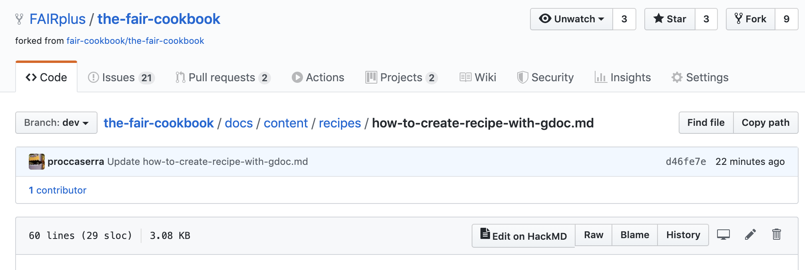
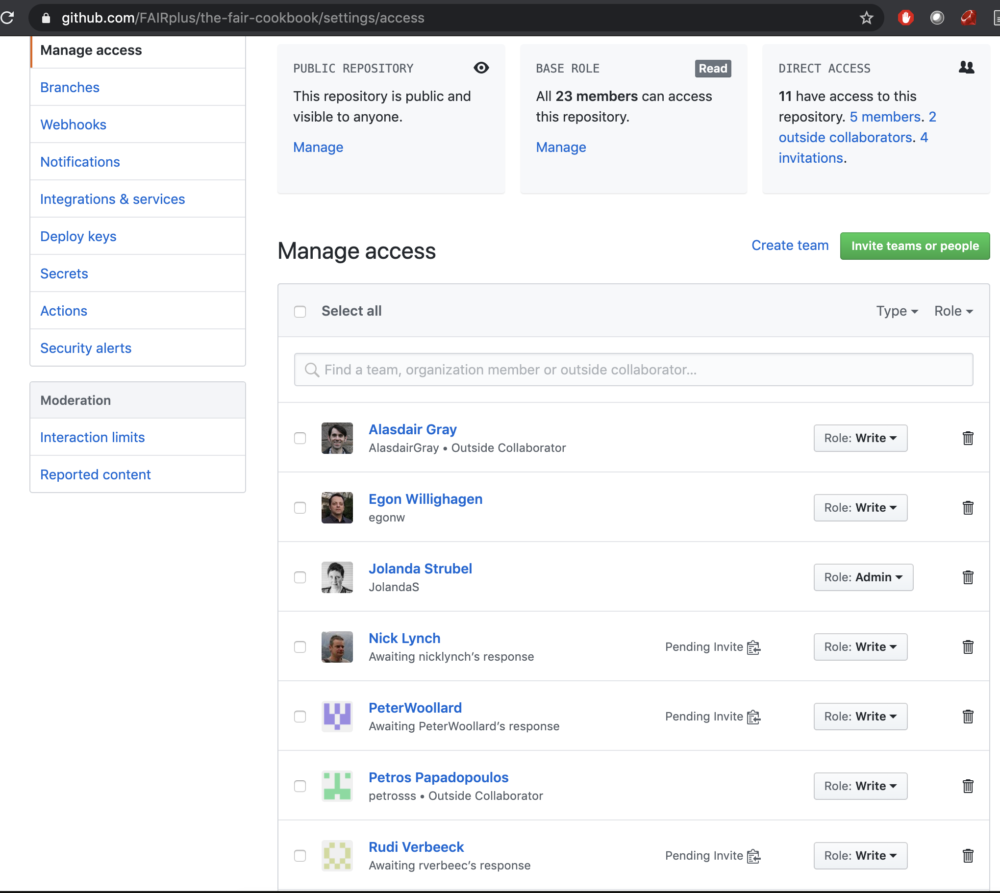
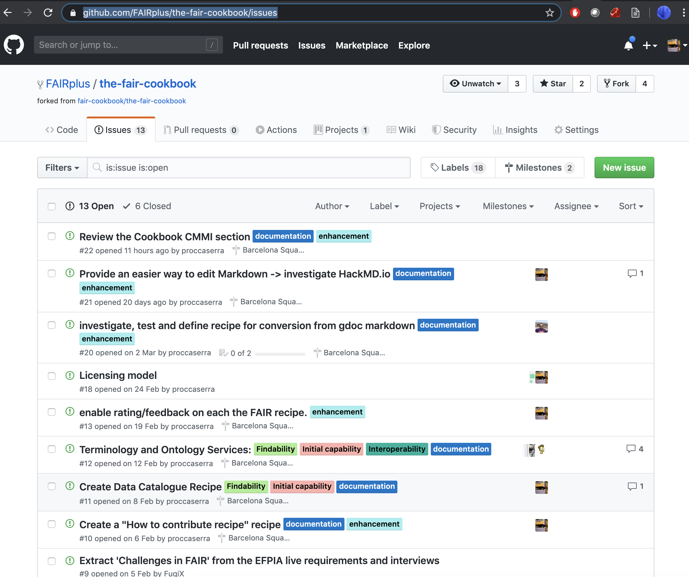

(fcb-help-recipe-hackmd)=
# Add via HackMD 


## Main Objectives

>**This document aims to guide users through the process of getting set up to contribute content to [the FAIR cookbook](https://fairplus.github.io/the-fair-cookbook/intro) using HackMD.io online editor.
>
>The document contains a checklist taking you point by point through the installation process and through the 2 main ways of using HackMD.**


```{warning}
 ⚡ **IMPORTANT: Install the HackMD browser extension ([Chrome](https://chrome.google.com/webstore/detail/hackmd-it/cnephjboabhkldgfpdokefccdofncdjh), [Firefox](https://addons.mozilla.org/en-US/firefox/addon/hackmd-it/?src=search))**
```

At the current time, the **HackMD-it** browser extension is only available for Chrome and Firefox and [this tutorial](https://hackmd.io/s/hackmd-it) details the installation procedure. 
Once the extension installed, any **Markdown** document in any GitHub repository you have access to and for which HackMD app
has been authorized (which is already the case for all FAIRplus GitHub repositories) will be readily editable using
'HackMD' and you should see the following *icon* in the relevant menu bar:

<!-- <div> </div> -->

````{dropdown}
:open:
```{figure} ../../../images/k79IQUA.png
---
width: 200px
name: edits with HackMD from GitHub
alt: edits with HackMD from GitHub
---
edits with HackMD button from GitHub bar.
```
````

The HackMD button *in-situ* from a GitHub repository bar:

````{dropdown}
:open:
```{figure} ../../../images/yI8TRNM.png
---
width: 800px
name: F+ GitHub repository
alt: FAIRplus GitHub repository
---
FAIRplus GitHub repository.
```
````

<!-- <div> </div> -->


<br/>

```{note}
⚡ This button will only be visible from Chrome or Firefox once the **HackMD** browser extension has been installed.

🐙 This will not be visible from Safari, Brave or Internet Explorer browsers *even if* you have HackMD activated for your repository.
```


## Create a GitHub account and obtain your GitHub handle

## Request to be added to the [FAIR Cookbook GitHub repository](https://github.com/FAIRplus/the-fair-cookbook) and accept the invitation.
<!-- <div> </div> -->

````{dropdown}
:open:
```{figure} ../../../images/wyTn5aS.png
---
width: 800px
name: join FAIRplus Cookbook GitHub
alt: join FAIRplus Cookbook GitHub
---
join FAIRplus Cookbook GitHub.
```
````


## Create a new recipe
### Create a new issue in the [issue tracker](https://github.com/FAIRplus/the-fair-cookbook/issues)

````{dropdown}
:open:
```{figure} ../../../images/frsBwqc.png
---
width: 800px
name: new recipe
alt: Creating a new recipe
---
Creating a new recipe.
```
````

<!-- <div> </div> -->


<br/>

```{note}
ℹ️  remember to assign yourself or a team member to the issue

ℹ️  remember to assign the issue to a milestone

ℹ️  remember to tag the issue with relevant label
```

## Create a new branch under the FAIR Cookbook GitHub repository using the following command:

```bash
> git checkout -b recipe_xx master
```

## Create a [HackMD.io](https://hackmd.io) account, simply using your GitHub credentials


````{dropdown}
:open:
```{figure} ../../../images/E2ok5ni.png
---
width: 400px
name: create HacKMD account
alt: Creating a HacKMD account
---
Creating a HacKMD account.
```
````

<!-- <div> </div> -->


## Getting familiar with MarkDown

Here is a [good tutorial provided by Gitlab](https://about.gitlab.com/handbook/engineering/ux/technical-writing/markdown-guide/)


````{dropdown}
:open:
```{figure} ../../../images/Kt3d9eo.png
---
width: 800px
name: Getting familiar with Markdown
alt: Getting familiar with Markdown
---
Getting familiar with Markdown.
```
````

<!--  -->


## Build confidence using HackMD


````{dropdown}
:open:
```{figure} ../../../images/bt012cm.png
---
width: 800px
name: Learning HackMD
alt: Learning HackMD
---
Getting familiar with HackMD.
```
````

<!--  -->

use the split view to have what you type immediately rendered.

## Use the FAIRplus Recipe Template as guide

The FAIRPlus Cookbook Team is working at establishing a standard layout for easing the creation of a new recipe.
The template contains key sections and outlines, which will help boostrap the process.

[recipe template](https://github.com/FAIRplus/the-fair-cookbook/edit/dev/docs/content/recipes/help/recipe-template.md)


## Writing notes with HackMD.io:

1. From a GitHub repository, by editing an existing Markdown 

```{note}
⚡  In order to be able to **push** a change to GitHub from HackMD.io, it is **required** to first create a placeholder
**markdown** file in the targeted GitHub repository.
```

For instance, you want to create a new recipe, you first need to create *my_new_recipe.md* file under a branch of the 
FAIR Cookbook repository.

```bash
touch my_new_recipe.md
git add my_new_recipe.md
git push origin my_recipe_branch
```

In a browser (one with the hackMD browser extension enabled), navigate to the recipe page on the GitHub repository
and click on the **hackMD** button.

<!--  -->

````{dropdown}
:open:
```{figure} ../../../images/k79IQUA.png
---
width: 145px
name: HackMD button
alt: HackMD button
---
HackMD button.
````


This will launch the HackMD.io editor in a separate tab.

```{note}
⚡  Toggling back to the GitHub page, notice the following message, which highlights 2 options, one allowing to switch 
back to the editor view, one allowing to end it. 
```

````{dropdown}
:open:
```{figure} ../../../images/3uqMaT3.png
---
width: 800px
name: hackmd editor 
alt: hackmd editor 
---
hackmd editor .
```
````

<!--  -->

By pressing **Stop Editing**, HackMD.io tab closes and the user is taken back to GitHub page. The user is now offered
to either **commit changes** or **cancel**

```{warning}
☢️ Pressing **cancel** will lose any changes made during the editing phase.

ℹ️  Pressing **commit change** offers two options. We **strongly recommend** using the **create a new branch for this 
commit and start a pull request** option when choosing to commit changes. This is good practice and always remember to 
assign a reviewer and set a milestone when sending the **pull request**.
```

2. Directly from HackMD by creating a new note from the tool itself

To do so, open HackMD and go the **New Note**

````{dropdown}
:open:
```{figure} ../../../images/KMsANJL.png
---
width: 450px
name: Create new Note with HackMD
alt: Create new Note with HackMD
---
Create new Note with HackMD.
```
````

<!--  -->

This will open an empty HackMD page and if one presses **pull from GitHub**, a pop-up will open and allow users to select: 
- a GitHub repository
- a branch in the repository
- a file in that branch

Fill in the relevant information (all required) before it is possible to hit the blue **pull** button.


````{dropdown}
:open:
```{figure} ../../../images/Bccq6OD.png
---
width: 1000px
name: Pulling content from GitHub
alt: Pulling content from GitHub
---
Pulling content from GitHub.
```
````

<!--  -->


If the **pull** is successful, the user can now edit the document.

When the edits are completed, the user can push the file back to GitHub. To do so, one needs to hit the '...' icon in
the top right-hand corner of the HackMD menu bar, as show below:

<!--  -->


````{dropdown}
:open:
```{figure} ../../../images/0TdXGl0.png
---
width: 400px
name: Pushing to git via HackMD UI-0
alt: Pushing to git via HackMD UI-0
---
Pushing to git via HackMD UI-0.
```
````

Navigate to **Versions**. This will bring the following window:


````{dropdown}
:open:
```{figure} ../../../images/6AUdRLo.png
---
width: 900px
name: Check Versions
alt: Check Versions
---
Check Versions.
```
````

<!--  -->


Press the blue **Push to Github** button to bring up the following menu:


````{dropdown}
:open:
```{figure} ../../../images/zSMLtMU.png
---
width: 900px
name: Pushing to git via HackMD UI-1
alt: Pushing to git via HackMD UI-1
---
Pushing to git via HackMD UI - Choosing a file.
```
````


The process is very similar to that described when pulling a file. Except that is now possible to create a branch for 
the commit, an option we recommend using.


````{dropdown}
:open:
```{figure} ../../../images/rheX0ib.png
---
width: 900px
name: Pushing to git via HackMD UI-2 
alt: Pushing to git via HackMD UI-2
---
Pushing to git via HackMD UI - Creating a new file.
```
````


Fill all the necessary information and press the blue **Push** button.


## Conclusion:

This recipe should get you started to contribute content, writing Markdown documents, following the FAIRplus guidance 
and FAIRplus recipe template.

If unsure about these steps, contact the FAIRPlus editorial team for assistance, using the
[dedicated email](mailto:FAIRplus-cookbook@elixir-europe.org) or via our [github issue tracker](https://github.com/FAIRplus/the-fair-cookbook/issues).

### What to read next?
* [HackMD & MarkDown Tips and Tricks](fcb-help-tips)
* [How to create jupyter notebook?](https://jupyter-notebook.readthedocs.io/en/stable/)
* [FAIRplus recipe template](https://the-fair-cookbook.netlify.app/recipes/help/recipe-template)


````{dropdown} **References**
````

## Authors

````{authors_fairplus}
Philippe: Writing - Review & Editing
Susanna: Writing - Review & Editing
````


## License

````{license_fairplus}
CC-BY-4.0
````

