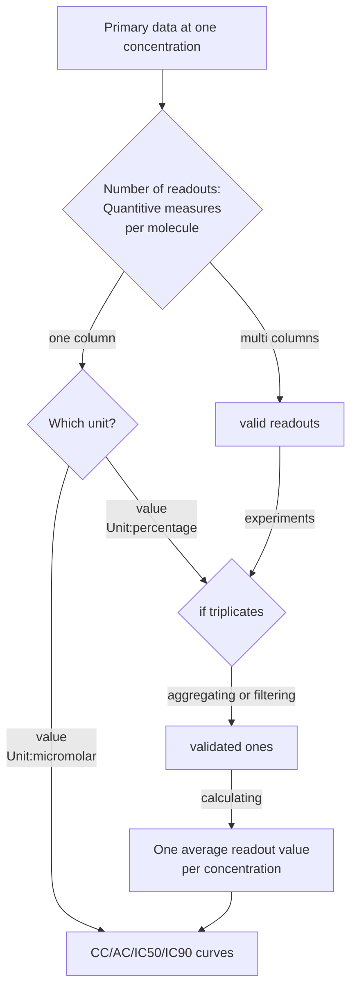

# Bioactivity data profile

[TOC]
## Main objective
This recipe shows how to prepare `bioactivity data`, defined as the measurable effects of a chemical compound in a biological system monitored with a specific assay, to meet the ChEMBL submission criteria, focusing on data formats, structures, and vocabularies. 
This recipe is meant to address the Findability and Interoperability of such type of data.

## Graphical overview of the Recipe FAIRification Objectives
```mermaid
graph TD
    A[Data collection] -->B(Enriched metadata)
    B1{Minimum information checklist} -->B
    B --> C(Annotaed metadata)
    C1{Recommended data models} -->C
    C --> D[Processed assay data]
    D--> E[Formatted datasets]
    E1{Format requirements} -->E
    E--> F[Submission-ready datasets]
    classDef standards stroke:#f66,stroke-width:2px,color:#000000,stroke-dasharray: 5 5
    class B1,C1,E1 standards
end
```
## Introduction
Bioactivity data, as stored in public archives such as the European repository [CHEMBL](https://www.ebi.ac.uk/chembl/) or its US counterpart [PubChem](https://pubchem.ncbi.nlm.nih.gov/) in together with chemical data and omics data, can be used to search for new `hits`(compounds with desired property in drug screening), for example by using cell line information, compound ID as input to queries over such resources.

Early-stage bioactivity dataset includes compound molecular structure, molecular production details, assay data and, pharmacokinetic study information.

The FAIR principles for data management can guide the improvements of pharmacokinetic properties of compounds and the identification of drug targets by enhancing the reporting of `bioactivity data`.

Among the FAIR principles, the `use of  rich metadata` (F2. data are described with rich metadata and R1. meta(data) are richly described with a plurality of accurate and relevant attributes) and the reliance on `community standards`  (R1.3. (meta)data meet domain-relevant community standards) are essential.

In the context of `bioactivity data`, we have on the one hand the [Minimum information about a bioactive entity (MIABE)](https://www.nature.com/articles/nrd3503) checklist recommend attributes, formats and vocabularies for the reuse of such datasets. 

On the other hand, public bioactivity data archives, such as [ChEMBL](https://www.ebi.ac.uk/chembl/), [PubChem](https://pubchem.ncbi.nlm.nih.gov/), and [ECBD](https://ecbd.eu/) also have their own requirements for data submission.

### Data content

<table>
  <tr>
   <td><strong>Content</strong>
   </td>
   <td><strong>Details</strong>
   </td>
   <td><strong>Data types</strong>
   </td>
  </tr>
  <tr>
   <td>Chemistry (SDF)
   </td>
   <td>Structure ID
   </td>
   <td>
<ul>

<li>SDF

<li>SMILE

<li>InChI

<li>CID
</li>
</ul>
   </td>
  </tr>
  <tr>
   <td>Target 
   </td>
   <td>Protein/GENE ID
   </td>
   <td>PN_ or SwissProt ID
   </td>
  </tr>
  <tr>
   <td>Assay
   </td>
   <td>Typology
   </td>
   <td>Binding, FRET, SPR, Inhibition, phenotypic cellular
   </td>
  </tr>
  <tr>
   <td>Result Type
   </td>
   <td>Potency/Tox 
   </td>
   <td>CC50/IC50/EC50/%
   </td>
  </tr>
  <tr>
   <td>Unit
   </td>
   <td>Result unit
   </td>
   <td>Concentration/ratio/SI
   </td>
  </tr>
  <tr>
   <td>Image
   </td>
   <td>
   </td>
   <td>
<ul>
<li>OMETIFF
<li>Matrix Format-Zarr
</li>
</ul>
   </td>
  </tr>
</table>

### Minimum metadata 

A **minimum metadata set** represents a collection of metadata items that should ideally be systematically supplied to support interpretation by humans or machines within a specific domain, for instance bioactivity experimental data. The minimum metadata set includes three parts: 

1. Assay and project bibliographic references (mainly links to literature and protocol or summary)
    - Project level metadata
    - Common sample-level metadata, such as species, tissue, cell type and so on.
2. Chemical compounds reference, including chemical structures
3. Assay results 


For ChEMBL submission, molecular structures and assay description as depicted in the scheme above are suggested as essential metadata. This is a subset of the following [schema](https://www.ebi.ac.uk/chembl/db_schema). In case mutated cell lines and/or mutated target proteins have been used in the assay, additional desirable metadata should be added in the proper group. MIABE also lists detailed bioassay description requirements.

Besides metadata, the diagram below also shows how to prepare numeric assay data.



### Data vocabularies

 [A set of well-established standards and **minimum metadata checklists**](https://chembl.gitbook.io/chembl-loader/untitled-10) exist for various aspects of ChEMBL formatting.  

* **Chemical information ontology (CHEMINF)** [http://semanticchemistry.github.io/semanticchemistry/ontology/cheminf.owl](http://semanticchemistry.github.io/semanticchemistry/ontology/cheminf.owl) 

    CHEMINF covers information about chemical entities and defines descriptors commonly used in cheminformatics software applications and to denote algorithms used to generate those chemicals.

* **BioAssay Ontology**(BAO)

    [http://www.bioassayontology.org/bao/bao_complete.owl](http://www.bioassayontology.org/bao/bao_complete.owl) 

    The BioAssay Ontology (BAO) describes biological screening assays and their results, including high-throughput screening (HTS) data for the purpose of categorising assays and data analysis. BAO is an extensible, knowledge-based, highly expressive (currently [SHOIQ(D)](SHOIQ(D))) description of biological assays making use of descriptive logic based features of the [Web Ontology Language (OWL)](https://www.w3.org/TR/owl2-syntax/)

* __Ontology of units of Measure (OM)__
 [http://www.ontology-of-units-of-measure.org/resource/om-2](http://www.ontology-of-units-of-measure.org/resource/om-2) 
 The OM ontology provides classes, instances, and properties that represent the different concepts used for defining and using measures and units. It includes, for instance, common units such as the SI units meter and kilogram, and a wide range of units of significance for the field of Chemistry and related information.
It can be easily mapped to other resources such as [Unit Ontology](https://www.ebi.ac.uk/ols/ontologies/om), with tools such as [OXO](https://www.ebi.ac.uk/spot/oxo/)

More information on annotating data with ontologies using tools like [Zooma](https://www.ebi.ac.uk/spot/zooma/), can be found in Section 7.7.3.3. of [this recipe ](https://fairplus.github.io/the-fair-cookbook/content/recipes/interoperability/ontology-robot-recipe.html)

### Exemplar Bioactivity datasets

[SARS CoV2 phenotypic assay from Caco2 cell line](https://www.ebi.ac.uk/chembl/assay_report_card/CHEMBL4303806/)

The present dataset is a subset of [IMI CARE](https://www.imi.europa.eu/projects-results/project-factsheets/care) dataset with compounds tested on the Caco-2 cell line. The dataset can be downloaded and, besides structural information, it will contain readout numbers for activity (e.g. either `percentage of cellular cytopathic inhibition at a given concentration` or corresponding extracted `dose-response IC50 `(Half-maximal inhibitory concentration)).

> Recommendations above are based on ChEMBL ontology requirements. The US counterpart to ChEMBL, the  PubChem data bank have different ontology requirements for upload but provide a wizard-based upload process described in [this blog](https://pubchemblog.ncbi.nlm.nih.gov/tag/pubchem-upload/)

## Glossary
|Term|Definition|
|--|--|
|Experiment|Biochamical Assay, Cellular Activity Assay, Cellular Toxicity Assay|
|Readout|Quantitive measurements of a biophysical event followed by assay (e.g. change in fluorescence)|
|EC50|Half maximal Effective Concentration|
|IC50|Half maximal Inhibition Concentration|
|AC50|Half maximal Activation Concentration|
|CC50|Half maximal Cytotoxic Concentration|

## Further reading:
- [InChI and SMILES identifiers for chemical structures](https://w3id.org/faircookbook/FCB007)
- [ChEMBL interface documentation](https://chembl.gitbook.io/chembl-interface-documentation/)


## Authors:
````{authors_fairplus}
AndreaZaliani: Writing - Original Draft, Editing, Conceptualization
Fuqi: Writing - Writing - Original Draft, Editing, Conceptualization
Philippe: Writing - Review & Editing
````


## Licence:
````{license_fairplus}
CC-BY-4.0
```
