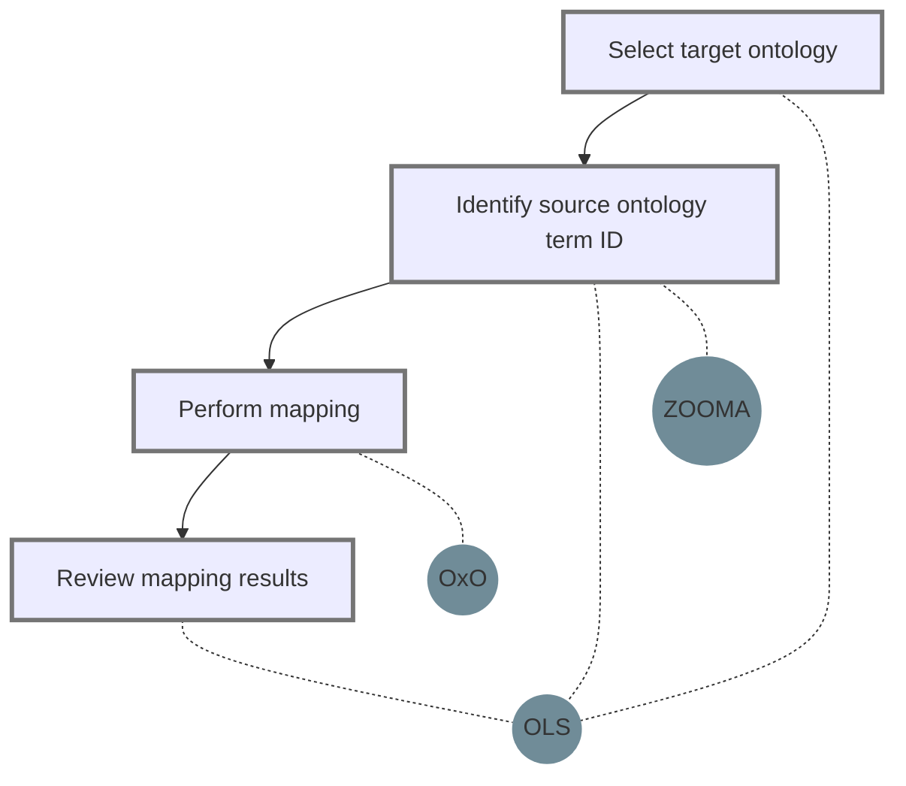

# Ontology mapping with Ontology Xref Service (OxO)

```{admonition} Important
Intended Audience
    - Data Curator
    - Data Manager
    - Data Scientist
    - Software Engineer
    - Terminology Manager
    - Ontologist

Recipe type
    - Hands-on 
```
## Main Objectives

Multiple ontology terms can describe the same concept, which makes it difficult for data integration. Ontology mapping, or ontology alignment, is the process of determining correspondences between equivalent concepts in alternative ontologies and other vocabularies. 

OxO maps terms in different ontologies, vocabularies and coding standards using evidence collected from the Ontology Lookup Service (OLS), Unified Medical Language System (UMLS), and other sources. 

This recipe demonstrates how to map ontology terms using the [EMBL-EBI Ontology Xref Service (OxO)](https://www.ebi.ac.uk/spot/oxo/).

## Graphical Overview of the FAIRification Recipe Objectives

## Requirements
* recipe dependency:
   * {ref}`Which vocabulary to use?`
* knowledge requirements:
   * Familiar with metadata curation
   * Familiar with ontology and other vocabularies
* technical requirements:
    * Experience with API or Bash scripts allows users to try the automated solutions.

## Capability & Maturity Table

| Capability  | Initial Maturity Level | Final Maturity Level  |
| :------------- | :------------- | :------------- |
| Interoperability | minimal | repeatable,automatable |


## FAIRification Objectives, Inputs and Outputs

| Actions.Objectives.Tasks  | Input | Output  |
| :------------- | :------------- | :------------- |
| [ID mapping](http://edamontology.org/operation_3282)  | [Ontology term](http://edamontology.org/data_0966)  | [Ontology term](http://edamontology.org/data_0966)  |
| [Annotation](http://edamontology.org/operation_0226)  | [Ontology term](http://edamontology.org/data_0966)  | [Ontology term](http://edamontology.org/data_0966)  |

## Table of Data Standards

| Data Formats  | Terminologies | Models  |
| :------------- | :------------- | :------------- |
|  | [Mondo Disease ontology](https://www.ebi.ac.uk/ols/ontologies/mondo)  | |
| | [Human Disease ontology](https://www.ebi.ac.uk/ols/ontologies/doid)  |  |
|| [Medical Subject Headings](https://meshb.nlm.nih.gov/search)


### Step 1: Identify source vocabulory and target vocabulory
The target vocabulary  should be selected before mapping. Guidance on how to select vocabularies can be found [here](https://fairplus.github.io/the-fair-cookbook/content/recipes/interoperability/selecting-ontologies.html). 

For pathology data annotation, vocabularies, such as [MeSH](https://meshb.nlm.nih.gov/search), [NCI thesaurus](https://www.ebi.ac.uk/ols/ontologies/ncit), [ICD-10](https://www.who.int/standards/classifications/classification-of-diseases), [UMLS](https://www.nlm.nih.gov/research/umls/index.html), [Human Disease Ontology(DOID)](https://www.ebi.ac.uk/ols/ontologies/doid), and [MONDO disease ontology](https://www.ebi.ac.uk/ols/ontologies/mondo), are widely used. In this example, we use MONDO as the target vocabulary, and MeSH and DOID as source vocabularies to demonstrate the ontology mapping workflow. 

OxO allows users to explore the mapping status between the target vocabulary and other vocabularies. Figure 1 shows how terms in MONDO are linked to terms in other ontologies. MONDO has over 16,000 mappings to terms in UMLS. It is also mapped to terms in DOID, Ophanet, OMIM, MeSH, etc.


<div align="center">Figure1: Ontology mapping overview</div>


### Step 2: Find the source vocabulary term ID
OxO takes ontology term IDs as inputs for ontology mapping, which assumes the (meta)data has been annotated. If the data is not annotated, please check the ontology annotation recipe first. 

In this recipe, we use terms for 'type 2 diabetes' as an example, and the corresponding source term IDs are listed in the table below.

|Text|Corresponding term in MeSH| Corresponding term in DOID|
|--|--|--|
|type 2 diabetes|[MeSH:D003924](https://www.ncbi.nlm.nih.gov/mesh/68003924)|[DOID:9352](https://www.ebi.ac.uk/ols/ontologies/doid/terms?iri=http%3A%2F%2Fpurl.obolibrary.org%2Fobo%2FDOID_9352)

### Step 3: Perform mapping

OxO offers both a graphical user interface and an API for mapping.

Figure 2 shows how to map the MeSH and DOID terms to the MONDO disease ontology. Users are expected to specify the target ontology, provide a list of source term IDs, and indicate the expected mapping distance. In this example, we set mapping distance as 1, which uses high confidence mapping evidence only. Having greater mapping distance returns more mappings but decreases the mapping confidence. 

Figure 3 is the corresponding mapping results. Both terms have been mapped to 'MONDO:0005148'. The results can be downloaded as flat-table(tsv) files.


<div align="center">Figure 2: Ontology mapping with OxO user inputs.</div>


<div align="center">Figure 3: Mapping results</div>

It's also possible to perform mapping from the command line. See the [OxO API documentation](https://www.ebi.ac.uk/spot/oxo/docs/api) page. In this example, the corresponding API request is 
```bash
curl 'https://www.ebi.ac.uk/spot/oxo/api/search' -i -X POST -H 'Content-Type: application/json' -H 'Accept: application/json' -d '{
  "ids" : [ "DOID:9352","MeSH:D003924"],
  "inputSource" : null,
  "mappingTarget" : [ "MONDO" ],
  "mappingSource" : [ "MONDO" ],
  "distance" : 1
}'
```
The corresponding results are 
```
{
      "queryId" : "DOID:9352",
      "querySource" : null,
      "curie" : "DOID:9352",
      "label" : "type 2 diabetes mellitus",
      "mappingResponseList" : [ {
        "curie" : "MONDO:0005148",
        "label" : "type 2 diabetes mellitus",
        "sourcePrefixes" : [ "MONDO" ],
        "targetPrefix" : "MONDO",
        "distance" : 1
      } ],
      "_links" : {
        "self" : {
          "href" : "https://www.ebi.ac.uk/spot/oxo/api/terms/DOID:9352"
        },
        "mappings" : {
          "href" : "https://www.ebi.ac.uk/spot/oxo/api/mappings?fromId=DOID:9352"
        }
      }
    }
```
### Step 4: Review mapping results

To ensure the quality of the mapping, users are recommended to review the mapping results, especially when the mapping distance increases. OxO allows users to explore vocabulary term relationships (see figure 4) by providing a network view of all linked terms. Users can also find more information about each term in the [Ontology lookup service](https://www.ebi.ac.uk/ols/index).


<div align="center">Figure 4: MONDO term overview</div>

### Common questions
1. Incorrect mappings

    OxO imports term mapping information from ontologies and other curated databases. It doesn't validate the mapping evidence. Users are recommended to check the mapping results manually, especially when the mapping distance is above 1.
    
2. Mapping not found.

    OxO relies on the ontology and other curated databases to improve the mapping coverage. Some terms describing the same concept might not be aligned in OxO. In this case, users are recommended to identify possible mappings by searching in OLS. 
    
    To help the ontology community improve the mapping, users can also submit an update request in corresponding ontologies. The guidance can be found here {ref}`Requesting terms addition to terminology artefacts`
3. Ontology mapping service for internal databases

    OxO has been dockerized for local deployment and licensed under [Apache License 2.0](https://github.com/EBISPOT/OXO/blob/master/LICENSE). The source code can be found [here](https://github.com/EBISPOT/OXO).


### Summary
This recipe uses OxO as an example to demonstrate the ontology mapping workflow.


## Authors:

| Name | Affiliation  | orcid | CrediT role  |
| :------------- | :------------- | :------------- |:------------- |
| Fuqi Xu|[EMBL-EBI](www.ebi.ac.uk)| [0000-0002-5923-3859](https://orcid.org/orcid.org/0000-0002-5923-3859) | Writing - Original Draft |

___


## License:

<a href="https://creativecommons.org/licenses/by/4.0/"></a>


