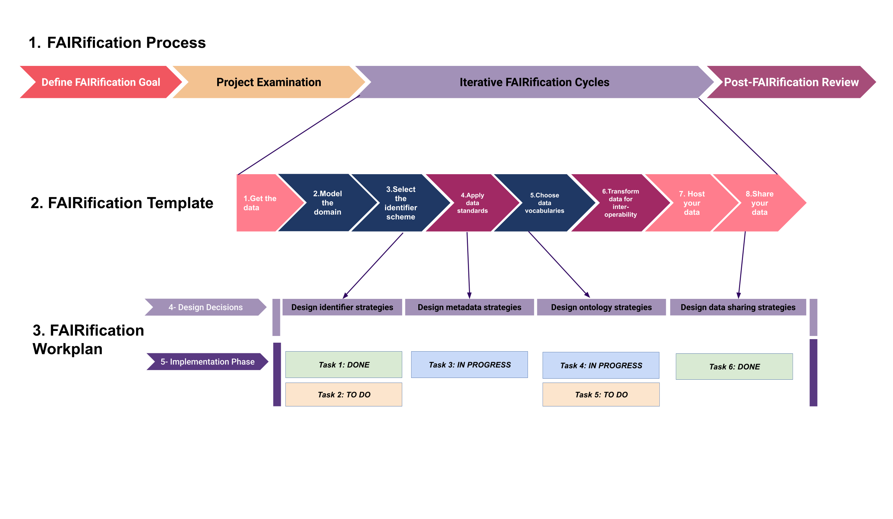
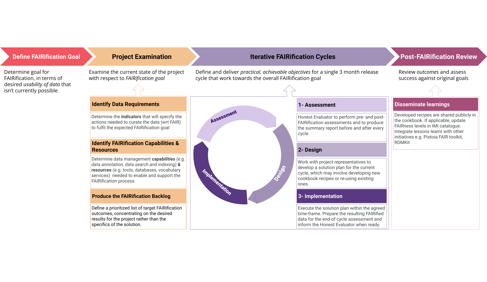
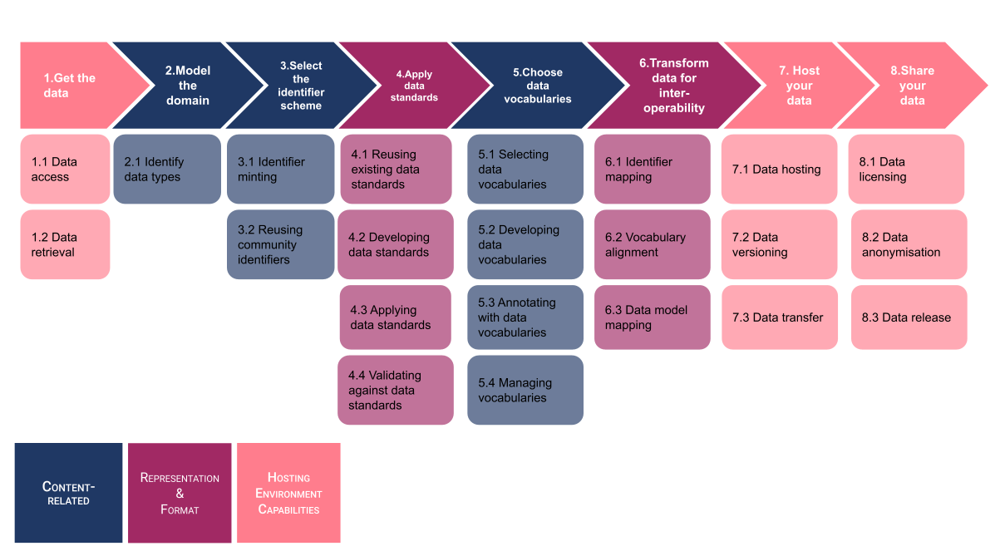

(fcb-help-recipe-template)=
# FAIRification framework


<br/>
<br/>


````{panels_fairplus}
:identifier_text: FCB000
:identifier_link: 'https://w3id.org/faircookbook/FCB000'
:difficulty_level: 2
:recipe_type: applied_example
:reading_time_minutes: 20
:intended_audience: tbd
:maturity_level: tbd  
:maturity_indicator: tbd
:has_executable_code: nope
:recipe_name: FAIRification framework
```` 


## Main Objectives

This recipe provides a general introduction to the FAIRification framework developed by FAIRplus. 

The recipe will cover the following elements:

>* The components of the framework
>* How to apply the framework 

---


## Graphical Overview




---


## The FAIRification framework

general intro - what is the framework, why was it developed (highlight iterative process), what are the components

### The FAIRification Process

The FAIRIfication process can be divided into four phases:
1. FAIRification goal defintion
2. Requirement examination
3. Design and Implementation
4. Review




Each of these phases are sequential dependent on each other and involve two to three groups working on them.
1. The first group is the data or project owner who plays the major role in definition of goals and reviewing the impact of the goals. 
   
2. The second group involves the technicians who specialize in processing and analyzing the data to work towards the goal. They might be a subset of the data owner group, but a clear distinct between these groups should be made to delegate responsibilities and to attain results efficiently. 

3. The third group is assessment group who are responsible for checking the aligned of the task done by the technician team and the goals set by the FAIRification team. The individuals involved in this team are not part of discussions between the data owners and technicians and hence act as peer-reviewers. 

In the following sections, we will discuss in depth the work involved in the individual phases of the FAIRIfication pipeline.

#### Phase 1: define FAIRification goals

This Phase involves the identification of outcomes and planning of goals that data or project owner would want to achieve upon FAIRification of the data. These goals are either centric to one aspect of FAIR for example deposition of data to Zenodo and GIT to increase its findability or they could cover multiple aspects of fair such as use of consistent terminologies and controlled vocabularies to represent the data (interoperability aspect) along with deposition of data in relevant repositories (findability apsect). 

Certain times the data/project owner is clueless about such aspect. In that case, tools such as the Dataset Maturity (DSM) model can assist in identification of goals. Check out the DSM recipe for more details on how the tool is able to accomplish it.

#### Phase 2: examine requirements

Upon identification of the goal by the data owners, a discussion with the technical team is done. The technical team then start with collection of the data to ensure that they have access to the data that needs to be FAIRified. If the technical team is external, certain legal aspects need to be placed for efficient transition of data between the data owners and technicians.

Following this, the technical team identifies tools and expertise required for the implementation of the work and start cataloging this material. Lastly, the team collectively decides on the individuals that would be assigned the FAIRIfication task.

At the end of this phase, an "action" team (subset of the technical team whose goal is to perform the FAIRifictaion tasks) is in place along with a catalog of tools and resources that would be used for achieving this goal.

#### Phase 3: assess, design, implement, repeat

Following the selection of the "action" team, an iterative cycle of assessment, design, and implementation in put in place. 

**Assessment :**
Prior to starting the work, the assessment of goals is done to ensure that individuals in the action team are synced with the FAIRification goals formulated by the data owners. This assessment is carried out by review team which could be an independent team or certain individuals from the technical team who are not involved in the action team. The assessment involves a binary decision of "GO" or "NO GO" based on the FAIRification goals and the catalog provided. At this stage, the reviews can also provide suggestion based on their experiences on the resources, tool, or goals.

**Design :**
Once the team receives a "GO" decision from the review team, the action team now starts by enlisting the steps that need to be done performed to achieve the goal. For each task, the resources, an estimate time duration, as well as the responsible person is selected. 

**Implementation :**
Once the tasks have been selected and assigned, the actual work begins. To ensure that the action team is working smoothly, weekly or bi-weekly meetings is recommended so that the team is aware of the progress.

Once the implementation of task listed in the design phase are done, the action team assess the work done and checks the aligned with the FAIRification goal. In case more tasks are needed to achieve the goal, a second round of the assess-review-implement cycle takes place as described above with the starting point as the FAIRIfication goals, the completed tasks and the proposed task

This phase is usually run in short sprints of 3-month.

#### Phase 4: review against the goals

At this phase, the FAIRification work has been completed by the team. The technical team and the data owners now come together to assess the output of FAIRification. At this point, the technical team packages all the work done and hands it over to the data owners. Decisions on the key learning as well as future aspects of the work take place. Finally, to ensure that the work done is sustainable, the deposition of workflows and the information on steps is deposited on online catalogs and recipe books such as teh Cookbook, RDMKit, IMI Data Catalog to name a few.

### The FAIRification Template

brief explanation, image & reuse supplementary table 2 from process paper




### The FAIRification Workplan

The FAIRification Workplan is a specific design and implementation plan generated for a specific project based on the goals set in phase 1 and requirements identified in phase 2 of the Process. Relevant elements from the FAIRification Template are selected and broken down into concrete tasks. These tasks are then completed within the agreed cycle time frame as per the FAIRification Process.

The diagram below shows the bespoke FAIRification Workplan for the CARE project. The  Workplan follows the general outline of the FAIRification Process, with the goals listed in section 1 (red), the outcomes of the project examination on section 2 (orange) and the pre-FAIRification assessment outcomes in section 3. It can also be beneficial to explicitly list the indicators targeted for improvement in this section in order to keep this information easily accessible in one place.

The key parts of the workplan are section 4 (Design Decisions) and 5 (Implementation). Section 4 lists the specific steps from the FAIRification Template that will be addressed in this FAIRification cycle (dark purple) and refines them into more concrete steps relevant for this context (light purple). In section 5, these concrete steps are broken down into clear implementable tasks, which are recorded in colour coded boxes to track progress. If a Cookbook recipe already exists to address a task, this can be linked here. 

Following a FAIRification cycle, the results of the post-FAIRification assessment are recorded in section 6. 

If more than one FAIRification cycle is performed, a new version of the Workplan should be produced for each cycle, in particular if there are changes in sections 4 and 5.


## Practical considerations

* multi-disciplinary task teams
* restate the importance of good goal setting
* flexibility of the framework w/ regards to assessment approaches etc

---

## Conclusion

> Summerize Key Learnings of the recipe.
> 

### What should I read next?
> * [Tips and Tricks](./tips-tricks.md)
> * [how-to-create-recipe-with-hackmd](./how-to-create-recipe-with-hackmd.md)
> * using a reference tag affored by MyST markdown and sphinx with JupyterBook 0.7+. <!-- {ref}`fcb-intro-fair-principles` -->
  [my-prefered-label](fcb-help-recipe-template)


## References:

````{dropdown} **References**
```{footbibliography}
```
````


## Authors


````{authors_fairplus}
Danielle: Writing - Original Draft
Yojana: Writing - Original Draft
````


## License
````{license_fairplus}
CC-BY-4.0
````

