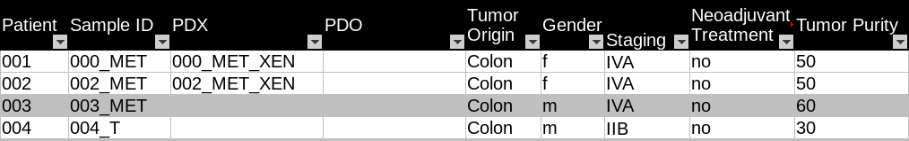
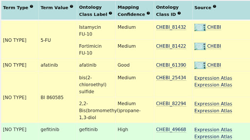

# Oncotrack FAIRification recipe

## Ingredients

*   Metadata model
    *   [Oncotrack cohort metadata](https://drive.google.com/open?id=13xmazrUUWaCZVooL8d3HXZg7URfVlupM)
    *   [Oncotrack drug sensitivity data](https://drive.google.com/file/d/166IlLr-kZLBPoGLkxEyp7cLw8KFKtN1_/view?usp=sharing) 
    *   [Oncotrack metadata template](https://docs.google.com/document/d/1OXSQsZbw2EEZOZrrXJIaJpsb60Y3-4N4W-wu9LX5oa8/edit?usp=sharing)
*   Vocabularies and terminologies
    *   Pharmaceutical drug names follow the nomenclature of ChEBI and ChEMBL database. All drug ontologies are listed [here](https://drive.google.com/open?id=1kYH76-3K3mkz6wfTydFoT_UPf8WP0fe_). 
    *   All abbreviations and acronyms used in OncoTrack cohort metadata are listed in the [OncoTrack public metadata acronym table](https://drive.google.com/open?id=1voD6FGHVyHUgZEHFRfzh_HlTQa7CvW5-MtheGhydDAg).
*   Data format
    *   Input data: Excel
    *   Output data: 
        *   tab-delimited text file
        *   JSON file (JSON schema: [BioSamples databases JSON schema](https://drive.google.com/open?id=1DoyOZ1uMFv0aPpAQUPkf7mS8vAoS6DCY))
*   Tools and software
    *   Metadata extract and transform tool: R (Version 3.6.1)
        *   String parsing: R package stringi_1.4.3, stringr_1.4.0
        *   Excel file Loading: readxl_1.3.1
        *   Data structure transform:plyr_1.8.4  
        *   JSON format parsing: rjson_0.2.20 
    *   JSON schema validator: [Elixir JSON schema validator](https://github.com/elixir-europe/json-schema-validator)
    *   Ontology mapping: [ZOOMA](https://www.ebi.ac.uk/spot/zooma/)
    *   File Integrity check: md5sum (GNU coreutils) 8.28

 	 	 	

## Objective

This FAIRification pipeline converts the OncoTrack sample metadata to a structured and consistent data format, improves the findability, interoperability, and reusability of the metadata. The FAIRified metadata provides an enriched context to other Oncotrack derived datasets.

## Step-by-Step Process

The FAIRification of Oncotrack metadata includes four steps, accessing the data, metadata extraction, transform and load(ETL) pipeline, data curation and data sharing. (Figure 1)

_Figure 1: OncoTrack metadata FAIRification pipeline_	

### Data Description

The OncoTrack colorectal carcinoma (CRC) biobank includes patient tumour samples, patient derived xenograft models (PDX) and patient-derived 3D  cell models (PDO) from 106 patients. Multi-omics experiments and various drug sensitivity studies have been performed on the CRC biobank.

The[ OncoTrack](http://www.oncotrack.eu/home/index.html) sample metadata includes published sample metadata, drug sensitivity experiment results, and private cohort information. Here, we focus on the FAIRification of the public sample metadata. Drug sensitivity, as an important property of the patient-derived 3D cell culture models, is also included. The metadata is published on[ Schütte, et al](https://www.nature.com/articles/ncomms14262#Sec54). Annotations to the metadata are stored in[ OwnCloud](https://owncloud.lcsb.uni.lu/apps/files/?dir=/ONCOTRACK&fileid=10738223) with controlled access.

The original cohort metadata is stored in an Excel spreadsheet. Figure 2 is an example of the cohort metadata. Each sample is listed as a separate row in the spreadsheet. Sample attributes are listed in columns. The sample names follow the[ OncoTrack identifier system guidelines](https://drive.google.com/file/d/1qTQ4cYsmD3AN9XYRxpwayOerc78LUzq6/view?usp=sharing), which consists of patient ID, tumour type, and patient-derived cell culture model ID. For example,_ Sample “150_MET1_XEN2”_ represents _“The second xenograft culture of the first metastatic tumour sample in Patient 150.”_ 

_Figure 2: Example of OncoTrack public cohort metadata_

The drug sensitivity data is also provided in Excel spreadsheets. Seventeen drugs are tested on patient-derived organoid(PDO) and patient-derived xenografts(PDX) models in five sets of experiments. Different sets have their unique measurement methods, drug response scales. For example, in _Sheet 1: PDO drug response_ experiment, IC50 value is measured and defines the drug _response category_ (Figure 3a). In _Sheet 2: PDX drug response test_, the _response evaluation criteria in solid tumours (**RECIST**)_ scales defines the_ drug response category_ (Figure 3b). In both examples, the _drug response category _is marked by colour codes.

_Figure 3: Example of Oncotrack drug response data_

### Metadata ETL pipeline

The frequent use of acronyms and abbreviations in Oncotrack metadata and the inconsistent metadata structures make it difficult to interpret and reuse. To extract and annotate the metadata, the data owner and data curators first agreed on the structure and content of the FAIRified metadata, as well as the principles in metadata extraction.

Firstly, all missing values in the metadata shall be marked with _NAs _instead of being removed, to facilitate cross-sample comparisons. Secondly, all acronyms and abbreviations shall be expanded to their full forms to avoid ambiguity. Thirdly, the sample attribute values shall correspond to ontology terms if applicable. The final sample metadata template can be found[ here](https://docs.google.com/document/d/1OXSQsZbw2EEZOZrrXJIaJpsb60Y3-4N4W-wu9LX5oa8/edit).

The cohort metadata was converted to a[ tab-delimited table](https://docs.google.com/document/d/1pBjRe7rWO4xsUIVecIgxOm_SJaMWeWf8KBrsDTDVAmg/edit?usp=sharing), of which each row represents one sample, and each column represents one sample attribute. 144 samples from 106 patients were extracted, including 35 organoids and 59 xenografts. Tumour type and sample origin information was retrieved from the sample name. The disease name _“colon and rectal cancer”_ was replaced with ontology term[ “Colorectal cancer”](http://www.ebi.ac.uk/efo/EFO_0005842). Figure 4 is an example of the extracted cohort metadata.

_Figure 4: Example of the extracted cohort metadata_

Drug sensitivity data were also extracted from the original spreadsheets. Each drug test per sample was listed as one entry. To coordinate different measurement approaches and response category scales, all drug sensitivity data were converted to a unified representation. All the measurement results were stored in Attribute _“Value”_, the drug response categorizes criteria were stored in Attribute _“Unit”,_ and the _drug response category _was recalculated and stored in Attribute _“Response”._ Figure 5 is an example of the extracted drug sensitivity data. 1829 drug tests were extracted in total. The drug response summary is [here](https://drive.google.com/file/d/1BNkuLtKUsqoAPJqDKqdhj2xYAhuxhQkf/view?usp=sharing). 

_Figure 5: Example of extracted drug sensitivity data_	

 	 	

To associate drug sensitivity data with related sample cohort metadata and convert them to machine-readable formats, we combined cohort metadata and drug sensitivity data to JSON files. The[ BioSamples JSON schema](https://drive.google.com/file/d/1DoyOZ1uMFv0aPpAQUPkf7mS8vAoS6DCY/view) was used as the sample metadata template, allowing direct submissions to[ BioSamples database](https://www.ebi.ac.uk/biosamples/) and can be easily converted to other formats, like XML, spreadsheets, etc.

The BioSamples JSON schema includes four blocks, submission metadata( e.g. submission domain, release date, update date), administrative metadata, (e.g. contacts, affiliations), general sample metadata (sample names, species, etc) and sample characteristics. All information is stored in key: value pairs. In sample characteristics, only data with flatten structure is accepted. 

All cohort metadata and drug sensitivity data of each sample were combined into separate JSON files, named after the original sample identifier.

BioSamples JSON schema only supports strings as value types. Therefore, complex data, for example, drug sensitivity data, need additional parsing to fit into the schema. For each drug response experiments, four descriptive attributes were “_Drug Name_”, “_Value_”, “_Unit_” and “_Drug response level_” provided. To convert them to key: value pairs, the “_drug name_” was kept as part of the attribute key. “Value”, “Unit” and “Drug response level” information were joint into one string. For example, the drug response of _regorafenib in Sample 302_MET_CELL_XEN _(Figure 6) was converted to _“Drug response(regorafenib): Minor response, IC50(µM) = 29”._ For drugs that were tested more than once, a replicate ID was added to the attribute key.

Administrative information was also added to each JSON object, including institute, project name, and project website. Contact details were not provided, which needs further confirmation from the data owners.

All transformed metadata was validated against BioSamples schema with the[ Elixir JSON validator](https://github.com/elixir-europe/json-schema-validator), which is based on AJV with additional life science keyword validation.

### Data curation

Data curation was implemented to increase the findability of the extracted metadata, including ontology mapping, encoding, and fixing data discrepancy.

#### Drug name ontology

Different types of drug names were used in the original drug sensitivity data, including generic names, trade names and their chemical names. Some in-development drugs were labelled by their company code. All drug names were mapped to a standardized nomenclature, together with ontology annotations, to increase the findability of drug response results.

The popular drug nomenclatures include International Nonproprietary Names (INNs), [DrugBank](https://www.drugbank.ca/) names, Chemical Entities of Biological Interest ([ChEBI](https://www.ebi.ac.uk/chebi/)) database identifiers, and bioactivity database,[ ChEMBL](https://www.ebi.ac.uk/chembl/) identifiers. Among them, the ChEBI database cover most drugs in OncoTrack, is easy to access and has been curated as an ontology source in Open Biomedical Ontology (OBO). Hence, the drug names in ChEBI was selected as the primary drug names. For drugs or active compounds that were not included in ChEBI, their names in ChEMBL were selected.

The OncoTrack drug names were mapped to corresponding ontology terms in ChEBI and ChEMBL using ZOOMA. ZOOMA is an ontology annotation tool, which maps free texts to ontology terms based on a curated repository of annotation knowledge. In OncoTrack drug name mapping, only ChEBI and ChEMBL were selected as ontology sources, and all curation sources except GWAS were selected to improve the coverage and increase the mapping confidence. Figure 6 is an example of the ZOOMA mapping output. Only entries with high mapping confidences were selected. The rest were mapped manually to terms in ChEBI databases. Among all 17 drugs, Drug “BI 860585” didn’t map to any pharmaceutical terms, so the original name was kept. The complete mapping results are listed[ here](https://drive.google.com/open?id=1kYH76-3K3mkz6wfTydFoT_UPf8WP0fe_). 

_Figure 6: Example of  ZOOMA ontology mapping results_

#### Data discrepancy

Discrepancy and errors were found in the published metadata. In the cohort metadata, the tumour purity of sample “150_MET1”, “208_MET1”, “209_MET2” and “209_T2” were wrongly labelled. We compared these entries with the original records in the OncoTrack database and found discrepancies between the published metadata and Oncotrack database records. Those values were removed from extracted data until further confirmation from the data owner. The updated cohort metadata is [here](https://drive.google.com/open?id=13xmazrUUWaCZVooL8d3HXZg7URfVlupM).  In drug response metadata extraction, we recalculated the drug response level and found one error in _cetuximab_ drug response level. The corrected drug response data is [here](https://drive.google.com/open?id=166IlLr-kZLBPoGLkxEyp7cLw8KFKtN1_). 

#### Data encoding

Special letters were converted to ASCII encoding to avoid mojibake. All the “µM”s in drug sensitivity data were converted to “microM”.

### Data sharing

The curated metadata, both in summary spreadsheet format and JSON format, were uploaded to Owncloud and Google drive. The OncoTrack sample metadata can be submitted directly to the EMBL BioSamples database upon request. Supplementary figure 1 is an example of how the metadata will be displayed in the BioSamples database. Checksums were also provided to verify metadata integrity. 

## Summary

The public cohort metadata and drug sensitivity data were converted to tab-delimited summary files. For each sample, corresponding cohort metadata and drug data were combined to a separate JSON file, which can be later loaded to EBI BioSamples database. Metadata were translated to consistent terminologies and linked with ontology terms.

## Future plan

The current ontology annotation is limited to drug names. Other ontologies can be added upon request. More detailed administrative metadata will be added once getting permission from the OncoTrack consortium. The license will be added according to the drug release policy.

## Supplementary materials

Script 1: [Extract_cohort_metadata.R](https://drive.google.com/file/d/1bbMMKZnygZ8kccdnSj2R_BRLDhd0vAS-/view?usp=sharing)

Script 2: [Extract_drugResponse_metadata.R](https://drive.google.com/open?id=1eNxdNFGN7GAw7Z0Cmk0k2BJiMMZ7wbel)

Script 3: [Transform to JSON.R](https://drive.google.com/file/d/18Ik3RryhWVFq9_2IIy6k8N-qpnP9Wgm3/view?usp=sharing)

Supplementary figure 1: [Example of Sample 150-MET1-XEN2 in BioSamples database](https://drive.google.com/open?id=1ALOwGwB2RpWksH4TuGeye8qEnUm0ULVH)
