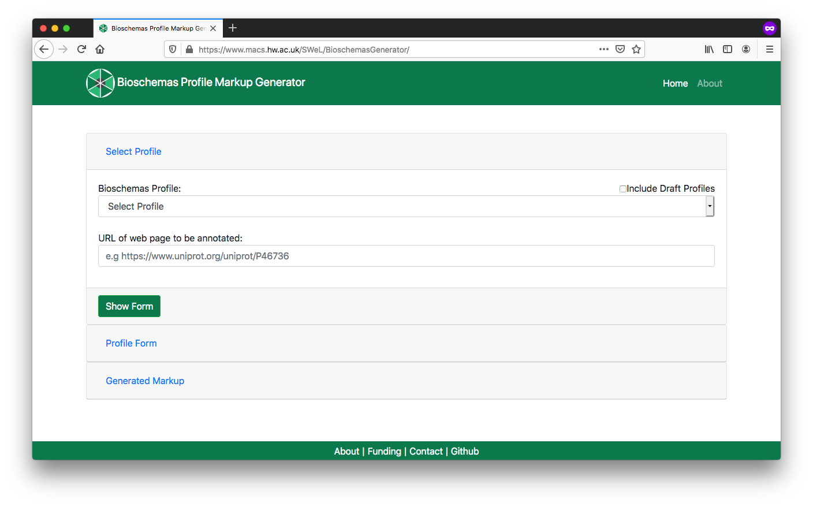

# Findability: Data Catalog Markup
<!-- 
**identifier:** [RX.X](RX.X)

**version:** [v0.1](v0.1)

___

**_Difficulty level:_** :triangular_flag_on_post: :white_circle: :white_circle:  :white_circle:  :white_circle:

**_Reading time:_** 10 minutes

**_Intended Audience:_** 

> :heavy_check_mark: Application Developer

> :heavy_check_mark: Data Scientist

**_Recipe Type_**: Guidance

**_Executable code_**: No -->


___

<div class="row">

  <div class="column">
    <div class="card">
      <div class="container">
        <i class="fa fa-qrcode fa-2x" style="color:#7e0038;"></i>
        <h4><b>Recipe metadata</b></h4>
        <p> identifier: <a href="">RX.X</a> </p>
        <p> version: <a href="">v0.1</a> </p>
      </div>
    </div>
  </div>
  <div class="column">
    <div class="card">
      <div class="container">
        <i class="fa fa-fire fa-2x" style="color:#7e0038;"></i>
        <h4><b>Difficulty level</b></h4>
        <i class="fa fa-fire fa-lg" style="color:#7e0038;"></i>
        <i class="fa fa-fire fa-lg" style="color:#7e0038;"></i>
        <i class="fa fa-fire fa-lg" style="color:lightgrey"></i>
        <i class="fa fa-fire fa-lg" style="color:lightgrey"></i>
        <i class="fa fa-fire fa-lg" style="color:lightgrey"></i>
  <!--       <p><span data-v-013baba1="" title="" class=""><svg data-v-013baba1="" viewBox="0 0 16 16" width="1em" height="1em" focusable="false" role="img" alt="icon" xmlns="http://www.w3.org/2000/svg" fill="currentColor" class="bi-bar-chart-fill b-icon bi medium-level"><g data-v-013baba1=""><rect width="4" height="5" x="1" y="10" rx="1"></rect><rect width="4" height="9" x="6" y="6" rx="1"></rect><rect width="4" height="14" x="11" y="1" rx="1"></rect></g></svg> Medium </span></p> -->
      </div>
    </div>
  </div>  
  <div class="column">
    <div class="card">
      <div class="container">
        <i class="fa fa-clock-o fa-2x" style="color:#7e0038;"></i>
        <h4><b>Reading Time</b></h4>
        <p><i class="fa fa-clock-o fa-lg" style="color:#7e0038;"></i> 10 minutes</p>
        <h4><b>Recipe Type</b></h4>
        <p><i class="fa fa-globe fa-lg" style="color:#7e0038;"></i> Guidance</p>
        <h4><b>Executable Code</b></h4>
        <p><i class="fa fa-play-circle" style="color:#fc7a4a;"></i> No</p>
      </div>
    </div>
  </div>
  <div class="column">
    <div class="card">
      <div class="container">
        <i class="fa fa-group fa-2x" style="color:#7e0038;"></i>
        <h4><b>Intended Audience</b></h4>
<!--         <p> <i class="fa fa-user-md fa-lg" style="color:#7e0038;"></i> Principal Investigators </p> -->
        <p> <i class="fa fa-cogs fa-lg" style="color:#7e0038;"></i> Software Developers </p>
        <p> <i class="fa fa-wrench fa-lg" style="color:#7e0038;"></i> Data Scientists </p>
 <!--        <p> <i class="fa fa-money fa-lg" style="color:#7e0038;"></i> Funders</p> -->
      </div>
    </div>
  </div>
</div>


___

# Table of Contents

1. [Main FAIRification Objectives](#Main%20Objectives)
2. [Graphical Overview of the FAIRification Recipe Objectives](#Graphical%20Overview%20of%20the%20FAIRification%20Recipe%20Objectives)
3. [FAIRification Objectives, Inputs and Outputs](#FAIRification%20Objectives,%20Inputs%20and%20Outputs)
4. [Capability & Maturity Table](#Capability%20&%20Maturity%20Table)
5. [Table of Data Standards](#Table%20of%20Data%20Standards)
6. [Executable Code in Notebook](#Executable%20Code%20in%20Notebook)
7. [How to create workflow figures](#How%20to%20create%20workflow%20figures)
8. [License](#License)

---

## Main Objectives

The main purpose of this recipe is:

> To embed `Schema.org` markup in a web page that publishes multiple datasets in a single page.

___


## Graphical Overview of the FAIRification Recipe Objectives
<!--
[](https://mermaid-js.github.io/mermaid-live-editor/#/edit/eyJjb2RlIjoiZ3JhcGggVERcbiBBKEhUTUwgcGFnZSk6Ojpib3ggLS0-IEJ7UGFnZSBhYm91dCA8YnI-IG11bHRpcGxlIDxicj4gZGF0YXNldHM_fTo6OmJveFxuIEIgLS0-fFlFU3wgQyhDcmVhdGUgbWFya3VwIGZvciBEYXRhQ2F0YWxvZyk6Ojpib3hcbiBCIC0tPnxOT3wgRihVc2UgRGF0YXNldCBSZWNpcGUpOjo6Ym94XG4gQyAtLT4gRChNYXJrdXAgVGVtcGxhdGUpOjo6Ym94XG4gRCAtLT58RW1iZWQgdGVtcGxhdGUgaW4gd2Vic2l0ZXwgRShmYTpmYS1zZWFyY2ggZmE6ZmEtY29nIGZhOmZhLWZpZ2h0ZXItamV0IFNjaGVtYS5vcmcgYXVnbWVudGVkIEhUTUwgcGFnZSk6Ojpib3hcbiBjbGFzc0RlZiBib3ggZm9udC1mYW1pbHk6YXZlbmlyLGZvbnQtc2l6ZToxNHB4LGZpbGw6IzJhOWZjOSxzdHJva2U6IzIyMixjb2xvcjojZmZmLHN0cm9rZS13aWR0aDoxcHhcbmxpbmtTdHlsZSAwLDEsMiwzLDQgc3Ryb2tlOiMyYTlmYzksc3Ryb2tlLXdpZHRoOjFweCxjb2xvcjojMmE5ZmM5LGZvbnQtZmFtaWx5OmF2ZW5pcjsiLCJtZXJtYWlkIjp7InRoZW1lIjoiZGVmYXVsdCJ9LCJ1cGRhdGVFZGl0b3IiOmZhbHNlfQ)
-->

<div class="mermaid">
graph TD
 A(HTML page):::box --> B{Page about <br> multiple <br> datasets?}:::box
 B -->|YES| C(Create markup for DataCatalog):::box
 B -->|NO| F(Use Dataset Recipe):::box
 C --> D(Markup Template):::box
 D -->|Embed template in website| E(fa:fa-search fa:fa-cog fa:fa-fighter-jet Schema.org augmented HTML page):::box
 classDef box font-family:avenir,font-size:14px,fill:#2a9fc9,stroke:#222,color:#fff,stroke-width:1px
linkStyle 0,1,2,3,4 stroke:#2a9fc9,stroke-width:1px,color:#2a9fc9,font-family:avenir;
</div>

----

## Capability & Maturity Table

| Capability  | Initial Maturity Level | Final Maturity Level  |
| :------------- | :------------- | :------------- |
| Findability | minimal | repeatable |
| Interoperability | minimal |  |

----

## Method

We will outline the steps for marking up a page in your site that is about multiple datasets. The resulting markup will be compliant with both [Google's Dataset markup guidelines](https://developers.google.com/search/docs/data-types/dataset#publication) and the [Bioschemas DataCatalog Profile](https://bioschemas.org/profiles/DataCatalog). 

We will use [FAIRsharing](https://fairsharing.org/) as an example for this recipe which makes three datasets available within its markup.

1. Identify the page in your site about a specific dataset, e.g. https://fairsharing.org/

2. Open the  [Bioschemas Generator](http://www.macs.hw.ac.uk/SWeL/BioschemasGenerator/)

   1.  Select `DataCatalog` from the Bioschemas Profile dropdown

   2.  Enter the URL of the page in URL box, e.g. `https://fairsharing.org/`

   3.  Click on the `Show Form` button

   

3. Complete the profile form with the information relevant for your page. Once completed, click on the `Generate Markup`  button

   - You should complete all *Minimum* properties and as many *Recommended* properties as possible. You can show/hide properties using the `Additional Properties` buttons.
   - Where possible you should link to other resources. The Bioschemas Generator does not make this as simple as it could, but you can do it in step 5 once you have generated your markup, e.g. our dataset will link to a page with DataCatalog markup in rather than repeating all the properties for now we will just enter a `url` and no other properties.
     - If there are separate pages for your datasets then you should link to them using an `@id` link
     - Otherwise you can include the markup within the `DataCatalog` markup
   - The form defaults to the data type with the first alphabetical character, e.g. for `identifier` this defaults to `PropertyValue` but `Text` or `URL ` will be more appropriate in most cases
   - The right side of the screen gives examples for properties, where these have been provided by the Bioschemas profile authors. Click on the `Show` button to see the example for a specific property. Click on `Minimum`, `Recommended`, or `Optional` to expand/contract the section and see the properties contained at that marginality level

   

4. You will now see the generated markup in `JSON-LD` format. You can click on the `Microdata` and `RDFa` tabs to see the same content rendered in the different formats. However, we recommend the use of `JSON-LD`. For our FAIRsharing.org example, we get the following markup

   ```json
   <script type="application/ld+json" >
   {
     "@context": "http://schema.org",
     "@id": "https://fairsharing.org/",
     "@type": "DataCatalog",
     "alternateName": [
       "BioSharing.org"
     ],
     "citation": [
       {
         "@id": "https://doi.org/10.1038/s41587-019-0080-8",
         "@type": "CreativeWork"
       }
     ],
     "dataset": [
       {
         "@context": "http://schema.org",
         "@type": "Dataset",
         "dct:conformsTo": "https://bioschemas.org/profiles/Dataset/0.3-RELEASE-2019_06_14",
         "description": "A manually curated registry of standards, split into three types - Terminology Artifacts (ontologies, e.g. Gene Ontology), Models and Formats (conceptual schema, formats, data models, e.g. FASTA), and Reporting Guidelines (e.g. the ARRIVE guidelines for in vivo animal testing). These are linked to the databases that implement them and the funder and journal publisher data policies that recommend or endorse their use.",
         "identifier": [
           "https://www.fairsharing.org/bsg-sXXXXXX"
         ],
         "keywords": [
           "Standards",
           "Metadata",
           "Formats",
           "Ontologies",
           "Terminology Artifacts",
           "Reporting Guidelines"
         ],
         "name": "Metadata Standard",
         "url": "https://fairsharing.org/standards"
       },
       {
         "@context": "http://schema.org",
         "@type": "Dataset",
         "dct:conformsTo": "https://bioschemas.org/profiles/Dataset/0.3-RELEASE-2019_06_14",
         "description": "A manually curated registry of databases/data repositories, conforming to the BioDBcore standard (from the Life Sciences). These are linked to the standards that they use and the funder and journal publisher data policies that recommend or endorse their use.",
         "identifier": [
           "https://www.fairsharing.org/bsg-dXXXXXX"
         ],
         "keywords": [
           "Database",
           "Data repository"
         ],
         "name": "Database",
         "url": "https://fairsharing.org/databases"
       },
       {
         "@context": "http://schema.org",
         "@type": "Dataset",
         "dct:conformsTo": "https://bioschemas.org/profiles/Dataset/0.3-RELEASE-2019_06_14",
         "description": "A manually curated registry of data policies from research funders, journal publishers, societies, and other organisations. These are linked to the databases and standards that they recommend for use",
         "identifier": [
           "https://www.fairsharing.org/bsg-pXXXXXX"
         ],
         "keywords": [
           "Data policy",
           "journal",
           "funder",
           "society"
         ],
         "name": "Data Policy",
         "url": "https://fairsharing.org/policies"
       }
     ],
     "dct:conformsTo": "https://bioschemas.org/profiles/DataCatalog/0.3-RELEASE-2019_07_01",
     "description": "A manually curated, informative and educational resource on data and metadata standards, inter-related to databases/data repositories and funder and journal publisher data policies from across disciplines. FAIRsharing is an ELIXIR-UK node resource and has an active role in the RDA and Force11 data initiatives.",
     "identifier": [
       "https://identifiers.org/MIR:00000364"
     ],
     "keywords": [
       "registry",
       "life science",
       "natural science",
       "social science"
     ],
     "license": {
       "@id": "https://creativecommons.org/licenses/by-sa/4.0/",
       "@type": "CreativeWork"
     },
     "name": "FAIRsharing.org",
     "provider": [
       {
         "@context": "http://schema.org",
         "@type": "Organization",
         "dct:conformsTo": "https://bioschemas.org/profiles/Organization/0.2-DRAFT-2019_07_19",
         "description": "",
         "name": "FAIRsharing.org Registry"
       }
     ],
     "url": "https://fairsharing.org/"
   }
   </script >
   ```

5. Download or copy and paste the generated markup

6. Make adjustments for any bits that could not be properly entered through the form. 

   For example, for our generated markup we would change the `provider` so that it provides a direct link rather than repeating the properties. We would replace

   ```json
   "provider": [
       {
         "@context": "http://schema.org",
         "@type": "Organization",
         "dct:conformsTo": "https://bioschemas.org/profiles/Organization/0.2-DRAFT-2019_07_19",
         "description": "",
         "name": "FAIRsharing.org Registry"
       }
     ],
   ```
   
   with

   ```json
   "provider": [
       {
         "@type": "Organization",
         "@id": "https://fairsharing.org/communities"
       }
     ],
   ```
   
   You can test that your JSON-LD is valid syntax, and visualise your markup using the [JSON-LD Playground](https://json-ld.org/playground/).

7. Once you are happy with your markup, include the `JSON-LD`, script tags and all, at the bottom of your HTML page template. Make sure that this is before the closing `</html>` tag

Your site should now include DataCatalog markup. 

Once you have deployed this on your web server, you can test it with the [Bioschemas Validator](http://www.macs.hw.ac.uk/SWeL/BioschemasValidator/) which scrapes the markup from your page and allows you to test it against various Bioschemas profiles<sup>[1](#bioschemas-validator)</sup>.

----

## FAIRification Objectives, Inputs and Outputs

| Actions.Objectives.Tasks  | Input | Output  |
| :------------- | :------------- | :------------- |
| [text annotation](http://edamontology.org/operation_3778)  | [Bioschemas](https://fairsharing.org/FAIRsharing.20sbr9) | [annotated text](http://edamontology.org/data_3779)  |
| [validation](http://edamontology.org/operation_2428) | [schema.org](https://fairsharing.org/FAIRsharing.hzdzq8) | [report](http://edamontology.org/data_2048) |


## Table of Data Standards

| Data Formats  | Terminologies | Models  |
| :------------- | :------------- | :------------- |
| [JSON-LD](http://edamontology.org/format_3749)  | [Bioschemas](https://fairsharing.org/FAIRsharing.20sbr9) | [RDF](http://edamontology.org/data_2353)  |
| [HTML](http://edamontology.org/format_2331) | |  |

___

## Authors:

| Name          | Affiliation                                                  | orcid                                                        | CrediT role              |
| :------------ | :----------------------------------------------------------- | :----------------------------------------------------------- | :----------------------- |
| Alasdair Gray | Bioschemas Community Lead / Heriot-Watt Unviersity / ELIXIR-UK | [0000-0002-5711-4872](https://orcid.org/0000-0002-5711-4872) | Writing - Original Draft |
| Leyla Garcia | Bioschemas Community / ZB MED Information Centre for life sciences, Knowledge Management Group | [0000-0003-3986-0510](https://orcid.org/0000-0003-3986-0510) | External review |

___

## Footnotes:

<a name="bioschemas-validator">1</a>: The Bioschemas Validator is currently in an early alpha release and does not include all the profiles.

___

## License:

<a href="https://creativecommons.org/licenses/by/4.0/"></a>


