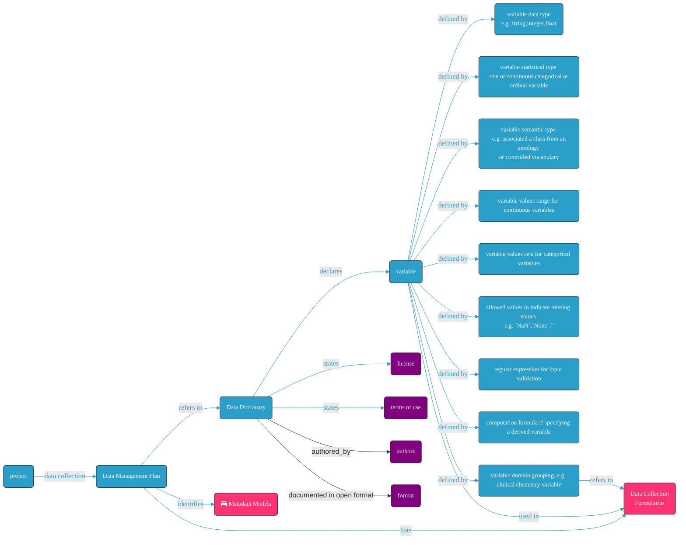

# How to create a FAIR Data/Variable Dictionary


**identifier:** [TBA](TBA)
**version:** [v0.1](v0.1)

___


**_Difficulty level:_** : TBD

**_Reading time:_** 15 minutes

**_Intended Audience:_** Data Scientist, Data Manager

**_Recipe Type_**: TBA 

**_Executable code_**: No

___

<div class="row">

  <div class="column">
    <div class="card">
      <div class="container">
        <i class="fa fa-qrcode fa-2x" style="color:#7e0038;"></i>
        <h4><b>Recipe metadata</b></h4>
        <p> identifier: <a href="">TBA</a> </p>
        <p> version: <a href="">v0.1</a> </p>
      </div>
    </div>
  </div>
  <div class="column">
    <div class="card">
      <div class="container">
        <i class="fa fa-fire fa-2x" style="color:#7e0038;"></i>
        <h4><b>Difficulty level</b></h4>
        <i class="fa fa-fire fa-lg" style="color:#7e0038;"></i>
        <i class="fa fa-fire fa-lg" style="color:lightgrey"></i>
        <i class="fa fa-fire fa-lg" style="color:lightgrey"></i>
        <i class="fa fa-fire fa-lg" style="color:lightgrey"></i>
        <i class="fa fa-fire fa-lg" style="color:lightgrey"></i>
  <!--       <p><span data-v-013baba1="" title="" class=""><svg data-v-013baba1="" viewBox="0 0 16 16" width="1em" height="1em" focusable="false" role="img" alt="icon" xmlns="http://www.w3.org/2000/svg" fill="currentColor" class="bi-bar-chart-fill b-icon bi medium-level"><g data-v-013baba1=""><rect width="4" height="5" x="1" y="10" rx="1"></rect><rect width="4" height="9" x="6" y="6" rx="1"></rect><rect width="4" height="14" x="11" y="1" rx="1"></rect></g></svg> Medium </span></p> -->
      </div>
    </div>
  </div>  
  <div class="column">
    <div class="card">
      <div class="container">
        <i class="fa fa-clock-o fa-2x" style="color:#7e0038;"></i>
        <h4><b>Reading Time</b></h4>
        <p><i class="fa fa-clock-o fa-lg" style="color:#7e0038;"></i> 15 minutes</p>
        <h4><b>Recipe Type</b></h4>
        <p><i class="fa fa-globe fa-lg" style="color:#7e0038;"></i> Guidance</p>
        <h4><b>Executable Code</b></h4>
        <p><i class="fa fa-play-circle" style="color:#fc7a4a;"></i> No</p>
      </div>
    </div>
  </div>
  <div class="column">
    <div class="card">
      <div class="container">
        <i class="fa fa-group fa-2x" style="color:#7e0038;"></i>
        <h4><b>Intended Audience</b></h4>
        <p> <i class="fa fa-database fa-lg" style="color:#7e0038;"></i> Data Managers </p>
        <p> <i class="fa fa-wrench fa-lg" style="color:#7e0038;"></i> Data Scientists </p>
<!--         <p> <i class="fa fa-terminal fa-lg" style="color:#7e0038;"></i> System Administrators</p>  -->       
      </div>
    </div>
  </div>
</div>

___


<!-- # Table of Contents
1. [Main FAIRification Objectives](#Main%20FAIRification%20Objectives)
2. [User Stories](#User%20Stories)
3. [Capability & Maturity Table](#Capability%20&%20Maturity%20Table)
4. [FAIRification Objectives, Inputs and Outputs](#FAIRification%20Objectives,%20Inputs%20and%20Outputs)
5. [An Example of Data Dictionary](#An%20Example%20of%20Data%20Dictionary)
6. [Factors to be considered when building a data dictionary](#Factors%20to%20be%20considered%20when%20building%20a%20data%20dictionary) -->

## Main FAIRification Objectives

Scope: Based on prior experience with other IMI projects, it is essential to ensure the provision of a comprehensive project specific `data dictionary`. 

A `data dictionary` is a file (or collection of files) which unambiguously declares, defines and annotates all the variables collected in a project and associated to a dataset.

Building a `FAIR data dictionary` means delivering a machine-actionable list of variables, thus greatly helping in assessing the **interoperability potential** of a dataset.

Presenting a `FAIR data dictionary template` is also meant to be useful to deal with current IMI projects as well as guide future ones.

The main purpose of this recipe is:

> - Provide a guide on what factors should be considered when building a `data dictionary` for data collection, data processing and analysis. 
> - Give an example of a data dictionary
> - Provide an example of machine-actionable data dictionary template.
___

## User Stories

When working on data from previous IMI projects, it became apparent that a well defined data dictionary is essential for data curation and analysis. It should contain all information needed for data collection and subsequent processing of data.

---

## Graphical overview


---

## Capability & Maturity Table

| Capability  | Initial Maturity Level | Final Maturity Level  |
| :------------- | :------------- | :------------- |
| Interoperability | minimal | repeatable |

----

## FAIRification Objectives, Inputs and Outputs

| Actions.Objectives.Tasks | Input | Output  |
| :------------- | :------------- | :------------- |
| [text annotation](http://edamontology.org/operation_3778) | list of Variables | Machine-acionable list of annotated Variables |

## An Example of Data Dictionary

| File Name            | Variable Name      | Variable Label            | Variable Ontology ID (RDFtype)                      | Variable Ontology Source | Variable Statistical Type | Variable Data Type | Variable Size | Max Allowed Value | Min Allowed Value | Unit   | Regex      | Allowed Value Shorthands | Allowed Value Descriptions      | Computed Value          | Unique (alone) | Unique (Combined with) | Required | Collection Form Name | Comments                                    |
|----------------------|--------------------|---------------------------|-----------------------------------------------------|--------------------------|---------------------------|--------------------|---------------|-------------------|-------------------|--------|------------|--------------------------|---------------------------------|-------------------------|----------------|------------------------|----------|----------------------|---------------------------------------------|
| 1\_Subjects.txt      | SUBJECT\_ID        | Subject number            |                                                     |                          | categorical variable      | integer            |               |                   |                   |        |            |                          |                                 |                         | Y              |                        | Y        | FORM 1               |                                             |
| 1\_Subjects.txt      | SPECIES            | Species name              |                                                     |                          | categorical variable      | string             |               |                   |                   |        |            |                          |                                 |                         |                |                        |          | FORM 1               |                                             |
| 1\_Subjects.txt      | STRAIN             | Strain                    |                                                     |                          | categorical variable      | string             |               |                   |                   |        |            |                          |                                 |                         |                |                        |          | FORM 1               |                                             |
| 1\_Subjects.txt      | AGE                | Age at study initiation   |                                                     |                          | continuous variable       | integer            |               |                   |                   | month  |            |                          |                                 |                         |                |                        | Y        | FORM 1               |                                             |
| 1\_Subjects.txt      | SEX                | Sex                       | http://purl.bioontology.org/ontology/LNC/MTHU002975 | LOINC                    | categorical variable      | enum               |               |                   |                   |        |            | M;F                      | M=male;F=female                 |                         |                |                        |          | FORM 1               |                                             |
| 1\_Subjects.txt      | SOMEDATE           | Date of acquiring subject |                                                     |                          | ordinal variable          | date               |               |                   |                   |        | YYYY-MM-DD |                          |                                 |                         |                |                        |          | FORM 1               |                                             |
| 1\_Subjects.txt      | HEMOGLOBIN         | Hematology: Hemoglobin    |                                                     |                          | continuous variable       | float              | 2,1           | 15.0              | 4.0               | mmol/l |            |                          |                                 |                         |                |                        |          | FORM 1               | Field size denotes "places, decimal places" |
| 1\_Subjects.txt      | HEIGHT             | Body size                 |                                                     |                          | continuous variable       | float              |               | 2,5               | 0,5               | m      |            |                          |                                 |                         |                |                        |          |                      |                                             |
| 1\_Subjects.txt      | WEIGHT             | Body weight               |                                                     |                          | continuous variable       | float              |               | 300               | 25                | kg     |            |                          |                                 |                         |                |                        |          |                      |                                             |
| 1\_Subjects.txt      | BMI                | Body mass index           |                                                     |                          | continuous variable       | float              |               | 100               | 10                |        |            |                          |                                 | WEIGHT/(HEIGHT\*HEIGHT) |                |                        |          |                      |                                             |
| 1\_Subjects.txt      | LAB                | Laboratory                |                                                     |                          | categorical variable      | integer            |               |                   |                   |        |            | 1;2;3                    | 1=LabA;2=UniversityB;3=CompanyC |                         |                |                        |          | FORM 1               |                                             |
| 2\_Samples.txt       | SAMPLE\_ID         | Sample ID                 |                                                     |                          | categorical variable      | string             |               |                   |                   |        |            |                          |                                 |                         | Y              |                        | Y        | FORM 2               |                                             |
| 2\_Samples.txt       | SAMPLE\_SITE       | Sample collection site    |                                                     |                          | categorical variable      | string             |               |                   |                   |        |            |                          |                                 |                         |                |                        | Y        | FORM 2               |                                             |
| 2\_Samples.txt       | ANALYTE\_TYPE      | Type of analysis          |                                                     |                          | categorical variable      | string             |               |                   |                   |        |            |                          |                                 |                         |                |                        | Y        | FORM 2               |                                             |
| 2\_Samples.txt       | GENOTYPING\_CENTER | GENOTYPING\_CENTER        |                                                     |                          | categorical variable      | string             |               |                   |                   |        |            |                          |                                 |                         |                |                        |          | FORM 2               |                                             |
| 2\_Samples.txt       | SEQUENCING\_CENTER | SEQUENCING\_CENTER        |                                                     |                          | categorical variable      | string             |               |                   |                   |        |            |                          |                                 |                         |                |                        |          | FORM 2               |                                             |
| 3\_SampleMapping.txt | SUBJECT\_ID        | Subject number            |                                                     |                          | ordinal variable          | integer            |               |                   |                   |        |            |                          |                                 |                         |                | SAMPLE\_ID             | Y        | FORM 3               |                                             |
| 3\_SampleMapping.txt | SAMPLE\_ID         | Sample ID                 |                                                     |                          | categorical variable      | string             |               |                   |                   |        |            |                          |                                 |                         |                | SUBJECT\_ID            | Y        | FORM 3               |                                             |                                          |

___

## Elements that should be included when building a data dictionary

* **File Name:** The file that contains the annotated variable(s).
* **Variable Name:** Name of the variable (field).
* **Variable Label:** A self explanatory annotation of the variable.
* **Ontology Source:** If the variable has been mapped to an ontology term, the source of that ontology.
* **Ontology ID:** The ontology term ID.
* **Variable Data Type:** The type of the variable. It is recommended to use the same type definition as it will be implemented in the data capturing system (e.g. an `xsd:datatype` such as `{date, integer, float, date, string}`).
* **Variable Type:** To unambiguously specify if the data associated with the variable being defined should be treated as a `continuous variable`, ` discrete/polychotomous variable` or an `ordinal variable`.
* **Field Size:** The size (length) of the variable value, e.g. 8 digits, 5,3 (for floating numbers)...
* **Max Allowed Value:** Upper limit of the allowed value.
* **Min Allowed Value:** Lower limit of the allowed value.
* **Unit:** Unit of the value.
* **Regex:** a regular expression allowing input validation in the case the value should follow a certain pattern (e.g. "\d{5}" for a 5-digit `Post Code`).
* **Allowed Values:** Customised list of allowed values (e.g. "M" and "F" for Gender).
* **Allowed Value Description:** Annotation of the list of allowed values (e.g.: M=male;F=female).
* **Computed Value:** If a field is computed based on values from other fields, annotate the calculation rule (e.g BMI=	WEIGHT/(HEIGHT*HEIGHT) ).
* **Unique (alone):** If the value of in a field should be unique (e.g. Subject ID).
* **Unique (combined with):** If the combination of several fields should be unique (e.g. Sample ID and Visit Number).
* **Required:** If the field should NOT allow empty value.
* **Collection Form Name:** Optional, if the field is collected in certain forms (e.g. in Case Report Forms from a clinical trial).
* **Comments:** Optional, for futher information.


### What fields to include in a data dictionary?

The right fields to include in a data dictionary are strongly dependent on the needs of the project and its context. 
- As a starting point, review existing community standards or minimum information checklists for your subject area to identify recommended fields (see for example recipes on [minimal metadata profiles for transcriptomics metadata](transcriptomics-metadata.md) and [guidance on creating minimal metadata profiles](creating-minimal-metadata-profiles.md)). We recommend consulting three key resources:
    - [FAIRsharing](https://fairsharing.org) and in particular the [Minimal Checklists](https://fairsharing.org/standards/?q=&selected_facets=type_exact:reporting%20guideline&selected_facets=has_publication:false) section 
    - In the context of clinical trial data, get familiar with [CDISC Therapeutic Area](https://www.cdisc.org/standards/therapeutic-areas) annotation profiles
    - the [OHDSI OMOP guidelines](https://www.ohdsi.org/resources/tutorials/) to bootstrap efforts and ensure interoperability.

- Make sure you capture all relevant variables for your planned analyses, in particular if you plan any non-standard or novel analyses. Also, ensure that variables are captured in the correct format (standardised if appropriate) **in order to minimise the need for transformations later**.
- Capture variables in the **most atomic form possible** as it is easier to aggregate separate fields into a new, combined value than to extract values from a larger field.
- Reduce free text use to a minimum for value-sets associated with qualitative or ordinal variables by providing list of controlled values from standardised vocabularies (e.g. using NCI Thesaurus or CDISC vocabulary) suited for the context you operated in (e.g. LOINC, SNOMED-CT in clinical context).
- Provide unambiguous textual definitions for each of the variables so third party users can understand what the variable represents, instead of second-guessed obscure variable shorthands.
- Provide units, and where possible, acceptable ranges for continuous variables.
- Provide regular expressions for input validation where needed (e.g. expecting an identifier or a particular reporting pattern)
- Provide formula if `derived variables` are computed from `primary variables`

#### Indicate how missing values are dealt with:

Data collection is never plain sailing. Patients drop out from studies, animals die, cell cultures or laboratory tests can fail. This results in holes in the datasets. However, without a clear plan to record missing data point unambiguously, empty cells in a record can be the cause of analysis pain.
It is therefore important and good practice to detail in a `data dictionary` what is a legimitate form to indicate a `missing value`, which should be interpreted as `null`.

Depending on the persistence system, how this needs to be specified varies. We provide an example on how to do so in the context of a Frictionless Tabular package. The specifications provide more information about how to specify how missing values should look like:

- https://specs.frictionlessdata.io/table-schema/#missing-values

```
"missingValues": [""]
"missingValues": ["-"]
"missingValues": ["NaN", "-"]
```


#### Remember to provide descriptive metadata for the data dictionary itself

- filename (with extension)
- checksum (preferably a SHA2 checksum)
- authors orcid (https://orcid.org/0000-0000-0000-00001)
- license url (e.g.)
- version number (semantic version as in `1.0.1`)

#### Remember to provide the data dictionary in an open syntax

```python=
TODO:
insert example generating a frictionless package from the example

include RDFType

```


---
## Conclusion:

This recipe covered an essential output of any research program, namely the documentation of all variables recorded about study subjects and key metadata descriptors used in subsequence analysis in the form of a `data dictionary`
The creation and provision of such a `data dictionary` should be an central component of any `data management plan` and should be one of the key deliverable of any IMI project.
Why? simply because if affords several key data management process to take place
- First, it forces `data owners` to carefully structure core metadata and annotation requirements, by spelling out the nature, purpose and constraints on the data collection.
- Second, it provides `data owners` the means to communicate about their scientific outputs, without necessarily disclosing the actual data collected over the course of the projects. It simply brings clarity and removes ambiguity about collected metadata and data. This clarify helps gauge `reusability potential` as well as `interoperability potential` of datasets.
- Thirdly, the availability of the `data dictionary` prove extremely useful for any curatorial works, from gearing for an `ETL process`, to planning for mapping across ontological framework. This is especially facilitated if the `data dictionaries` have clearly identified the semantic resources relied upon in a project.
- Finally, in the context of the Innovative Medicine Initiatives, delivering `Data Dictionaries` contributes to making research output more FAIR.

### What to read next:

> - [How to select ontologies]()
> - [Ontology Mapping]()
> - [Key issues to be aware of when planning [Extract-Transform-Load processes]()


___
## Authors:

| Name | Affiliation  | orcid | CrediT role  |
| :------------- | :------------- | :------------- |:------------- |
| Wei Gu |  LCSB, University of Luxembourg| [0000-0003-3951-6680](https://orcid.org/0000-0003-3951-6680) | Writing - Original Draft |
| Danielle Welter |  LCSB, University of Luxembourg| [0000-0003-1058-2668](https://orcid.org/0000-0003-1058-2668) | Writing - Original Draft |
| Philippe Rocca-Serra |  University of Oxford, Data Readiness Group| [0000-0001-9853-5668](https://orcid.org/orcid.org/0000-0001-9853-5668) | Writing - Original Draft |

___


## License:

<a href="https://creativecommons.org/licenses/by/4.0/"></a>
