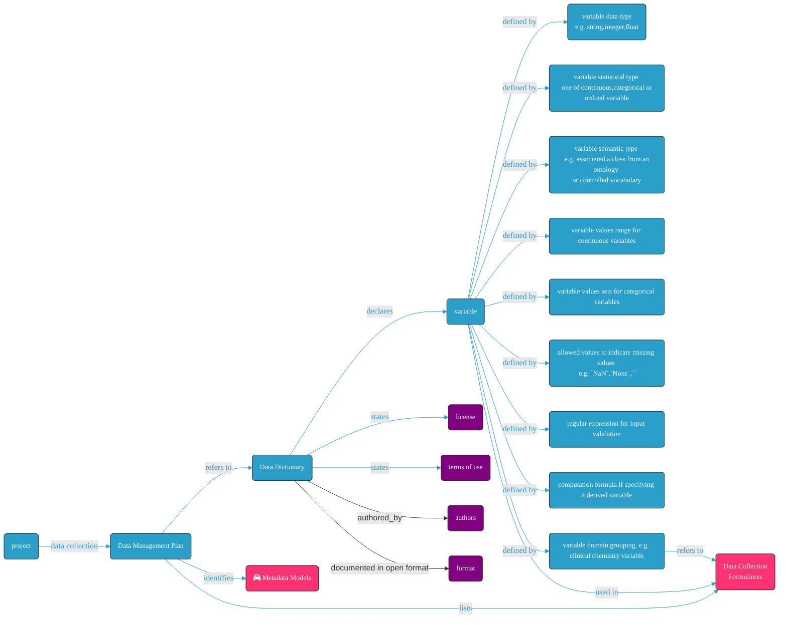

# How to standardizing and exchanging patient and sample phenotypic data


**identifier:** [TBA](TBA)
**version:** [v0.1](v0.1)

___


**_Difficulty level:_** : TBD

**_Reading time:_** 15 minutes

**_Intended Audience:_** Data Scientist, Data Manager

**_Recipe Type_**: TBA

**_Executable code_**: No

___

<div class="row">

  <div class="column">
    <div class="card">
      <div class="container">
        <i class="fa fa-qrcode fa-2x" style="color:#7e0038;"></i>
        <h4><b>Recipe metadata</b></h4>
        <p> identifier: <a href="">TBA</a> </p>
        <p> version: <a href="">v0.1</a> </p>
      </div>
    </div>
  </div>
  <div class="column">
    <div class="card">
      <div class="container">
        <i class="fa fa-fire fa-2x" style="color:#7e0038;"></i>
        <h4><b>Difficulty level</b></h4>
        <i class="fa fa-fire fa-lg" style="color:#7e0038;"></i>
        <i class="fa fa-fire fa-lg" style="color:lightgrey"></i>
        <i class="fa fa-fire fa-lg" style="color:lightgrey"></i>
        <i class="fa fa-fire fa-lg" style="color:lightgrey"></i>
        <i class="fa fa-fire fa-lg" style="color:lightgrey"></i>
  <!--       <p><span data-v-013baba1="" title="" class=""><svg data-v-013baba1="" viewBox="0 0 16 16" width="1em" height="1em" focusable="false" role="img" alt="icon" xmlns="http://www.w3.org/2000/svg" fill="currentColor" class="bi-bar-chart-fill b-icon bi medium-level"><g data-v-013baba1=""><rect width="4" height="5" x="1" y="10" rx="1"></rect><rect width="4" height="9" x="6" y="6" rx="1"></rect><rect width="4" height="14" x="11" y="1" rx="1"></rect></g></svg> Medium </span></p> -->
      </div>
    </div>
  </div>
  <div class="column">
    <div class="card">
      <div class="container">
        <i class="fa fa-clock-o fa-2x" style="color:#7e0038;"></i>
        <h4><b>Reading Time</b></h4>
        <p><i class="fa fa-clock-o fa-lg" style="color:#7e0038;"></i> 15 minutes</p>
        <h4><b>Recipe Type</b></h4>
        <p><i class="fa fa-globe fa-lg" style="color:#7e0038;"></i> Guidance</p>
        <h4><b>Executable Code</b></h4>
        <p><i class="fa fa-play-circle" style="color:#fc7a4a;"></i> No</p>
      </div>
    </div>
  </div>
  <div class="column">
    <div class="card">
      <div class="container">
        <i class="fa fa-group fa-2x" style="color:#7e0038;"></i>
        <h4><b>Intended Audience</b></h4>
        <p> <i class="fa fa-database fa-lg" style="color:#7e0038;"></i> Data Managers </p>
        <p> <i class="fa fa-wrench fa-lg" style="color:#7e0038;"></i> Data Scientists </p>
<!--         <p> <i class="fa fa-terminal fa-lg" style="color:#7e0038;"></i> System Administrators</p>  -->
      </div>
    </div>
  </div>
</div>

___


<!-- # Table of Contents
1. [An introduction of the phenopacket schema](#An%20introduction%20of%20the%20phenopacket%20schema)
2. [An example of phenotypic data represented in phenopacket](#An%20example%20of%20phenotypic%20data%20represented%20in%20phenopacket)
3. [Existing tools and ETLs for know formats](#Existing%20tools%20and%20ETLs%20for%20know%20formats)
4. [A demo case of adopting phenopacket at BioSamples](#A%20demo%20case%20of%20adopting%20phenopacket%20at%20BioSamples) -->

## Main FAIRification Objectives

Scope: Submitting and exchange different type of molecular data (e.g. OMICS) data requires the submission of the phenotypic data of the associated patients and samples. 
The phenopackets schema is a community accpeted open standard (approved by the GA4GH Steering Committee) for sharing disease and phenotype information to improve the understand, diagnose, and treat both rare and common diseases. 

Prepare the phenotypic data using the phenopackets schema will greatly help in improving the **interoperability** of a dataset. It is also becoming mandatory for the submission to public data repositories.

The main purpose of this recipe is:

> - Provide a basic introduction of the phenopacket specification.
> - Give an example of how to transform phenotypic data using the phenopackets schema.
> - Provide links to existing tools and ETLs from established formats.
> - A demo case of adopting phenopacket at BioSamples
___

## User Stories

Submit your genomics sequencing data to the European Genome-Phenome Archive (EGA).

---

## Graphical overview


---

## Capability & Maturity Table

| Capability  | Initial Maturity Level | Final Maturity Level  |
| :------------- | :------------- | :------------- |
| Interoperability | minimal | repeatable |

----

## FAIRification Objectives, Inputs and Outputs

| Actions.Objectives.Tasks | Input | Output  |
| :------------- | :------------- | :------------- |
| [text annotation](http://edamontology.org/operation_3778) | list of Variables | Machine-acionable list of annotated Variables |

## An introduction of the phenopacket schema

TO BE MODIFIED: "The Phenopacket Schema represents an open standard for sharing disease and phenotype information to improve our ability to understand, diagnose, and treat both rare and common diseases..."

### Phenopacket data model

> :bulb: TBD: phenopacket ontology recommendation not included
<table>
  <tr>
   <td><strong>Phenopackets blocks</strong>
   </td>
   <td><strong>Phenopackets attributes</strong>
   </td>
  </tr>
  <tr>
   <td rowspan="4" >Subject
   </td>
   <td>Id
   </td>
  </tr>
  <tr>
   <td>Individual Id
   </td>
  </tr>
  <tr>
   <td>Age
   </td>
  </tr>
  <tr>
   <td>Sex
   </td>
  </tr>
  <tr>
   <td rowspan="12" >Biosample
   </td>
   <td>Description
   </td>
  </tr>
  <tr>
   <td>sampled_tissue
   </td>
  </tr>
  <tr>
   <td>Phenotypic Features
   </td>
  </tr>
  <tr>
   <td>Age Of Individual At Collection
   </td>
  </tr>
  <tr>
   <td>Taxonomy
   </td>
  </tr>
  <tr>
   <td>Histological diagnosis
   </td>
  </tr>
  <tr>
   <td>Tumor progression
   </td>
  </tr>
  <tr>
   <td>Tumor grade
   </td>
  </tr>
  <tr>
   <td>Diagnostic marker
   </td>
  </tr>
  <tr>
   <td>Procedure
   </td>
  </tr>
  <tr>
   <td>Variants
   </td>
  </tr>
  <tr>
   <td>Is control sample (true/false)
   </td>
  </tr>
  <tr>
   <td rowspan="2" >Diseases
   </td>
   <td>Term
   </td>
  </tr>
  <tr>
   <td>Disease stage
   </td>
  </tr>
  <tr>
   <td rowspan="2" >External References
   </td>
   <td>Id
   </td>
  </tr>
  <tr>
   <td>Description
   </td>
  </tr>
</table>
## An example of phenotypic data represented in phenopacket

Example here.


## Existing tools and ETLs for know formats

The link

## A demo case of adopting phenopacket at BioSamples
The [BioSamples](www.ebi.ac.uk/biosamples) database converts the sample to Phenopacket data exchange format.

BioSample export as PDX file.
```json
{
  "id": "SAMN15751358",
  "subject": {
    "id": "SAMN15751358-individual",
    "sex": "FEMALE",
    "taxonomy": {
      "id": "NCBITaxon:9606",
      "label": "Homo sapiens"
    }
  },
  "biosamples": [{
    "id": "SAMN15751358",
    "individualId": "SAMN15751358-individual",
    "taxonomy": {
      "id": "NCBITaxon:9606",
      "label": "Homo sapiens"
    },
    "ageOfIndividualAtCollection": {
      "age": "75"
    }
  }],
  "metaData": {
    "created": "1970-01-01T00:00:00Z",
    "createdBy": "Biosamples phenopacket exporter",
    "resources": [{
      "id": "pato",
      "name": "PATO - the Phenotype And Trait Ontology",
      "url": "http://purl.obolibrary.org/obo/pato.owl",
      "version": "2020-08-02",
      "namespacePrefix": "PATO"
    }, {
      "id": "ncbitaxon",
      "name": "NCBI organismal classification",
      "url": "http://purl.obolibrary.org/obo/ncbitaxon.owl",
      "version": "2020-04-18",
      "namespacePrefix": "NCBITAXON"
    }]
  }
}
```


---
## Conclusion:

This recipe covered an essential part of standardizing and exchangign patient and sample phenotype using the phenopacket schema...

## What to read next:

> - [Phenopacket Documentation](https://phenopackets-schema.readthedocs.io/en/latest/)
> - [The Human Phenotype Ontology (HPO)](https://hpo.jax.org/app/)

___
## Authors:

| Name | Affiliation  | orcid | CrediT role  |
| :------------- | :------------- | :------------- |:------------- |
| Danielle Welter |  LCSB, University of Luxembourg| [0000-0003-1058-2668](https://orcid.org/0000-0003-1058-2668) | Writing - Original Draft |
| Philippe Rocca-Serra |  University of Oxford, Data Readiness Group| [0000-0001-9853-5668](https://orcid.org/orcid.org/0000-0001-9853-5668) | Writing - Original Draft |
| Wei Gu |  LCSB, University of Luxembourg| [0000-0003-3951-6680](https://orcid.org/0000-0003-3951-6680) | Writing - Original Draft |
| Mélanie Courtot | EMBL-EBI| [0000-0002-9551-6370](https://orcid.org/orcid.org/0000-0002-9551-6370) | Writing - Original Draft |
| Cincia Thion | EMBL-EBI| |Writing - Original Draft |
|Fuqi Xu|EMBL-EBI|[0000-0002-5923-3859](https://orcid.org/0000-0002-5923-3859)|Writing and editing|
___


## License:

<a href="https://creativecommons.org/licenses/by/4.0/"></a>
