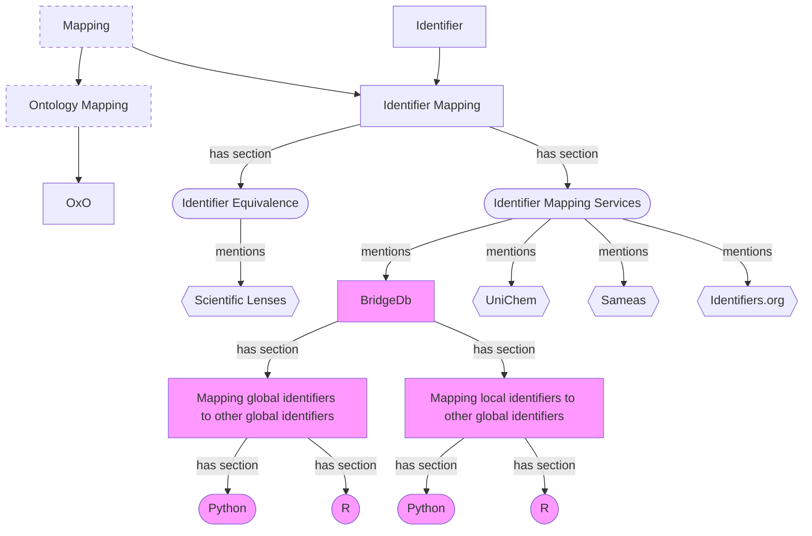
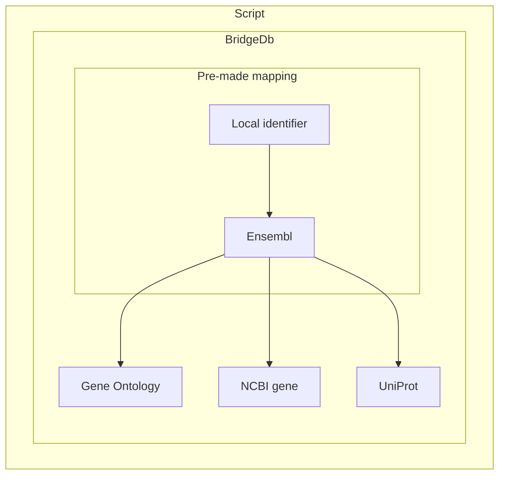
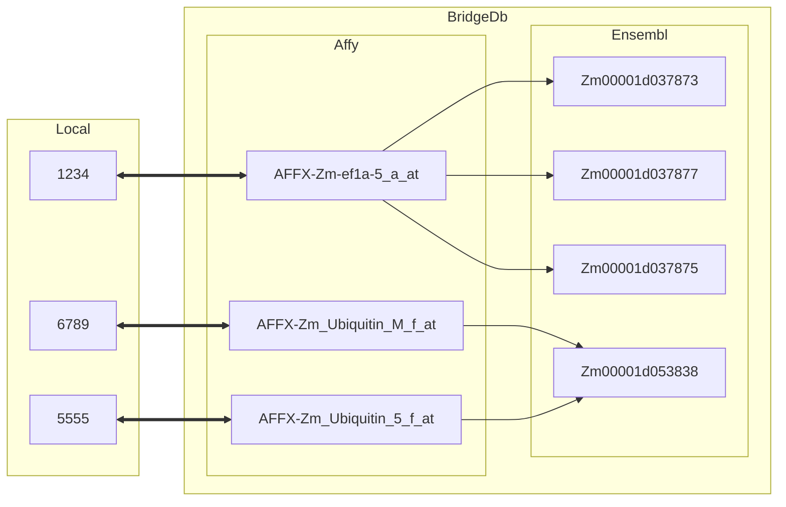

# Identifier mapping with BridgeDB

## Table of Contents
[toc]

---

## Main Objectives

The main purpose of this recipe is:

> Providing practical examples on how to map identifiers using two of BridgeDB's interfaces (R package and Webservices).


___


## Graphical Overview of the FAIRification Recipe Objectives

This recipe will cover the highlighted topics


___


## Requirements

* technical requirements:
    * R
    * Python
* recipe dependency:
    * "How to generate globally unique, resolvable and persistent identifiers"
    * "How to interlink data from different sources?"

---

## Capability & Maturity Table

| Capability  | Initial Maturity Level | Final Maturity Level  |
| :------------- | :------------- | :------------- |
| Interoperability | minimal | repeatable |
| Reusability | minimal| reusable|


<!--## Table of Data Standards


| Data Formats  | Terminologies | Models  |
| :------------- | :------------- | :------------- |
| [FASTQ](https://fairsharing.org/FAIRsharing.r2ts5t)  | [LOINC](https://fairsharing.org/FAIRsharing.2mk2zb)  | [SRA XML](https://fairsharing.org/FAIRsharing.q72e3w)  |
| [DICOM](https://fairsharing.org/FAIRsharing.b7z8by)  | [Human Phenotype Ontology](https://fairsharing.org/FAIRsharing.kbtt7f)  | [OMOP](https://fairsharing.org/FAIRsharing.qk984b)  |
-->
___

## Identifier mapping with BridgeDb

[Identifier mapping](https://github.com/FAIRplus/the-fair-cookbook/blob/id-map-services/docs/content/recipes/interoperability/identifier-mapping.md) is an essential step for data reusability and interoperability. This step requires of dedicated tools, here we show how BridgeDb can help us in this process.

BridgeDB is an open source tool that can help us perform identifier mapping using three different interfaces:
* Java API
* R package
* Webservices


> :book: In the context of this recipe we will use two terms to categorize identifiers:
>* *Local identifiers* which refer to identifiers that are locally defined and minted within an organization or database
>* *Global identifiers* which will refer to identifiers from BridgeDb's [data sources file](https://github.com/bridgedb/BridgeDb/blob/2dba5780260421de311cb3064df79e16a396b887/org.bridgedb.bio/resources/org/bridgedb/bio/datasources.tsv)

We will focus here on two different cases that depend on the data that we have available, namely, whether our data is already using global identifiers or local identifiers. 


#### Cases:

1. Connect data with global identifiers to different global identifiers
3. Connect data with local identifiers that were mapped to a global identifier to a different global identifier

In this recipe we will cover how the R package and webservices can be used to accomplish the stated objectives.

### Mapping global identifier to other global identifier
In this case we have a list of elements with an identifier that is part of [BridgeDbs data sources](https://github.com/bridgedb/BridgeDb/blob/2dba5780260421de311cb3064df79e16a396b887/org.bridgedb.bio/resources/org/bridgedb/bio/datasources.tsv). In our example we will use a list of Homo Sapiens, Hugo Gene Nomenclature Convention (HGNC) gene identifiers stored in a TSV file. The objective is to map these to other available gene identifiers.

#### Webservices in Python
> :exclamation: For this tutorial Python v3.8.5, [pandas](https://pandas.pydata.org/) v1.1.3 and BridgeDb Webservices v0.9.0 were used.

One of the biggest benefits of using BridgeDb's webservices is that these can be accessed using most programming language. Python has become one of the leading programming languages in data science and predictive modelling. Despite the lack of a BridgeDb Python library we show here how to use the Webservices to perform the mappings suggested under [Cases](#Cases) 

We start by defining strings containing the url of the webservices and the specific method from the Webservices that we want to use. In our case a batch cross reference. When we do our query we will specify the organism and the source dataset. We can also optionally specify a target data source if we only want to map one of them (e.g. Ensembl)  

```python=3.8.5
url = "https://webservice.bridgedb.org/"
batch_request = url+"{org}/xrefsBatch/{source}{}"
```

If we aim to map only to a specific target data source we can check whether the mapping is supported by calling the webservices running the following 
```python=3.8.5
mapping_available = "{org}/isMappingSupported/{source}/{target}"
query = url+mapping_available.format(org='Homo sapiens', source='H', target='En')
requests.get(query).text
```
Which will return `True` if the mapping between the given source and target is supported for the given organism or `False` otherwise.

We then load our data into a pandas dataframe and call the requests library using our query.

```python=3.8.5
query = batch_request.format('?dataSource=En', org='Homo sapiens', source='H')
response = requests.post(query, data=data.to_csv(index=False, header=False))
```

The webserivce's response is now stored in the `response` variable. We can then simply pass this variable to the `to_df` method provided in the `bridgedb_script.py` module (see [Code](#Code)). This method will extract the response in text form and turn it into a pandas Dataframe with conveniently named columns and structured data.

In our case the output of `to_df` is:
| original   | source   | mapping         | target   |
|:-----------|:---------|:----------------|:---------|
| A1BG       | HGNC     | ENSG00000121410 | En       |
| A1CF       | HGNC     | ENSG00000148584 | En       |
| A2MP1      | HGNC     | ENSG00000256069 | En       |

The output table will contain:
* The original identifier
* The data source that the identifier is part of
* The mapped identifier
* The data source for the mapped identifier

If we were to not specify the target data source (by passing an empty string as the parameter) we would get all the potential mappings for the given identifiers. In our case (top 10 rows):
| original   | source   | mapping      | target   |
|:-----------|:---------|:-------------|:---------|
| A1BG       | HGNC     | uc002qsd.5   | Uc       |
| A1BG       | HGNC     | 8039748      | X        |
| A1BG       | HGNC     | GO:0072562   | T        |
| A1BG       | HGNC     | uc061drj.1   | Uc       |
| A1BG       | HGNC     | ILMN_2055271 | Il       |
| A1BG       | HGNC     | Hs.529161    | U        |
| A1BG       | HGNC     | GO:0070062   | T        |
| A1BG       | HGNC     | GO:0002576   | T        |
| A1BG       | HGNC     | uc061drt.1   | Uc       |
| A1BG       | HGNC     | 51020_at     | X        |

#### R package
> :exclamation: For this tutorial R v4.0.3, [tidyverse](https://www.tidyverse.org/) v1.3.0 and [BridgeDbR](https://www.bioconductor.org/packages/release/bioc/html/BridgeDbR.html) v2.0.0 were used.

After having loaded the required packages we read the data and create a new column to include the source of the identifier.

```r
data_df <- read_tsv(filepath, col_names=c('identifier'))
data_df$source = 'H'
``` 

We then load the data for the organism we are mapping from.

```r
 location <- getDatabase('Homo sapiens')
 mapper <- loadDatabase(location)
```

And use the package function to map the identifiers

```r
mapping = maps(mapper, data_df, target='En')
```
This will return:
| identifier | source | target | mapping         |
|:---------- |:------ |:------ |:--------------- |
| A1BG       | H      | En     | ENSG00000121410 |
| A1CF       | H      | En     | ENSG00000148584 |
| A2MP1      | H      | En     | ENSG00000256069 |

As before we can also not specify the target and obtain all possible mappings. This will result in (top 10) 
| identifier | source | target | mapping      |
|:---------- |:------ |:------ |:------------ |
| A1BG       | H      | Uc     | uc002qsd.5   |
| A1BG       | H      | X      | 8039748      |
| A1BG       | H      | T      | GO:0072562   |
| A1BG       | H      | Uc     | uc061drj.1   |
| A1BG       | H      | Il     | ILMN_2055271 |
| A1BG       | H      | U      | Hs.529161    |
| A1BG       | H      | T      | GO:0070062   |
| A1BG       | H      | T      | GO:0002576   |
| A1BG       | H      | Uc     | uc061drt.1   |
| A1BG       | H      | X      | 51020_at     |

> :warning: An error message indicating "Error in download.file" might be caused by timeout being set to a value that is too low. To avoid this increase the timeout by calling `options(timeout=300)`
<!--
This will maybe link to the identifier mapping recipe in the future, where there will be a specific section detailing identifier equivalence files taking into account scientific lenses, as discussed with Egon. 

--------------------------------


### Mapping local identifier to global identifier
[NEED HELP HERE]
This is a step that should be done manually. In this case an important decision should be made, which identifiers to map to. To decide this you should look for the data source that contains the closest definition of the concepts to the one you used for your local identifiers.

-->

### Mapping local identifier to a different global identifier

> :bulb: Here we assume that we already have an equivalence file containing the mapping of a local identifier to one of the global identifiers. In our case this will be contained in a TSV where we map our local identifier to HGNC. You can see other potential data formats in the [Identifier Mapping recipe](). The mapping should be **one-to-one** for this recipe. 

Our TSV mapping file looks as follows:
| local   | source   |
|:--------|:---------|
| aa11    | A1BG     |
| bb34    | A1CF     |
| eg93    | A2MP1    |
You may notice the `source` identifiers correspond with those used in the previous example.


This is how the mapping will work


#### Webservices in Python

As before we will define variables including the webservice's URL and the method that we will use, which will be xRefsBatch.

In this case we pass the source column to the post request as follows

```python=3.8.5
source_data = case2.source.to_csv(index=False, header=False)
query = batch_request.format('', org=org, source=source)
response2 = requests.post(query, data = source_data)
```
You may notice here that we did not pass a target source, this could be done as specified before. Then we use `to_df` again and as expected obtain the same dataframe as before.
To see the equivalences with our local identifiers we can simply join the dataframes
```python=3.8.5
local_mapping = mappings.join(case2.set_index('source'), on='original')
```
which will return the following table (first 10 rows)
| original   | source   | mapping      | target   | local   |
|:-----------|:---------|:-------------|:---------|:--------|
| A1BG       | HGNC     | uc002qsd.5   | Uc       | aa11    |
| A1BG       | HGNC     | 8039748      | X        | aa11    |
| A1BG       | HGNC     | GO:0072562   | T        | aa11    |
| A1BG       | HGNC     | uc061drj.1   | Uc       | aa11    |
| A1BG       | HGNC     | ILMN_2055271 | Il       | aa11    |
| A1BG       | HGNC     | Hs.529161    | U        | aa11    |
| A1BG       | HGNC     | GO:0070062   | T        | aa11    |
| A1BG       | HGNC     | GO:0002576   | T        | aa11    |
| A1BG       | HGNC     | uc061drt.1   | Uc       | aa11    |
| A1BG       | HGNC     | 51020_at     | X        | aa11    |

in case we did specify the target we would instead get

| original   | source   | mapping         | target   | local   |
|:-----------|:---------|:----------------|:---------|:--------|
| A1BG       | HGNC     | ENSG00000121410 | En       | aa11    |
| A1CF       | HGNC     | ENSG00000148584 | En       | bb34    |
| A2MP1      | HGNC     | ENSG00000256069 | En       | eg93    |

Here we see a 1-to-1 relation between the identifiers in HGNC and En while the relation between HGNC and UCSC Genome Browser (Uc) or Gene Ontology (T) is 1-to-N. Depending on the identifiers relation could also be N-to-N as shown below.

<!--
You may notice that despite the 1-to-1 relation between `local` and `original` we get a N-to-N relation between `local` and `mapping` due to the N-to-N relation between `original` and `mapping`. This can be easily understood with the diagram below-->


> :book: This N-to-N relationship stems from different *scientific lenses* in the data sources. You can read more about these in **[CITE]**. The core idea is that depending on the domain/application of the data we can consider different entities as unique. While certain proteins could be considered "equal" from a biological perspective they may require differentiation when using a chemical lense. This is what then leads to N-to-N relationships.

#### R Package

Here we will follow the same steps as in the previous case. The only difference is that when loading the data we will specify the columns as:

```r
data_df <- read_tsv(filepath, col_names=c('local', 'identifier'))
``` 
Then, after computing the mapping we can join it with the local identifier

```r
right_join(data_df, mapping)
```
Assuming we did not specify the target data source we obtain the following table (first 10 rows):
| local | identifier | source | target | mapping      |
|:----- |:--------   |:------ |:------ |:------------ |
| aa11  | A1BG       | H      | Uc     | uc002qsd.5   |
| aa11  | A1BG       | H      | X      | 8039748      |
| aa11  | A1BG       | H      | T      | GO:0072562   |
| aa11  | A1BG       | H      | Uc     | uc061drj.1   |
| aa11  | A1BG       | H      | Il     | ILMN_2055271 |
| aa11  | A1BG       | H      | U      | Hs.529161    |
| aa11  | A1BG       | H      | T      | GO:0070062   |
| aa11  | A1BG       | H      | T      | GO:0002576   |
| aa11  | A1BG       | H      | Uc     | uc061drt.1   |
| aa11  | A1BG       | H      | X      | 51020_at     |

In case we did specify the target data source we would get:

| local | identifier | source | target | mapping         |
|:----- |:---------- |:------ |:------ |:--------------- |
| aa11  | A1BG       | HGNC   | En     | ENSG00000121410 |
| bb34  | A1CF       | HGNC   | En     | ENSG00000148584 |
| eg93  | A2MP1      | HGNC   | En     | ENSG00000256069 |
___
## Code 
You can find ready-made methods to map using R and Python for the given use cases [here](https://github.com/mavrokefalidis/bridgedb-recipe-code). These assume the data has the structure described in this recipe.

---

## Conclusion

> We showed how to use BridgeDb's webservices and R package to map identifiers from different data sources using toy data. 
> 
> #### What should I read next?
> * [Identifiers](#TODO)
> * [Identifier mapping](#TODO)

## References
---
1. Brenninkmeijer, C., Evelo, C., Goble, C., Gray, A. J. G., Groth, P., Pettifer, S., Stevens, R., Williams, A. J., & Willighagen, L. (n.d.). Scientific Lenses over Linked Data: An approach to support task specific views of the data. A vision. 4.
2. Leemans C, Willighagen E, Slenter D, Bohler A, Eijssen L (2020). BridgeDbR: Code for using BridgeDb identifier mapping framework from within R. R package version 2.0.0, https://github.com/bridgedb/BridgeDbR. 
3. Standardised access to Gene, Gene-Variant, Protein, Metabolite and Interaction Identifier Mapping Services. (n.d.). bridgedb.github.io. Retrieved January 4, 2021, from https://bridgedb.github.io/

___
## Authors

| Name | Affiliation  | orcid | Credit role  | specific contribution |
| :------------- | :------------- | :------------- |:------------- |:------------- |
| Lucas Giovanni Uberti-Bona Marin |  Maastricht University| | Writing - Original Draft | Original format |
| Chris Evelo |  Maastricht University |[0000-0002-5301-3142](https://orcid.org/0000-0002-5301-3142) | Writing - Review & Editing | | 
| Egon Willighagen |  Maastricht University | [0000-0001-7542-0286](https://orcid.org/0000-0001-7542-0286)| Writing - Review & Editing | | 
| Alasdair Gray | Heriot-Watt Unviersity / ELIXIR-UK | [0000-0002-5711-4872](https://orcid.org/0000-0002-5711-4872) | Writing - Review & Editing |  |

___


## License

This page is released under the Creative Commons 4.0 BY license.

<a href="https://creativecommons.org/licenses/by/4.0/"></a>

