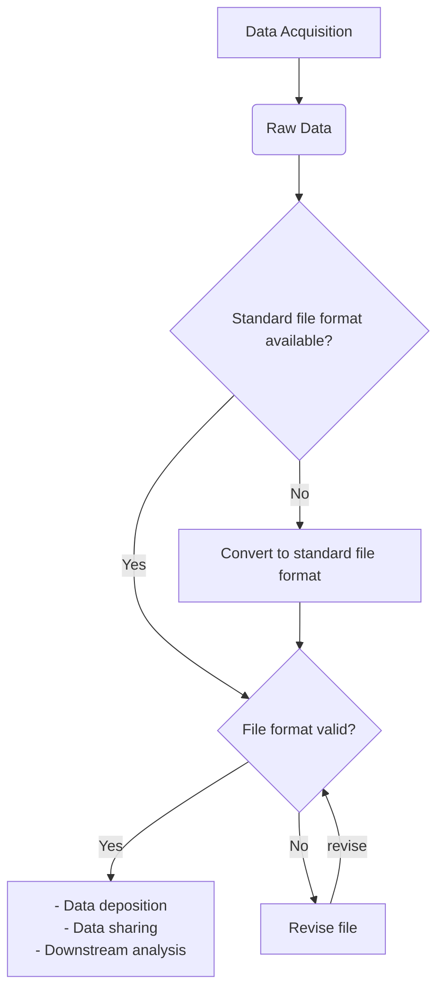

>:bulb: __W.I.P__

# File format validation, an example with FASTQ files

[toc]

---

## Main Objectives

The main purpose of this recipe is to:

> provide a FASTQ file validation solution, and suggest a general file validation workflow. 

Data reuse in life science is common and important. Biologists and bioinformaticians To make sure the data can be reuse, before deposition and ?

[FASTQ](edamontology.org/format_2182) is the _de facto_ sequencing file format, and the foundamental file format for many bioinformatics analysis. It is a common practice to reuse FASTQ files in public archives for analysis. Since the files may come from different sources, and the FASTQ-based downstream analysis is usually automated, time-consuming and error-prone, it is important to validate FASTQ files. 

## Graphical Overview of the FAIRification Recipe Objectives


[](https://mermaid-js.github.io/mermaid-live-editor/#/edit/eyJjb2RlIjoiZ3JhcGggVEQ7XG4gICAgQVtEYXRhIEFjcXVpc2l0aW9uXSAtLT5CKFJhdyBEYXRhKVxuICAgIEIgLS0-IEN7U3RhbmRhcmQgZmlsZSBmb3JtYXQgYXZhaWxhYmxlP31cbiAgICBDIC0tPnxZZXN8IER7RmlsZSBmb3JtYXQgdmFsaWQ_fVxuICAgIEMgLS0-fE5vfCBFW0NvbnZlcnQgdG8gc3RhbmRhcmQgZmlsZSBmb3JtYXRdXG4gICAgRCAtLT4gfFllc3xGWy0gRGF0YSBkZXBvc2l0aW9uIDwvYnI-ICAtIERhdGEgc2hhcmluZyA8L2JyPiAgLSBEb3duc3RyZWFtIGFuYWx5c2lzIF1cbiAgICBEIC0tPiB8Tm98R1tSZXZpc2UgZmlsZV1cbiAgICBFIC0tPiAgRFxuICAgIEcgLS0-IHxyZXZpc2V8RCIsIm1lcm1haWQiOnsidGhlbWUiOiJkZWZhdWx0In0sInVwZGF0ZUVkaXRvciI6ZmFsc2V9)
:octopus: Related recipes: [From proprietary format to open standard format: an exemplar](https://github.com/FAIRplus/the-fair-cookbook/blob/mzml-format/docs/content/recipes/interoperability/from-proprietary-to-open-standard-mzml-exemplar.md) 

## User Stories

The table below lists common file validation use cases. This recipe provide solutions with FASTQ files as an example.

|As a ..| I want to .. |So that I can ..|
|---|--|--|
|Data owner| Validate my sequencing files before depositing to public archives| Reduce the risk of submitting invalid files or rejected submission|
|Data consumer| Validate files before running analysis|Avoid wasting time and resource processing corrupted files|
|Data consumer| Intergrate file format validation into my data process pipeline| Build a more reproducible and error-proof pipeline| 
|Data librarian| check the file from unknown source before depositing the file| Ensure the file is usable in the future.|


## Capability & Maturity Table

| Capability  | Initial Maturity Level | Final Maturity Level  |
| :------------- | :------------- | :------------- |
|   |  |   |

----

## FAIRification Objectives, Inputs and Outputs

| Actions.Objectives.Tasks  | Input | Output  |
| :------------- | :------------- | :------------- |
| [Format validation](http://edamontology.org/operation_0336)  | [FASTQ file](http://edamontology.org/format_2182)  | Validation results  |


## Table of Data Standards

| Data Formats  | Terminologies | Models  |
| :------------- | :------------- | :------------- |
| [FASTQ](http://edamontology.org/format_2182)  | |
___

FASTQ validators detect truncated reads, base calls and quality score mismatches, invalid encoding, etc. For paired-end reads, they also checks if the forward reads are paired with the reverse reads. Most validators can detect different FASTQ variants and process compressed FASTQ files automatically. 

Most validators detects FASTQ variants automaticlly. The Quality control of FASTQ file are not included in this recipe. 

[FASTQ-utils](https://github.com/nunofonseca/fastq_utils) is an open-source software to validate and process FASTQ files. It has been used in __popular archives___, European Nucleotide Archive, (ENA) and several research projects, __Human Cell Atlas__, for example.

Here is an example of validating FASTQ file with _FASTQ-utils_

### Step 1: Install fastq-utils
```shell
conda install -c bioconda fastq_utils
```
It is also possible to install fastq_utils from [the source code](https://github.com/nunofonseca/fastq_utils).

### Step 2: Get example file for testing*
_* :bulb: Users can skip this step and test with their own files._ 

__Here we provide two FASTQ examples in ENA for testing.__ The first example is _Ion Torrent S5_ sequencing FASTQ single read. The second example is _Illumina iSeq 100_ paired end sequencing files.

__Example 1: Get single read FASTQ file__

The command below downloads an _Ion Torrent S5_ fastq file from ENA. [This file](https://www.ebi.ac.uk/ena/browser/view/SRR12132977) is the Whole genome sequencing file of SARS-CoV-2. The complete file is 192Mb. 
```shell
wget -c ftp://ftp.sra.ebi.ac.uk/vol1/fastq/SRR121/077/SRR12132977/SRR12132977.fastq.gz
```
Uses can inspect the _fastq.gz_ file using `gzip -cd SRR12132977.fastq.gz | head -8`. Below is the header of the FASTQ file.
```
@SRR12132977.1 1/1
AACAAACCAACCAACTTTCGATCTCTTGTAGATCTGTTCTCTAAACGAACAAACTAAAATGTCTGATAATGGACCCCAAAATCAGCGAAATGCACCCCGCATTACGTTTGGTGGACCCTCAG
+
C@CCD>DBC?B692;;;09?<BBBBC>BBBBBBBBB@?ABB@BC<BBB>@A?:999992;=>>@??==:=C;>=<:'555)8;;;;;AG:AAAAADD;CCBB>?@;;;0:<@A>CEE?CFCC
@SRR12132977.2 2/1
AACAAACCAACCAACTTTCGATCTCTTGTAGATCTGTTCTCTAAACGAACTTTAAAATCTGTGTGGCTGTCACTCGGCTGCATGCTTAGTGCACTCACGCAGTATAATTAATAACTAATTACTGTCGTTGACAGGACACGAGTAACTCGTCTATCTTCTGCAGGCTGCTTACGGTTTCGTCCGTGTTGCAGCCGATCATCAGCAC
+
A>A@@=@@F@D@C<999,:<@ABBBB@B=>=BB@BBB?@@><;;7>??=BBB>BDD;D>????@@;@CDC@@@BBB>BBB@AAC>>9BBBB;;;@@?;><::;99<9<;A;>><@@A:=:>@@@>A@>:>===>:=<<>>;;;>=BCAA?>=A>>>:==>;998<=;===@@@<>>9>>>?;??==:=>>>>:>>;;;;;;;<;;
```
__Example 2: Get paired-read FASTQ files__

The command below downloads Illumina iSeq 100 paired end sequencing files from ENA. [These files](https://www.ebi.ac.uk/ena/data/view/SRR11542244) are raw sequence reads of a SARS-CoV-2 sample. Each file is 26 Mb.

```shell
wget -c \
ftp://ftp.sra.ebi.ac.uk/vol1/fastq/SRR115/044/SRR11542244/SRR11542244_1.fastq.gz \
ftp://ftp.sra.ebi.ac.uk/vol1/fastq/SRR115/044/SRR11542244/SRR11542244_2.fastq.gz
```
Below is the headers of the two files. The paired info are indicated in the read ID.
```
# Header of the forward read, SRR11542244_1.fastq.gz
@SRR11542244.1 1/1
GTGTGTGTATACATATATATATATATCACATTTTCTTTATCCATTTATCTGTTGTTGGACACTTAGGTTGATTCCATATCTTGGCTATTGTGAATAGTG
+
,,FFFFFFFFFFFFFFFFFFFFFFFF:FFF:FFFFFFFFFFFFFFFFFFFFFFFFFFFFFFFF:FFFFFFFFFFFF:FFFFFFFFFFFFFFFFFFFFFF
@SRR11542244.2 2/1
GTGATTCCTCAAAGATTTAGAACCAGAAATACCATGTGACCCAGCAATTCCATTACCAGGTCTAAACCCAAAGGAATATAAATCATTCTGTAATGAAGATA
+
FFFFFFFFFFFFFFFFFFFFFFFFFFFFFFFFFFFFFFFFFFFFFFFFFFFFFFFFFFFFFFFFFFFFFFFFFFFFFFFFFFFFFFFFFFFFFFFFFFFFF


# Header of the reverse read, SRR11542244_2.fastq.gz
@SRR11542244.1 1/2
CTATTGGGTATTTAATCCAAAGAAAGGAAATCGGTATATCAAAGAGACATCTGCATGCCCATGTTTATTGTAGCACTATTCACAATAGCCAAGATATGGAA
+
FFFFFFFFFFFFFFFFFFFFFFFFFFFFFFFFFFFFFFFFFFFFFFFFFFFFFFFFFFFFFFFFFFFFFFFFFFFFFFFF:FFFFFFFFFFFFFFFFFFFF
@SRR11542244.2 2/2
GAACATATGTGTGCATGTATCTTCATTACAGAATGATTTATATTCCTTTGGGTTTAGACCTGGTAATGGAATTGCTGGGTCACATGGTATTTCTGGTTCTA
+
FFFFFFFFFFFFFFFFFFFFFFFFFFFFFFFFFFFFFFFFFFFFFFFFFFFFFFFFFFFFFFFFFFFFFFFFFFFFFFFFFFFFFFFFFFFFFFFFFFFFF
```


### Step 3: Perform validation

The command below validates the single read file in _Example 1_. 

```shell
fastq_info -r SRR12132977.fastq.gz
```
Here is an validation result. __Explain quality encoding__
```
Skipping check for duplicated read names
1900000
------------------------------------
Number of reads: 1919741
Quality encoding range: 34 77
Quality encoding: 33
Read length: 25 352 215
OK
```

The validation of paired end reads is similar to single read file validation.

```shell
fastq_info -s SRR11542244_1.fastq.gz SRR11542244_2.fastq.gz
```
Here is an example output.
```
DEFAULT_HASHSIZE=39000001
Scanning and indexing all reads from SRR11542244_1.fastq.gz
700000Scanning complete.

Reads processed: 733611
Memory used in indexing: ~47 MB
------------------------------------
Number of reads: 733611
Quality encoding range: 35 70
Quality encoding: 33
Read length: 35 101 96
OK
```
_fastq_util_ also provides additional argument to customize the validation:
`-s`: to validate two paired fastq files when the reads are sorted in the same way.
`-r`: to skip duplicated read names validation. This uses less memory and runs faster.
    `-r`: Skip check for duplicated read names. The validation uses less memory and runs faster.
    
 -h  : print this help message
 -s  : the reads in the two fastq files have the same ordering
 -e  : do not fail with empty files
 -q  : do not fail if quality encoding cannot be determined
 -r  : skip check for duplicated readnames


Example output
```shell
fastq_utils 0.23.0
DEFAULT_HASHSIZE=39000001
Scanning and indexing all reads from SRR11542244_1.fastq.gz
700000Scanning complete.

Reads processed: 733611
Memory used in indexing: ~47 MB
File SRR11542244_1.fastq.gz processed
Next file SRR11542244_2.fastq.gz
700000
------------------------------------
Number of reads: 733611
Quality encoding range: 35 70
Quality encoding: 33
Read length: 35 101 96
OK
```
:bulb: :bulb: :bulb:
If the paired-end reads doens't match, it returns
```
```
__Example invalid files and outputs__

#### Overview of fastq utils

|Aspects|Validation content |Description|FASTQ-utils|
|--|--|--|--|
|Basic validation|4-line format|Check if the FASTQ file validates the format|:heavy_check_mark:|
| |Character encoding| Check if the base calls and quality score encoding are correct.  |:heavy_check_mark:| 
||Read length| check if the length of the base calls are the same as that of the quality scores|:heavy_check_mark:|
||File truncation|Check if the file is truncated or not|:heavy_check_mark:|
|Paired end reads| Deinterleaved paired reads| Forward and reverse reads are provided in two files.|:x:|
| |Interleaved _"8-line"_ files|Forward and reverse reads are provided together as an 8-line file|:x:|
|Compressed files| gzip| Compressed fastq files, with extension `fastq.gz`|:heavy_check_mark:|
|FASTQ variants| fastq-illumina|A fastq varaint, using PHRED score. </br> ASCII character offset = 66|:heavy_check_mark:|
| |fastq-sanger|A fastq varaint, using PHRED score.</br> ASCII character offset = 33|:heavy_check_mark:||
| |fastq- solexa|A fastq varaint, using Solexa quality score| |
|File by sequencing machines|Illumina|FASTQ files produced by Illumina sequencing machines|:heavy_check_mark:|
| |nanopore|FASTQ files produced by Illumina sequencing machines |:heavy_check_mark:|:x:|
| |454 |FASTQ files produced by Illumina sequencing machines|:heavy_check_mark:|:x:|
| |pacbio|FASTQ files produced by Illumina sequencing machines| :heavy_check_mark:|:x:|
|performance| memory||`N/A`|
| |speed| |`N/A`|
|Archieve compatiablity|ENA|File validated can be submitted to the ENA archive.|:heavy_check_mark:|
||ArrayExpress|File validated can be submitted to Array Express.|:heavy_check_mark:|
||SRA|File validated can be submitted to the SRA archive.|:heavy_check_mark:|
|Interface|Command line interface||:heavy_check_mark:|
|License|Free license|A license allowing use the data 'freely', e.g."CC-BY"|:heavy_check_mark:|
|Code|Open source|Source code available on public platforms|:heavy_check_mark:|
 
## Summary


## Authors
|Name|Institute|ORCID|Contributions|
|--|--|--|--|
|Fuqi Xu|[EMBL-EBI](https://www.ebi.ac.uk/)|[0000-0002-5923-3859](https://orcid.org/0000-0002-5923-3859)|Writing - Original Draft|
|Eva Martin | [Barcelona Supercomputing Center (BSC)](https://www.bsc.es/) |[0000-0001-8324-2897](https://orcid.org/0000-0001-8324-2897)|Writing |

## License

<a href="https://creativecommons.org/licenses/by/4.0/"></a>