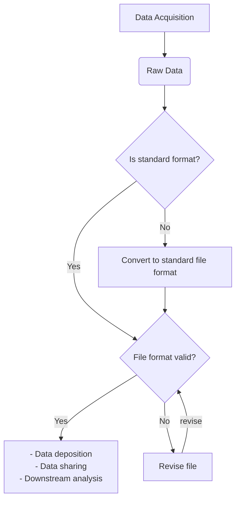

# File format validation, an example with FASTQ files

---

<div class="row">

  <div class="column">
    <div class="card">
      <div class="container">
        <i class="fa fa-qrcode fa-2x" style="color:#7e0038;"></i>
        <h4><b>Recipe metadata</b></h4>
        <p> identifier: <a href="">RX.X</a> </p>
        <p> version: <a href="">v1.0</a> </p>
      </div>
    </div>
  </div>
  <div class="column">
    <div class="card">
      <div class="container">
        <i class="fa fa-fire fa-2x" style="color:#7e0038;"></i>
        <h4><b>Difficulty level</b></h4>
        <i class="fa fa-fire fa-lg" style="color:#7e0038;"></i>
        <i class="fa fa-fire fa-lg" style="color:#7e0038;"></i>
        <i class="fa fa-fire fa-lg" style="color:lightgrey"></i>
        <i class="fa fa-fire fa-lg" style="color:lightgrey"></i>
        <i class="fa fa-fire fa-lg" style="color:lightgrey"></i>
  <!--       <p><span data-v-013baba1="" title="" class=""><svg data-v-013baba1="" viewBox="0 0 16 16" width="1em" height="1em" focusable="false" role="img" alt="icon" xmlns="http://www.w3.org/2000/svg" fill="currentColor" class="bi-bar-chart-fill b-icon bi medium-level"><g data-v-013baba1=""><rect width="4" height="5" x="1" y="10" rx="1"></rect><rect width="4" height="9" x="6" y="6" rx="1"></rect><rect width="4" height="14" x="11" y="1" rx="1"></rect></g></svg> Medium </span></p> -->
      </div>
    </div>
  </div>  
  <div class="column">
    <div class="card">
      <div class="container">
        <i class="fa fa-clock-o fa-2x" style="color:#7e0038;"></i>
        <h4><b>Reading Time</b></h4>
        <p><i class="fa fa-clock-o fa-lg" style="color:#7e0038;"></i> 15 minutes</p>
        <h4><b>Recipe Type</b></h4>
        <p><i class="fa fa-laptop fa-lg" style="color:#7e0038;"></i> Hands-on</p>
        <h4><b>Executable Code</b></h4>
        <p><i class="fa fa-play-circle fa-lg" style="color:#7e0038;"></i> Yes</p>
      </div>
    </div>
  </div>
  <div class="column">
    <div class="card">
      <div class="container">
        <i class="fa fa-group fa-2x" style="color:#7e0038;"></i>
        <h4><b>Intended Audience</b></h4>
        <p> <i class="fa fa-user-md fa-lg" style="color:#7e0038;"></i> Principal Investigators </p>
        <p> <i class="fa fa-database fa-lg" style="color:#7e0038;"></i> Data Managers </p>
        <p> <i class="fa fa-wrench fa-lg" style="color:#7e0038;"></i> Data Scientists </p>
      </div>
    </div>
  </div>
</div>


<!-- - [Main objectives](#Main-Objectives)
- [Graphical Overview of the FAIRification Recipe Objectives](#Graphical-Overview-of-the-FAIRification-Recipe-Objectives)
- [User Stories](#User-Stories)
- [Capability & Maturity Table](#Capability-amp-Maturity-Table)
- [FAIRification Objectives, Inputs and Outputs](#FAIRification-Objectives-Inputs-and-Outputs)
- [Table of Data Standards](#Table-of-Data-Standards)
    - [Requirements](#Requirements)
    - [Step 1: Install fastq-utils](#Step-1-Install-fastq-utils)
    - [Step 2: Get example file for testing*](#Step-2-Get-example-file-for-testing)
    - [Step 3: Perform validation](#Step-3-Perform-validation)
    - [FASTA-utils feature summary](#FASTA-utils-feature-summary)
- [Summary](#Summary)
- [Related Recipes](#Related-recipes)
- [References](#References)
- [Authors](#Authors)
- [License](#License) -->


---

## Main Objectives

The main purpose of this recipe is to:

> - provide a FASTQ file validation solution
> - propose a general file validation workflow. 

## Graphical Overview of the FAIRification Recipe Objectives


[](https://mermaid-js.github.io/mermaid-live-editor/#/edit/eyJjb2RlIjoiZ3JhcGggVEQ7XG4gICAgQVtEYXRhIEFjcXVpc2l0aW9uXSAtLT5CKFJhdyBEYXRhKVxuICAgIEIgLS0-IEN7SXMgc3RhbmRhcmQgZm9ybWF0P31cbiAgICBDIC0tPnxZZXN8IER7RmlsZSBmb3JtYXQgdmFsaWQ_fVxuICAgIEMgLS0-fE5vfCBFW0NvbnZlcnQgdG8gc3RhbmRhcmQgZmlsZSBmb3JtYXRdXG4gICAgRCAtLT4gfFllc3xGWy0gRGF0YSBkZXBvc2l0aW9uIDxicj4gLSBEYXRhIHNoYXJpbmcgPGJyPiAgLSBEb3duc3RyZWFtIGFuYWx5c2lzIF1cbiAgICBEIC0tPiB8Tm98R1tSZXZpc2UgZmlsZV1cbiAgICBFIC0tPiAgRFxuICAgIEcgLS0-IHxyZXZpc2V8RCIsIm1lcm1haWQiOnsidGhlbWUiOiJuZXV0cmFsIn19)

## User Stories

The table below lists common file validation use cases. This recipe provides solutions with FASTQ files as an example.

|As a ..| I want to .. |So that I can ..|
|---|--|--|
|Data owner| Validate my sequencing files before depositing to public archives| Reduce the risk of submitting invalid files or submission rejection|
|Data consumer| Validate files before running analysis|Avoid wasting time and resource processing corrupted files|
|Data consumer| Integrate file format validation into my data process pipeline| Build a more reproducible and error-proof pipeline| 
|Data librarian| Check files downloaded from unknown sources before deposition| Ensure the file is usable in the future.|


## Capability & Maturity Table

| Capability  | Initial Maturity Level | Final Maturity Level  |
| :------------- | :------------- | :------------- |
|Interoperability |minimal |	repeatable|

----

## FAIRification Objectives, Inputs and Outputs

| Actions.Objectives.Tasks  | Input | Output  |
| :------------- | :------------- | :------------- |
| [Format validation](http://edamontology.org/operation_0336)  | [FASTQ file](http://edamontology.org/format_2182)  | Validation results  |


## Table of Data Standards

| Data Formats  | Terminologies | Models  |
| :------------- | :------------- | :------------- |
| [FASTQ](http://edamontology.org/format_2182)  | |
| [Compressed Format](https://www.ebi.ac.uk/ols/ontologies/edam/terms?iri=http%3A%2F%2Fedamontology.org%2Fformat_4006)| |
___

[FASTQ](edamontology.org/format_2182) is the _de facto_ sequencing file format and one of the most common file formats in bioinformatics analysis. Researchers receive FASTQ files from various sources. These files are used intensively in automated bioinformatics analysis pipelines. Therefore, it is important to validate FASTQ files to improve the data reusability and build error-proof data analysis process.

FASTQ validators detect truncated reads, base calls and quality score mismatches, invalid encoding, etc. For paired-end reads, they also check if the forward reads match with the reverse reads. Most validators can process different FASTQ variants automatically and handle compressed FASTQ files. 

[FASTQ-utils](https://github.com/nunofonseca/fastq_utils) is an open-source software to validate and process FASTQ files. It has been applied in the [European Nucleotide Archive(ENA)](https://www.ebi.ac.uk/ena), and several research initiatives. 

This recipe provides an example of validating FASTQ files with _FASTQ-utils_ on MacOS and Linux machines.

>:bulb: Quality control is out of the scope of file format validation.


### Requirements

The users are expected to be comfortable with Unix-based OS and basic Bash programming syntax and commands.

|Software|Description|Version|
|--|--|--|
|[conda](https://docs.conda.io/projects/conda/en/latest/user-guide/install/)|Package manager for installing validators |4.8.3
|[FASTQ-utils](https://github.com/nunofonseca/fastq_utils)| FASTQ validator|0.23.0
|[wget](https://www.gnu.org/software/wget/)|File downloader|1.19.4|

### Step 1: Install fastq-utils

The command below installs _fastq-utils_ via Conda. It is also possible to install _fastq-utils_ from [the source code](https://github.com/nunofonseca/fastq_utils).

```shell
conda install -c bioconda fastq_utils
```


### Step 2: Get example file for testing*
_:bulb:*  Users can skip this step and test with their own files._ 

In this step, we download example FASTQ files from ENA for testing. The first example file is a single read file, the other ones are paired-end read files.

__Example 1: Get single read FASTQ file__

The command below downloads an _Ion Torrent S5_ fastq file from ENA. [This file](https://www.ebi.ac.uk/ena/browser/view/SRR12132977) is the whole genome sequencing file of SARS-CoV-2. The complete file is 192Mb. 
```shell
wget -c ftp://ftp.sra.ebi.ac.uk/vol1/fastq/SRR121/077/SRR12132977/SRR12132977.fastq.gz
```
Uses can inspect the _fastq.gz_ file using `gzip -cd SRR12132977.fastq.gz | head -8`. Below is the header of this FASTQ file.
```
@SRR12132977.1 1/1
AACAAACCAACCAACTTTCGATCTCTTGTAGATCTGTTCTCTAAACGAACAAACTAAAATGTCTGATAATGGACCCCAAAATCAGCGAAATGCACCCCGCATTACGTTTGGTGGACCCTCAG
+
C@CCD>DBC?B692;;;09?<BBBBC>BBBBBBBBB@?ABB@BC<BBB>@A?:999992;=>>@??==:=C;>=<:'555)8;;;;;AG:AAAAADD;CCBB>?@;;;0:<@A>CEE?CFCC
@SRR12132977.2 2/1
AACAAACCAACCAACTTTCGATCTCTTGTAGATCTGTTCTCTAAACGAACTTTAAAATCTGTGTGGCTGTCACTCGGCTGCATGCTTAGTGCACTCACGCAGTATAATTAATAACTAATTACTGTCGTTGACAGGACACGAGTAACTCGTCTATCTTCTGCAGGCTGCTTACGGTTTCGTCCGTGTTGCAGCCGATCATCAGCAC
+
A>A@@=@@F@D@C<999,:<@ABBBB@B=>=BB@BBB?@@><;;7>??=BBB>BDD;D>????@@;@CDC@@@BBB>BBB@AAC>>9BBBB;;;@@?;><::;99<9<;A;>><@@A:=:>@@@>A@>:>===>:=<<>>;;;>=BCAA?>=A>>>:==>;998<=;===@@@<>>9>>>?;??==:=>>>>:>>;;;;;;;<;;
```
__Example 2: Get paired-read FASTQ files__

The command below downloads Illumina iSeq 100 paired end sequencing files from ENA. [These files](https://www.ebi.ac.uk/ena/data/view/SRR11542244) are raw sequence reads of a SARS-CoV-2 sample. Each file is 26 Mb.

```shell
wget -c \
ftp://ftp.sra.ebi.ac.uk/vol1/fastq/SRR115/044/SRR11542244/SRR11542244_1.fastq.gz \
ftp://ftp.sra.ebi.ac.uk/vol1/fastq/SRR115/044/SRR11542244/SRR11542244_2.fastq.gz
```
Below is the headers of the two files. The read pairs info is listed in the read IDs.
```
# Header of the forward read, SRR11542244_1.fastq.gz
@SRR11542244.1 1/1
GTGTGTGTATACATATATATATATATCACATTTTCTTTATCCATTTATCTGTTGTTGGACACTTAGGTTGATTCCATATCTTGGCTATTGTGAATAGTG
+
,,FFFFFFFFFFFFFFFFFFFFFFFF:FFF:FFFFFFFFFFFFFFFFFFFFFFFFFFFFFFFF:FFFFFFFFFFFF:FFFFFFFFFFFFFFFFFFFFFF
@SRR11542244.2 2/1
GTGATTCCTCAAAGATTTAGAACCAGAAATACCATGTGACCCAGCAATTCCATTACCAGGTCTAAACCCAAAGGAATATAAATCATTCTGTAATGAAGATA
+
FFFFFFFFFFFFFFFFFFFFFFFFFFFFFFFFFFFFFFFFFFFFFFFFFFFFFFFFFFFFFFFFFFFFFFFFFFFFFFFFFFFFFFFFFFFFFFFFFFFFF


# Header of the reverse read, SRR11542244_2.fastq.gz
@SRR11542244.1 1/2
CTATTGGGTATTTAATCCAAAGAAAGGAAATCGGTATATCAAAGAGACATCTGCATGCCCATGTTTATTGTAGCACTATTCACAATAGCCAAGATATGGAA
+
FFFFFFFFFFFFFFFFFFFFFFFFFFFFFFFFFFFFFFFFFFFFFFFFFFFFFFFFFFFFFFFFFFFFFFFFFFFFFFFF:FFFFFFFFFFFFFFFFFFFF
@SRR11542244.2 2/2
GAACATATGTGTGCATGTATCTTCATTACAGAATGATTTATATTCCTTTGGGTTTAGACCTGGTAATGGAATTGCTGGGTCACATGGTATTTCTGGTTCTA
+
FFFFFFFFFFFFFFFFFFFFFFFFFFFFFFFFFFFFFFFFFFFFFFFFFFFFFFFFFFFFFFFFFFFFFFFFFFFFFFFFFFFFFFFFFFFFFFFFFFFFF
```


### Step 3: Perform validation

The command below validates the single read file in _Example 1_. 

```shell
fastq_info -r SRR12132977.fastq.gz
```
Below are the validation results. _fastq-utils_ returns the number of reads, read length details, and encoding info. Field `Quality encoding` indicates the fastq file variant. FASTQ-utils returns `OK` for a valid fastq file. Otherwise, it will return the validation details in the Error message.

```
Skipping check for duplicated read names
1900000
------------------------------------
Number of reads: 1919741
Quality encoding range: 34 77
Quality encoding: 33
Read length: 25 352 215
OK
```

The validation of paired end reads is similar to single read file validation. 

```shell
fastq_info SRR11542244_1.fastq.gz SRR11542244_2.fastq.gz
```
Here are the validation results.
```
fastq_utils 0.23.0
DEFAULT_HASHSIZE=39000001
Scanning and indexing all reads from SRR11542244_1.fastq.gz
700000Scanning complete.

Reads processed: 733611
Memory used in indexing: ~47 MB
File SRR11542244_1.fastq.gz processed
Next file SRR11542244_2.fastq.gz
700000
------------------------------------
Number of reads: 733611
Quality encoding range: 35 70
Quality encoding: 33
Read length: 35 101 96
OK
```
_fastq_util_ also provides additional arguments to tune the validation:

`-s`: to validate if reads in two files have the same ordering.

`-r`: to skip duplicated read names validation. It uses less memory and runs faster.

`-e`: to allow empty files pass the validation

`-q`: not to fail if the encoding can't be decided.

#### Error messages for invalid files
FASTQ-utils returns an error message with the location of invalid lines and type of errors if the files are invalid. Below are examples of error messages.

- Invalid file example 1, duplicated reads
    > ERROR: Error in file SRR11542244_2.fastq: line 16: duplicated sequence SRR11542244.5 5/

- Invalid file example 2, wrong base call encoding
    > ERROR: Error in file SRR11542244_2.fastq: line 5: invalid character 'e' (hex. code:'65'), expected ACGTacgt0123nN.

### FASTA-utils feature summary

The table lists technical considerations when selecting the validator, including basic validation function, performance, interface, etc. It also provides a detailed summary of _fastq-utils_ features.  


|Aspects|Validation content |Description|FASTQ-utils|
|--|--|--|--|
|Basic validation|4-line format|Check if the FASTQ file is a 4-line file|:heavy_check_mark:|
| |Character encoding| Check if the base calls and quality score encoding are correct.  |:heavy_check_mark:| 
||Read length| Check if the length of the base calls are the same as that of the quality scores|:heavy_check_mark:|
||File truncation|Check if the file is truncated or not|:heavy_check_mark:|
|Paired-end reads validation| Deinterleaved paired reads| Validate when the forward and reverse reads are in two files.|:heavy_check_mark:|
| |Interleaved _"8-line"_ files|Validate when the forward and reverse reads are listed together as an 8-line file|:heavy_check_mark:|
|Compressed file validation| gzip| Validate compressed fastq files, with extension `fastq.gz`|:heavy_check_mark:|
|FASTQ variants* validation| fastq-illumina|Validate the _fastq-illumina_ format|:heavy_check_mark:|
| |fastq-sanger|Validate the _fastq-sanger_ format|:heavy_check_mark:||
| |fastq-solexa|Validate the _fastq-solexa_ format|:heavy_check_mark:|
|Performance| Memory||`N/A`|
| |Speed| |`N/A`|
|Archieve compatiablity|ENA|File validated can be submitted to the ENA archive.|:heavy_check_mark:|
||ArrayExpress|File validated can be submitted to Array Express.|:heavy_check_mark:|
||SRA|File validated can be submitted to the SRA archive.|:heavy_check_mark:|
|Interface|Command line interface|Can be used in shell and intergerated in pipe commands|:heavy_check_mark:|
|License|Licensed||:heavy_check_mark:[GPL-3](https://www.gnu.org/licenses/gpl-3.0.en.html)|
| |Commercial use|Can be used for commercial purpose|:heavy_check_mark:|
|Code|Open source|Source code available on public platforms|:heavy_check_mark:|

_*See details in the [FASTQ specification recipe]()._
 
## Conclusion:

In this recipe, we have shown how to validate fastq files, and proposed indicators to evaluate a FASTQ validator. We also identified common file validation related use cases and provided a general file validation workflow. This recipe can be expanded to other file formats and other use cases.


#### What to read next

- :octopus:[From proprietary format to open standard format: an exemplar](https://github.com/FAIRplus/the-fair-cookbook/blob/mzml-format/docs/content/recipes/interoperability/from-proprietary-to-open-standard-mzml-exemplar.md) 
- :octopus:[FASTQ file specification recipe](TBD)
- :octopus:[FASTQ file validator in Biopython](TBD)

---

## References

- Cock, Peter J. A., Christopher J. Fields, Naohisa Goto, Michael L. Heuer, and Peter M. Rice. ‘The Sanger FASTQ File Format for Sequences with Quality Scores, and the Solexa/Illumina FASTQ Variants’. Nucleic Acids Research 38, no. 6 (1 April 2010): 1767–71. https://doi.org/10.1093/nar/gkp1137.
- ENA. ‘Accepted Read Data Formats — ENA Training Modules 1 Documentation’. Accessed 6 July 2020. https://ena-docs.readthedocs.io/en/latest/submit/fileprep/reads.html#fastq-format.
- NCBI. ‘File Format Guide’. Accessed 14 July 2020. https://www.ncbi.nlm.nih.gov/sra/docs/submitformats/#fastq-files.
- Nuno Fonseca, and Jonathan Manning. Nunofonseca/Fastq_utils 0.24.0. Zenodo, 2020. https://doi.org/10.5281/zenodo.3936692.


---

## Authors

|Name|Institute|ORCID|Contributions|
|--|--|--|--|
|Fuqi Xu|[EMBL-EBI](https://www.ebi.ac.uk/)|[0000-0002-5923-3859](https://orcid.org/0000-0002-5923-3859)|Writing - Original Draft|
|Eva Martin | [Barcelona Supercomputing Center (BSC)](https://www.bsc.es/) |[0000-0001-8324-2897](https://orcid.org/0000-0001-8324-2897)|Reviewing and editing |
|Peter Woollard|[GSK](https://www.gsk.com/en-gb/)|[0000-0002-7654-6902](https://orcid.org/0000-0002-7654-6902)|Reviewing|

---

## License:

This page is released under the Creative Commons 4.0 BY license.

<a href="https://creativecommons.org/licenses/by/4.0/"></a>