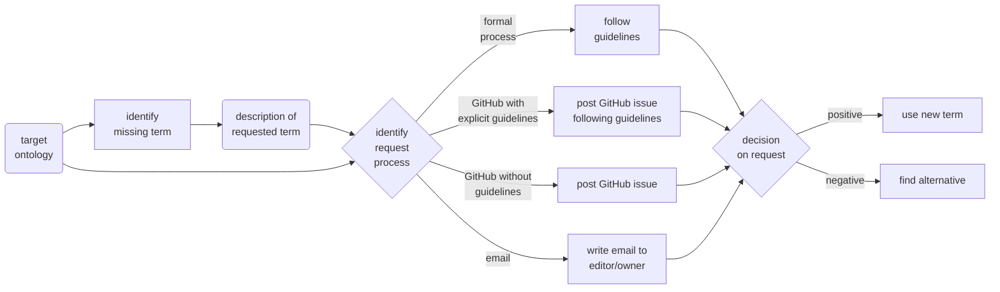

# R2.2.1: (self) request terms to be added to a public ontology

Terms could be missing from public ontologies of choice. Where needed, new terms can be requested for these ontologies. The objective of this recipe is to provide a general guidline on how to request new terms, as well as to give some examples for specific ontologies.

## Background

Requesting new terms in public (biomedical) ontologies might be a structured, streamlined process or completely undocumented, depending on the actual ontology. Also, the process can take somewhere between days and up to a year, depending on the implemented release cycles of the target ontology.

Some ontologies, often large projects organized by consortia, have a detailed formal request process, maybe even with a dedicated ticketing and tracking system. A big number of ontologies rely on [GitHub](https://github.com) as a publicly accessible ticketing system for reporting issues on the ontology and also for requesting new terms. They might provide explicit guidelines on how to create an issue for a new term request, or they rely on GitHub issues without guidelines. And there are also ontologies relying on email for requesting new terms. These different request processes can be summarized as follows:
* Formal request process
* Request via GitHub with explicit guidelines
* Request via GitHub without guidelines
* Request via email

In most ontologies, everybody can request new terms. However, in some ontologies only members have access to the request process. In case of a request process organized via GitHub, a free [GitHub account](https://github.com/join) is required.

## Ingredients
* List of new terms
* Target ontology
    * E.g. SNOMED CT, MedDRA, OBI, EFO, BAO, CL, RxNorm, BTO - BRENDA, DCAT 2
    
## Graphical Overview of FAIRification Recipe Objectives

## Capability & Maturity Table

| Capability | Status before recipe | Status after recipe |
| :--------- | :------------------- | :------------------ |
| C_PO_3 |data insufficiently annotated | data well annotated |
| C_S_7 |data not annotated | annotated data |

## FAIRification Objectives, Inputs and Outputs
| Actions.Objectives.Tasks  | Input | Output  |
| :------------- | :------------- | :------------- |
| [text annotation](http://edamontology.org/operation_3778)  | new term(s), [ontology](http://edamontology.org/data_0582) | [ontology term](http://edamontology.org/data_0966), [annotated text](http://edamontology.org/data_3779)  |

## Step-by-Step process

**Step 1**
Identify and describe relevant terms not included in public ontology of choice.

**Step 2**
Identify request process of the public ontology (i.e. formal request process, GitHub request with guidelines, GitHub request without guidelines, email request).

**Step 3**
Prepare at least the following information for requesting a new term:
* justification for the request
* preferred term label: a unique, unambiguous label for the term
* potential alternative terms: common synonyms or translations
* textual definition: expresses the meaning of the term, add sources and fully expand abbreviations
* logical definition: suggest parent and child terms
* example of usage: propose a use case
* attribution: contributor names (and ORCIDs)

**Step 4**
Finalize and submit term request. Depending on the ontology, it can take up to a year to have the new term incorporated in the ontology, or to have the request rejected.

## Examples

### Formal request process

**Example ontology:**
[SNOMED CT - Systematized Nomenclature of Medicine](http://www.snomed.org/)

**Scope of the ontology:**
conditions, clinical findings, procedures, body structures, substances, pharmaceuticals, devices, specimen

**Information about requesting changes or additions:**
SNOMED CT has a [Content Request Service (CRS)](https://confluence.ihtsdotools.org/display/SCTCR/CRS+User+Guide). Requests can be submitted by members of SNOMED International, National Release Centers or other authorized users, and must align with the [Editorial guide](https://confluence.ihtsdotools.org/display/DOCEG). When a person or organization wants to submit a request but is not a member of SNOMED International, the National Release Center of the country of residence should be contacted. To request access to the Content Request Service, an email can be send to info@snomed.org.  

When submitting a request, it is important to follow the aspects mentioned in **Step 3** of the **Step-by-Step process**. In addition to these aspects, the following is important to provide as well:
* Reference(s) from a scientific or professional journal, or professional society
* Fully expanded abbreviations

When submitting to the CRS, a request can have one of the sixteen possible statuses ('New', 'Draft', 'Accepted', 'Under Authoring', 'Ready for Release', 'In Inception', 'Clarification Needed', 'Pending Internal Input', 'On Hold', 'Forwarded', 'Withdrawn', 'Rejected', 'Completed', 'Appeal','Appeal rejected', 'In Appeal Clarification'). Within CRS, submitters are notified when a status has been changed.

More information can be found [here](https://www.snomed.org/snomed-ct/change-or-add) and in this [guide](https://www.snomed.org/SNOMED/media/SNOMED/documents/Version-8-0-CRS-Customer-Guidance-20191024.pdf).

### Request via GitHub with explicit guidelines

**Example ontology:**
[OBI - Ontology for Biomedical Investigations](http://obi-ontology.org/)

**Scope of the ontology:**
assays, devices, objectives in scientific investigations

**Information about requesting changes or additions:** 
OBI provides a [GitHub repository](https://github.com/obi-ontology/obi) and a mailing list. New-term requests are handled as GitHub issues. There is an explicit [guideline document](http://obi-ontology.org/page/OBI_term_guidelines) on how to request new terms.

For a proposed new term, they ask for the following information:
* editor preferred term: a unique, unambiguous label for the term in American English
* alternative terms: common synonyms or translations
* textual definition
* definition source for the textual definition
* logical definition (or parent term)
* example of usage
* term editor: your name, and that of any collaborators, as it should appear in OBI

### Request via GitHub without guidelines

**Example ontology:**
[CL - Cell Ontology](http://obofoundry.org/ontology/cl.html)

**Scope of the ontology:**
cell types

**Information about requesting changes or additions**:
The Cell Ontology provides a [GitHub repository](https://github.com/obophenotype/cell-ontology), a contact email, and a mail list. New-term requests (NTR) are formulated as issues on the GitHub repository. 

### Request via email

**Example ontology:**
[RxNorm](https://www.nlm.nih.gov/research/umls/rxnorm/index.html)

**Scope of the ontology:**
drugs

**Information about requesting changes or additions**:
Information about requesting terms can be found in the [FAQ section](https://www.nlm.nih.gov/research/umls/faq_main.html) of the Unified Medical Language System (UMLS) where RxNorm is part of.  

Changes or additions to UMLS can be requested by contacting [NLM Customer Support](https://support.nlm.nih.gov). The NLM Customer Support can be contacted through a [form](https://support.nlm.nih.gov/support/create-case/). If additions are specific to the source, you should contact the terminology source provider. Contact information is available in [Appendix 1](https://www.nlm.nih.gov/research/umls/knowledge_sources/metathesaurus/release/license_agreement_appendix.html) of the Licence agreement.

UMLS is updated in May and November of each year.

## Table of Data Standards

| Data Formats  | Ontologies |
| :------------- | :------------- |
| [OWL](https://fairsharing.org/FAIRsharing.atygwy)  | [OBI](https://fairsharing.org/FAIRsharing.284e1z), [Cell Ontology](https://fairsharing.org/FAIRsharing.j9y503)|
| [OBO](https://fairsharing.org/FAIRsharing.aa0eat)  | [Cell Ontology](https://fairsharing.org/FAIRsharing.j9y503)  |
| Release Format 2 | [SNOMED CT](https://fairsharing.org/FAIRsharing.d88s6e)|
| Rich Release Format |[RxNorm](https://fairsharing.org/FAIRsharing.36pf8q)|

## Additional Information

* [issue on FAIRplus GitHub](https://github.com/FAIRplus/FAIRPlus_squad1/issues/7)
* [more ontology examples](https://docs.google.com/document/d/1sq73y2vF0yhJ8M4xGd4tR5uwzSV1pOptcte5pKSyi7U/edit#heading=h.xoq2y4kj3obq)

## Authors

| Name | Affiliation  | ORCID | CRediT role  |
| :------------- | :------------- | :------------- |:------------- |
| Ulrich Goldmann | CeMM - Research Center for Molecular Medicine of the Austrian Academy of Sciences | [0000-0003-1120-6912](https://orcid.org/0000-0003-1120-6912) | Writing - Original Draft |
| Emma Vos |  The Hyve | | Writing - Original Draft | 

## License

