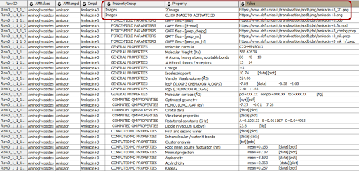
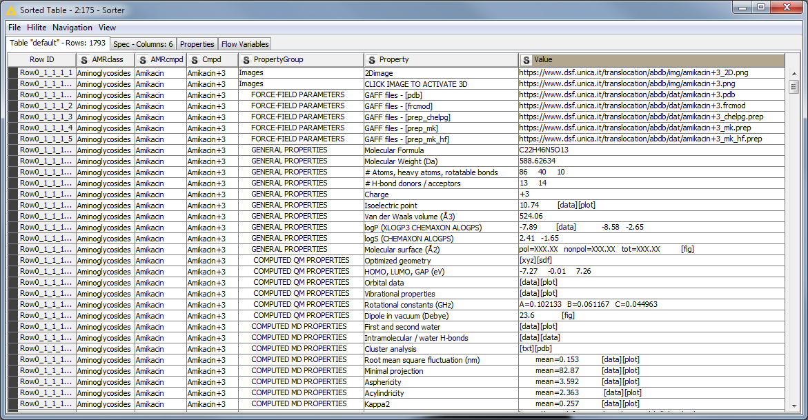

# ND4BB dataset FAIRification recipe

__Version:__ 2, this recipe is extracted from [Version 1](https://docs.google.com/document/d/1LOQAkDZY91Y-5aFCDSlwP-PUeufFavx4Jprnbnl1Hi4/edit)

## Ingredients

* Raw Data: [AMR Compounds Database](https://www.dsf.unica.it/translocation/abdb/)

* Metadata Model

* Vocabularies and Terminologies 

* Data Format:

	* Excel spreadsheet
	
<table>
  <tr>
   <td>PropertyGroup
   </td>
   <td>Property
   </td>
   <td>Value
   </td>
  </tr>
</table>

* Tools and  Software:

	* Data curation tools: Excel, JAVA
	* FAIRification pipeline tools: KNIME workflow
	* Ontology recommender: ZOOMA, NCBO
	* FAIR assessment: [RDA indicator V0.03](https://docs.google.com/spreadsheets/d/1zFcmllpD0loX_yi9NE56vFxbH_RaW-Z1/edit?dls=true#gid=1320380260)

    		

## Objectives

The current AMR dataset is stored in a local webpage at UNICA. We make the AMR data more accessible by extracting the data to a public repository using machine readable format. Also generic improvement of the FAIR parameters.

## Step by Step Process

### Dataset description

The AMR database consists of several nested static HTML pages. The information is well structured, results are mainly quantitative numeric data, and for all compounds a complete set of data is available. Thus, it should be easily linkable to other public sources (e.g. [PubChem](https://pubchem.ncbi.nlm.nih.gov/)) and a machine-readable data set should be easily created.

To get a good understanding of the AMR dataset, the AMR metadata shall be extracted. The AMR metadata includes four types of metadata: structural metadata, administrative metadata, and descriptive metadata. The structural metadata describes the structure of the dataset, for examples, column names and/or IDs. Administrative metadata contains the author, organization, and other provenance information. The descriptive metadata includes the procedure, usually protocols, in generating the experimental results. The descriptive metadata is always stored in a free-text format without data structure. 

Figure 1 is an example of the simplified schematic workflow of FAIRification, which includes the extraction, transform, annotation, licensing and identifier assigning process. Due to the limit of time, we ere, we focus on the extraction and annotation of structural metadata, the administrative metadata, descriptive metadata will be added in the future.

_Figure 1:  Schematic workflow of the general FAIRification pipeline. some steps need repetitions (yellow arrows)._ 

### Data extraction

Data are extracted using a[ KNIME workflow](https://owncloud.lcsb.uni.lu/remote.php/webdav/ND4BB/AMR_DB/AMR_DB_AnnotationProcess/20190122_ANTIMICROBIAL_COMPOUNDS_DATABASE_Cagliari_V4.knwf), which can visualize the data extraction steps, handle complex data extraction workflows and be easily reproduced. 

Figure 2 is a snapshot of the ND4BB website, which is structured into a central part (the blue section) with data and two side columns with additional information. Here, we focus on data extraction from the central part. The central part of the home page consists of a single table with compound class names as table data configured as heading level 3 (\<h3\>, shown in the red box in Figure 3) and compounds as an unsorted list (\<ul\>, shown in the yellow box in Figure 3).  

_Figure 2: Snapshot of AMR compound database home page. The blue area listed all compound data to be extracted._

_Figure 3: Snapshot of the AMR compound database home page source code. The red box shows the compound class header. The yellow box lists one compound._

We first identified all websites that contain the project data. The homepage (Figure 2) describes the compound names, the compound class and links to the compound subpage. Such information was generated using the Xpath nodes in the workflow in Figure 4. 

Data structure discrepancy was found in the extraction. In the compound class extraction, unlike the usual compound class structure, which is listed as a table and separated by <td>…</td>, chemical “Oxazolidinones” and “Tetracyclines” uses different data structure. Therefore the extracted XML document was updated before applying further nodes to the XML document. In the subpage link extraction, compound Amikacin and ampicillin have multiple subpages for differently charged molecules. The green boxes in Figure 4 highlighted the discrepancies we found in the original dataset.

_Figure 4: Workflow to extract antimicrobial classes and compound with their corresponding subpages_

Links to all content in the sub-page are also extracted. Figure 5 is an example of the subpage of one compound, which consists of table selection with the compound name, a 2D and 3D image of the compound structures, two tables with links to related files and properties and one table with links to external sources. (See the green boxes in Figure 5). External links were excluded from current data extraction.

The complete workflow to extract the data from the compound/charge webpage is provided in [supplementary figure 1](#heading=h.q7ozvs96azbw).

_Figure 5: Example of one ND4BB raw data_

### Data transform

The data were extracted following the schema to facilitate future data annotation: PropertyGroup – Property – Value where PropertyGroup is the heading of the table, Property is the type of property and Value is the corresponding value of the property which will be not part of the annotation process. If the propert is an image, then the “PropertyGroup” is image, “Property” is “2D/3D image”. (See the red box in Figure 6. For each property, the corresponding values in a controlled vocabulary list are collected into a[ spreadsheet](https://owncloud.lcsb.uni.lu/remote.php/webdav/ND4BB/AMR_DB/AMR_DB_AnnotationProcess/ExtractedMetadata_20190124_NCBOREC_0347.xlsx). Missing values were fixed in this transform as well. 

One limitation of this schema is that Excel does not explicitly describe the relations between the entities (e.g. Property Group and Property). Therefore predicates between concepts cannot be expressed (e.g. Property hasA PropertyGroup). 

_Figure 6: Example data set for +3 charged Amikacin_

### Extract and annotate structural metadata

To prepare for the ontology annotation, we first generated lists of different types of attributes, which include “AMRclass”, “AMR compound”, “PropertyGroup”, etc. In each spreadsheet, the values are listed as separate rows for ontology annotation. 

The strings went through additional parsing to improve mapping confidence. Duplicated or missing attributes were removed. Stemming and lemmatization were implemented to map the keyword to its root form to avoid mismatch because of spelling/form variations.  

all the strings were sent through ZOOMA/NCBO API to search for ontology annotation. The ontology annotation results are listed here ([ZOOMA](https://owncloud.lcsb.uni.lu/remote.php/webdav/ND4BB/AMR_DB/AMR_DB_AnnotationProcess/ExtractedMetadata_20190124_TP%2BZOOMA_1019.xlsx), [NCBO](https://owncloud.lcsb.uni.lu/remote.php/webdav/ND4BB/AMR_DB/AMR_DB_AnnotationProcess/ExtractedMetadata_20190124_TP%2BNCBOREC_1021.xlsx)). The ontology annotations were ranked and selected based on its confidence. For strings that didn’t find proper ontology mapping, the original values were kept. The ontology annotation preparation workflow is [here](https://owncloud.lcsb.uni.lu/remote.php/webdav/ND4BB/AMR_DB/AMR_DB_AnnotationProcess/20190122_EBI_ZOOMA_requests_V5.knwf). 

Both ZOOMA and NCBO ontology recommenders returned the nearly same number of annotated terms, also the number searched ontologies for the NCBO Recommender (313) was much higher than the number of searched ontologies for the ZOOMA (11) service. For only few cases the NCBO Recommender showed results (e.g. BAL29880 and MBX2319) were ZOOMA did not find a corresponding ontology. 

One difference between these two ontology mappers is they process special characters (e.g. -_#) and spaces differently. For example, in NCBO, among “ ‘beta-lactamase inhibitors’, ‘beta lactamase inhibitors’ and ‘betalactamase inhibitors’ only the ontology annotation of the first item was found. While ZOOMA returned ontology annotation results for all three descriptions. Another example would be Aminonucleosides, Aminonucleoside, Amino nucleoside. While NCBO Recommender found no result, ZOOMA found at least a result for the terms ‘Aminonucleoside’, ‘Amino nucleoside’. This proves the necessity of running stemming or lemmatizing prior to ontology mapping service.

Provenance metadata about the ontology annotation pipeline implementation are stored here in the same file. 

## Results

Both generated files ‘ExtractedMetadata_20190124_ZOOMA_0329.xlsx’ and ‘ExtractedMetadata_20190124_NCBOREC_0347.xlsx’ show nearly same number of annotated terms, also the number searched ontologies for the NCBO Recommender (313) was much higher than the number of searched ontologies for the ZOOMA (11) service. For only few cases the NCBO Recommender showed results (e.g. BAL29880 and MBX2319) were ZOOMA did not find a corresponding ontology. 

The proposed workflow is insufficient to extract adequate and consistent semantic annotations for the structural metadata. In addition the retrieved links do not reflect the used version of the ontology. 

## FAIR assessment

The FAIRness of the ND4BB was also assessed based on the [RDA indicators (v0.03)](https://docs.google.com/spreadsheets/d/1zFcmllpD0loX_yi9NE56vFxbH_RaW-Z1/edit#gid=1320380260). Although there are a few indicators that are not applicable to the ND4BB dataset because of data type limitations, and some indicators are too ambiguous to provide a objective assessment. We got different data curators evaluating the FAIRness seperately and compared and discussed the conflicting assessment. In general, the FAIRness score against RDA FAIR indicator is 36%, of which the mandatory indicator score is 47% and the recommended indicator score is 32%. 

## Future plan

1. Extract administrative metadata, provenance information, e.g. owner, date of creation
2. Add license to data set
3. Store data (=experimental results) together with administrative, structural, and descriptive metadata in a repository
4. Add PID to data set (=digital object)
5. Add metadata together with PID to a public catalog
6. Add metrics according to CMMI and add to the public catalog
7. Add checksums for all files for QC and integrity checks
8. Expand the ontology annotation to all terms

## Summary

The AMR dataset was provided as a first example as it was immediately available. A generic FAIRification workflow was also provided. We reviewed the workflow and derived general principles for the cookbook. However (as for the principles we learnt) the lack of a context for the data, and of goals for the FAIRification process made the actual action of FAIRification not valuable.

As a result or our work on the AMR dataset, we  identified useful general principles, including the need for license, availability of the data, the importance of context (e.g.: what ontologies to map to) and other details included in our report.

We also identified key FAIRification steps in the proposed process, some of which non obvious (e.g.: capture modifications done to ingest data). On this basis we started to sketch a generic workflow. 

Overall this dataset has been very useful to start our overall process and team activities.

## FAIRification process summary table

<table>
  <tr>
    <td>Defined FAIRification Steps</td>
    <td>How it is implemented 
Tools/Process</td>
    <td>Pros</td>
    <td>Cons</td>
    <td>Comments/Questions 
</td>
  </tr>
  <tr>
    <td>Define use case or describe scientific question</td>
    <td>missing</td>
    <td></td>
    <td></td>
    <td></td>
  </tr>
  <tr>
    <td>Fill out ELSI questionnaire 
https://drive.google.com/drive/u/0/folders/1iOShHkInNUuFoRYADwXKxS1_-UAIRmRK </td>
    <td>missing</td>
    <td></td>
    <td></td>
    <td></td>
  </tr>
  <tr>
    <td>Select/define target repository or schema</td>
    <td>missing</td>
    <td></td>
    <td></td>
    <td>Any restrictions due to the selected repository/schema, e.g. missing fields?</td>
  </tr>
  <tr>
    <td>Extract the information (data and metadata) from original source(s)</td>
    <td>Process: extracts data
Tool: KNIME
Source: Website</td>
    <td>KNIME workflow:
- Provides a Repeatable processes
-  Handles complex data extraction flows
 Easy to explain</td>
    <td>- Creating KNIME workflow requires a certain level of expertise/or training

- Workflows are customized to the data source (web page)
each variation at the source requires an additional branch </td>
    <td>Do we include the ETL processes in FAIRification cookbook ?
Having a reusable ETL process might help to continuous FAIRification of the resource 
</td>
  </tr>
  <tr>
    <td>Transform the extracted data into a common schema</td>
    <td>Process: transforms extracted data into a schema and if needed fills the missing values
Tool: KNIME/Excel
Output: Excel</td>
    <td>KNIME workflows can be tailored to fix systematic missing values (e.g. 2D image)</td>
    <td>- Excel does not explicitly describes the relations between the entities (e.g. Property Group and Property). Therefore predicates between concepts cannot be expressed (e.g. Property hasA PropertyGroup)</td>
    <td></td>
  </tr>
  <tr>
    <td>Extract administrative metadata </td>
    <td></td>
    <td></td>
    <td></td>
    <td></td>
  </tr>
  <tr>
    <td>Extract structural metadata and add semantic annotations based on publicly available ontologies</td>
    <td>it has four sub procedures: 
1) Enhancement
2) Annotation via vocabulary services 
ZOOMA
NCBO
3) Assessing the relevance of suggested vocabularies 
4) Merge
</td>
    <td>
</td>
    <td></td>
    <td>PRS: PID are missing for the searches over zooma and bioportal</td>
  </tr>
  <tr>
    <td>Substep1: Enhancement</td>
    <td>Process: generate alternative syntax of data to increase the annotation performance
Tool: KNIME
</td>
    <td>Variations in spelling of concepts (e.g. adding special characters) can be generated with workflows</td>
    <td>heuristic approach ( these methods can be provided as tips in the cookbook)</td>
    <td></td>
  </tr>
  <tr>
    <td>Substep2a: Annotation via vocabulary services: ZOOMA</td>
    <td>Process: Searching related ontology terminologies 
Recommender Service: ZOOMA 
Output: Excel</td>
    <td>- easy to use</td>
    <td>- performance relies on the recommender service</td>
    <td></td>
  </tr>
  <tr>
    <td>Substep2b: Annotation via vocabulary services: NCBO</td>
    <td>Process: Searching related ontology terminologies 
Recommender Service: NCBO API
Output: Excel</td>
    <td>-	easy to use
-	NCBO has a large collection of ontologies. KNIME workflow restricts the search to a curated list of ontologies (Search Ontologies.txt)</td>
    <td>- performance relies on the recommender service
- creating a curated list of ontologies requires domain expertise and knowledge on existing ontologies.
</td>
    <td>Success of the annotation  depends on the vocabulary services. Performance of recommender services can be tested before the annotation process. If needed performance improvement methods can be defined (e.g. restricted search)</td>
  </tr>
  <tr>
    <td>Substep3: Assessing the relevance of suggested vocabularies</td>
    <td>Process: assessing the relevance of the recommended ontology terms
Tool: Java functions compareTo() and contains()</td>
    <td>- readily available 
- CompareTo() returns the exact matches</td>
    <td>- contains() function returns positive when the query term is contained in the recommended term. Might require expert review.
- recommender systems might suggest a term with a different spelling. These terms will not be considered as a match by the functions and will need an expert review.</td>
    <td>Automated rating of the recommended terminologies is based on syntactical matches, expert review is required.</td>
  </tr>
  <tr>
    <td>Substep4: merging annotations</td>
    <td>Process: select  the results from multiple annotation flows
Tool: manual</td>
    <td>- data can be annotated with multiple ontologies</td>
    <td>-  if there is a need to select one matching ontology term for each entity, no guidance exists</td>
    <td>Comment by Andrea S:distinguish between suggestive choices vs objective ones.
(Yes, but that will not e.g. make a protein a gene, or a liver a hepatocyte). So we need mappings and the subjective part translates into context and using lenses</td>
  </tr>
  <tr>
    <td>Extract descriptive metadata and add semantic annotations based on publicly available ontologies</td>
    <td></td>
    <td></td>
    <td></td>
    <td></td>
  </tr>
  <tr>
    <td>Add license to data set </td>
    <td>is this defined in the recipe ?</td>
    <td></td>
    <td></td>
    <td></td>
  </tr>
  <tr>
    <td>Store data (=experimental results) together with administrative, structural, and descriptive metadata in a repository</td>
    <td></td>
    <td></td>
    <td></td>
    <td></td>
  </tr>
  <tr>
    <td>Add PID to data set (=digital object)</td>
    <td>is this defined in the recipe ?</td>
    <td></td>
    <td></td>
    <td>PID are missing for the searches over zooma and bioportal</td>
  </tr>
  <tr>
    <td>Add metadata together with PID to a public catalog </td>
    <td></td>
    <td></td>
    <td></td>
    <td></td>
  </tr>
  <tr>
    <td>Add metrics according to CMMI and add to the public catalog</td>
    <td></td>
    <td></td>
    <td></td>
    <td></td>
  </tr>
  <tr>
    <td>in your opinion if any FAIRification step is missing please add them here</td>
    <td></td>
    <td></td>
    <td></td>
    <td></td>
  </tr>
  <tr>
    <td>Suggested FAIRification Step</td>
    <td>
Why  it is needed</td>
    <td>
Place in the workflow</td>
    <td>
Any suggested tools/processes</td>
    <td></td>
  </tr>
  <tr>
    <td>Assessment of the current FAIR level.
(at the beginning)</td>
    <td></td>
    <td></td>
    <td>Subjective. Is having data in html tales 1 or 2 stars ?</td>
    <td>Out of the recipe, but present in the document. Is this something worth as a genetic first step? What would we use this assessment for?</td>
  </tr>
  <tr>
    <td>Data fixing
(at the beginning)</td>
    <td>Manual? Issue detection as a sub-product of workflow definition?</td>
    <td></td>
    <td></td>
    <td></td>
  </tr>
  <tr>
    <td>Schema /Data model definition</td>
    <td>Targeted data model can be defined explicitly and annotated with a set of vocabularies</td>
    <td>before the data extraction </td>
    <td></td>
    <td></td>
  </tr>
  <tr>
    <td>Add a manifest describing the content of the archive</td>
    <td>eases dive into the datasets for humans who can obtains basic information about each of the element or bundles in a dataset</td>
    <td>NA</td>
    <td></td>
    <td></td>
  </tr>
  <tr>
    <td>Add checksums for all files for QC and integrity checks</td>
    <td>allow integrity checks thus enables reuse
</td>
    <td></td>
    <td>various options.
e.g. python hashlib  </td>
    <td></td>
  </tr>
  <tr>
    <td>Executing the workflow fails owing to use of localized file references in Knime workflows (which seems unavoidable)</td>
    <td>avoid hard links to local storage</td>
    <td>KNIME worklows</td>
    <td></td>
    <td></td>
  </tr>
  <tr>
    <td>Absence of Ontology terms identifiers for all the terms retrieved from BioPortal/Zooma (only the strings are apparently retrieved)</td>
    <td>curis should be included</td>
    <td>knime/workflow output should always contains class label + class identifiers
</td>
    <td></td>
    <td></td>
  </tr>
  <tr>
    <td>Selected Ontologies ought to be identified more completely</td>
    <td>abbreviation (.e.g CHEBI) is reported but</td>
    <td></td>
    <td></td>
    <td></td>
  </tr>
</table>

## Supplementary information

_Supplement figure 1: Workflow to extract the data from compound/charge webpage_