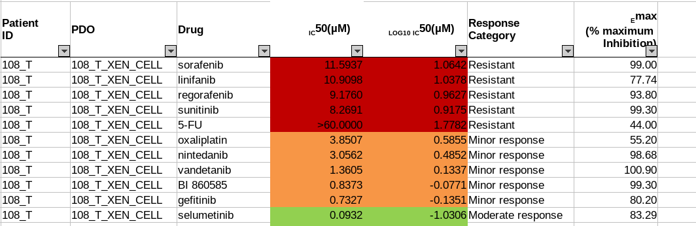
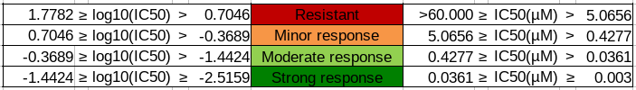
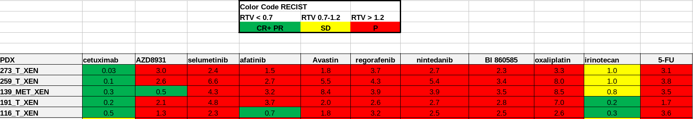

Oncotrack 

## (To be updated)

## Abstract

## Data Description

The OncoTrack colorectal carcinoma (CRC) biobank includes tumours from 106 patients, 35 organoids and 59 xenografts. Multi-omics experiments and various drug response studies have been performed on the CRC biobank. 

The OncoTrack metadata includes both project-level metadata and sample metadata. The project metadata is hosted on the Elixir [IMI Catalog](https://datacatalog.elixir-luxembourg.org/dataset/64f33e4f-0d6d-4062-86c5-9c3db4e3a99a), which includes general datasets information, planning site, intervention and observation, etc. The sample metadata includes published sample metadata and drug response experiment results, as well as private metadata, which includes patient ages,  surgery time, etc. Here, we focus the FAIRification of the public sample metadata of OncoTrack.

## Data FAIRification

The FAIRification of Oncotrack metadata includes four parts, accessing the data, Extract Transform and Load(ETL) pipeline, data curation and data sharing.

Data Access

The public metadata is published as supplementary information in [Schütte, et al](https://www.nature.com/articles/ncomms14262#Sec54).  Sample metadata identifier annotation, and relevant entries in the public dataset are stored in OwnCloud, with controlled access to Squad team members. 

#### Metadata ETL pipeline 

The original metadata was stored in Excel spreadsheets. In the [cohort metadata](https://drive.google.com/file/d/1GBEOIXMsTGvuSxUXJ_YhiBYh4ohdv4ag/view?usp=sharing), each sample is listed as a separate row in the spreadsheet. Each sample attribute, like tumour status, cancer stage, is listed as a separate column in the table. Each sample is named following the [OncoTrack identifier system](https://drive.google.com/file/d/1qTQ4cYsmD3AN9XYRxpwayOerc78LUzq6/view?usp=sharing), using patient ID, tumour type and patient-derived xenograft (PDX) /organoid(PDM) ID, for example, "150_MET1_XEN2" means “The second xenograft culture of the first metastatic tumour sample in patient 150.”

#### 

##### Metadata template

The frequent use of acronyms and inconsistent metadata structure make it difficult to interpret the metadata. To FAIRify the metadata, the data owner and data curators first agreed on the structure and content of the FAIRified metadata, including what attributes shall be extracted, how the attributes are presented and other domain-specific requirements. Below are five requirements:

* Enriched metadata 

Drug sensitivity is one important attributes of the PDX and PDM models. Hence, drug response information shall be included in the metadata. 

* Handling missing values

To compare properties across samples conveniently, missing values shall be replaced with NA instead of removing the empty attribute.

* Expanding acronyms 

All acronyms and abbreviations shall be replaced with their full forms to avoid ambiguity. 

* Standardized data representations

Special characters in attribute names shall be avoided. 

* Formal representations: 

The attribute values shall correspond to ontology terms if applicable. 

The final sample metadata template can be found [here](https://docs.google.com/document/d/1OXSQsZbw2EEZOZrrXJIaJpsb60Y3-4N4W-wu9LX5oa8/edit).

##### Metadata extract

###### Cohort metadata

The cohort metadata was converted to a [tab-delimited table](https://docs.google.com/document/d/1pBjRe7rWO4xsUIVecIgxOm_SJaMWeWf8KBrsDTDVAmg/edit?usp=sharing). Each row in the table represents one sample, and each column represents one sample attribute. Compared with the original dataset, all the abbreviations were expanded. Tumour type and sample origin information was retrieved from the sample name. The disease "colon and rectal cancer" was replaced by an ontology term [“Colorectal cancer”](http://www.ebi.ac.uk/efo/EFO_0005842). 144 samples from 106 patients were extracted, including 35 organoids and 59 xenografts. 

###### Drug response metadata

The drug response metadata is also provided as an Excel document. Each sheet in the file represents one group of drug sensitivity experiments. In different groups, different measurement method, drug response scale are used. For example, in the organoid drug response experiment, the IC50 value was measured. While in the xenografts test, both IC50 and response evaluation criteria in solid tumours (**RECIST**)  were used to define the drug response. Moreover, some drug response data was colour coded.

To extract different groups of drug response data of the patient-derived models and combine them into the same format, we recalculated the drug response and mapped them to the corresponding level.  All drug response data was converted to a flat data frame, in which, each drug test of each sample was as a single row. The drug response defining criteria was stored in the attribute "unit", the drug response experiment output was stored in attribute “value”. 1829 drug tests were carried out in total. The detailed drug response summary is listed [here](https://drive.google.com/file/d/1BNkuLtKUsqoAPJqDKqdhj2xYAhuxhQkf/view?usp=sharing). 

#### Metadata Transform

The cohort metadata and drug response metadata were extracted into two spreadsheets, making it difficult to collect all metadata related to one sample. Besides, a tab-demitted sample is not machine-readable and not compatible with the popular metadata host platforms, like the NCBI BioSample databases and EBI BioSamples database, standard. Hence, it’s important to combine all metadata related to one sample to a separate file and convert it to a machine-readable format.

The metadata was transformed to JSON format to make it convenient for machines to parse,  generate and exchange. The [BioSamples JSON schema ](https://drive.google.com/file/d/1DoyOZ1uMFv0aPpAQUPkf7mS8vAoS6DCY/view)was used as the sample metadata template, which enable direct submission to [BioSamples database](https://www.ebi.ac.uk/biosamples/) and can be easily converted to other formats, like XML, spreadsheets, etc. 

The BioSamples JSON schema includes four blocks, API submission requirements( e.g. domain, release date, update date, etc), administrative information, (e.g. contacts, affiliations), general sample metadata (sample names, species, etc) and detailed sample data for more domain-specific. All information is stored in key: value pairs. Only flatten JSON objects can be accepted.

In the metadata transformation, the metadata of each sample was kept in one seperate JSON file. The original sample name, which includes patient number, tissue ID and PDM ID,  was used as the JSON file name, to keep consistency different host platform. 

One limitation of BioSamples JSON schema is that it only supports strings as values and flat data structures, additional parsing is requested for complex metadata. For example, in the drug response metadata, one d

In the example above, cetuximab was tested twice on sample 100_MET_XEN, using different units and values. The second attribute was labelled with replicate number 2. Special letters were converted to ASCII encoding to avoid mojibake.  All the "µM" was converted to “microM”.

It was converted to attributes:

 

"Drug response (cetuximab) : Minor Response, IC50(microM) = 33"

"Drug response (cetuximab_2) : Progressive disease,  RECIST criteria = 3.1"

Administrative information was also added to each JSON data, including insititute, project name, and project website. Contact details were not provided because of ….

The generated metadata can be valiated agains BioSamples schema can be validated with the [Elixir JSON validator](https://github.com/elixir-europe/json-schema-validator), which is based on AJV and includes custom keyword extensions that are relevant for life science data validation.

### Data curation

#### Publications

Publications are also updated on OncoTrack IMI catalog. The publications were extracted from [http://www.oncotrack.eu/publications/index.html](http://www.oncotrack.eu/publications/index.html). PMID . To retain a persistant identifier, we used links from identifier org instead of PubMed link. The publication file can be found here.

#### Drug 

17 drugs were tested on 4? PDMs. Drug response is a very important test on the PDM. So we also included it as part of the metadata.

17 drugs are included in the OT database, including commercial drugs, antibodies (e.g. Avastin), proprietary, and in development drugs. To formalize the drug name and make it findable, we selected the official name , with drug ontology.

The candidate databases were [mednet INNs](https://mednet-communities.net/inn), [DrugBank,](https://www.drugbank.ca/) [ChEBI](https://www.ebi.ac.uk/chebi/), [ChEMBL](https://www.ebi.ac.uk/chembl/). The use ChEBI as the primary ID, as it covers the majoritry of drugs. Also, the ChEBI database, has been imported as one ontology source in the [EBI Ontology Look Up service](https://www.ebi.ac.uk/ols/index) (OLS). 

[ZOOMA](https://www.ebi.ac.uk/spot/zooma/), only ChEBI selected as the ontology source and accepts all curation sources. The complete outcome of ZOOMA can be found here. Only those with high confidence was selected. Manaual curations were also applied. Two drugs not in CHEBI, we used ChEMBL instead. One drug not mapped to any thing, kept the original name. The [final ontology mapping](https://drive.google.com/open?id=1kYH76-3K3mkz6wfTydFoT_UPf8WP0fe_) is here.

#### Data discrepancy

Discrepancy and errors were found in the published data. One drug response was wrongly marked, raw data provdided. Corrected. Missing data reported to the data owner. Checked in with the original record, if value provided, use the original. If missing, "provenance" contact the data generator. The checked files are here. 

### Data sharing

The curated metadata was uploaded to Owncloud and G-drive with controlled access and versioning. It’s also possible to host the metadata as private samples on Public databases, e.g. biosamples. (add picture) in both JSON and tab-delimitted spreadsheet format, to make it both machine and human friendly. Checksum was also provided to ensure the metadata intergraty. The original script was added (add link)

## Challenges

* Data privacy

* Data access

## Summary

## Future plan

1. Add more metadata once got data access permissions.

2. Add ontology annotation based on the data owner requirements.

1. Add license 

2. Administrative metadata

## Supplementary materials

Script 1: [Extract_cohort_metadata.R](https://drive.google.com/file/d/1bbMMKZnygZ8kccdnSj2R_BRLDhd0vAS-/view?usp=sharing)

Script 2: [Extract_drugResponse_metadata.R](https://drive.google.com/open?id=1eNxdNFGN7GAw7Z0Cmk0k2BJiMMZ7wbel)

Script 3: [Transform to JSON.R](https://drive.google.com/file/d/18Ik3RryhWVFq9_2IIy6k8N-qpnP9Wgm3/view?usp=sharing)

